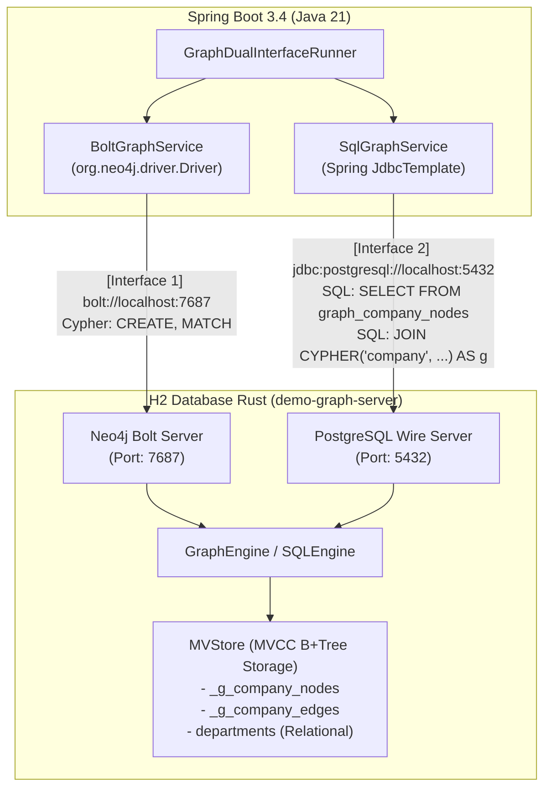

# Demo 016: Spring Boot グラフDB デュアルインターフェース (Bolt & SQL/JDBC)

本デモは、Java / Spring Boot アプリケーションから **H2 Database Rust のグラフDB機能** に対して、提供される **2系統のインターフェース** を通じて透過的にアクセスする実践サンプルです。

同一の MVCC ストレージエンジン（`MVStore`）をバックエンドに共有しているため、**Bolt（Cypher）経由で書き込んだグラフデータが、SQL（JDBC）側の仮想テーブルやテーブル値関数（TVF）から即座に参照・結合** できます。

---

## 🏛 アーキテクチャ構成



---

## 🌟 2つのインターフェースの役割

| インターフェース | 通信プロトコル | Java クライアント | 主な用途・操作内容 |
| :--- | :--- | :--- | :--- |
| **[Interface 1] Bolt** | Neo4j Bolt v4.4 / v5.x (Port: 7687) | 公式 `neo4j-java-driver` (`Driver`, `Session`) | **ネイティブグラフ操作**<br/>- Cypher によるノード・リレーションシップの作成 (`CREATE`)<br/>- パターンマッチング・トラバーサルクエリ (`MATCH ... RETURN`) |
| **[Interface 2] SQL / JDBC** | PostgreSQL Wire (Port: 5432) | 公式 `postgresql` ドライバ (`JdbcTemplate`) | **リレーショナル統合 & ハイブリッド分析**<br/>- 仮想テーブル (`graph_company_nodes`, `graph_company_edges`) の直接参照<br/>- テーブル値関数 `CYPHER(...)` と RDBMS テーブル（`departments`）のハイブリッド `JOIN` |

---

## 🚀 デモの実行ステップ

Spring Boot 起動時に `GraphDualInterfaceRunner` が以下の 5 ステップを自動実行します。

1. **[STEP 1] Bolt IF によるデータ作成 (Cypher)**
   - Neo4j Java Driver を使用して、社員ノード（`Alice`, `Bob`, `Charlie`, `Diana`, `Eve`）を作成。
   - 上司部下関係（`REPORTS_TO`）およびプロジェクト連携（`COLLABORATES`）を接続。
2. **[STEP 2] Bolt IF によるパターン検索 (Cypher)**
   - `MATCH (a:Employee)-[r:COLLABORATES]->(b:Employee) RETURN ...` によるコラボレーション抽出。
   - `MATCH (sub:Employee)-[r:REPORTS_TO]->(mgr:Employee) RETURN ...` によるレポートライン抽出。
3. **[STEP 3] SQL IF による仮想テーブルの参照 (SQL)**
   - `SELECT id, labels, properties FROM graph_company_nodes` で内部ノードを一覧。
   - `SELECT id, src_id, dst_id, type, properties FROM graph_company_edges` でエッジ情報を一覧。
4. **[STEP 4] SQL IF によるハイブリッド結合 (SQL + CYPHER TVF)**
   - リレーショナルテーブル `departments` と Cypher TVF `CYPHER('company', 'MATCH (e:Employee) RETURN ...')` を SQL `JOIN` で結合。
   - 部署の予算・ロケーション情報とグラフの社員・ロール情報を一度の SQL クエリで統合取得。
5. **[STEP 5] 双方向の即時整合性検証**
   - Bolt Driver 経由で新社員 `Frank` を作成。
   - SQL 側の仮想テーブルカウントおよびハイブリッド JOIN で `Frank` が即時に反映されていることを検証。

---

## 🏃 実行手順

### 1. サーバーの起動 (Rust)

別ターミナルでデュアルプロトコル（PGWire 5432 & Bolt 7687）サーバーを起動します。

```bash
cargo run -p demo-graph-server
```

出力例:
```text
  [SQL Interface]     PostgreSQL Wire listening on: 127.0.0.1:5432
  [Bolt Interface]    Neo4j Bolt Protocol listening on: 127.0.0.1:7687
```

### 2. Spring Boot アプリケーションの実行 (Java)

本ディレクトリへ移動し、実行スクリプトまたは Maven コマンドで起動します。

**Windows:**
```cmd
cd demo\016_spring_boot_graph_dual_interface
run_demo.bat
```

**Linux / macOS:**
```bash
cd demo/016_spring_boot_graph_dual_interface
./run_demo.sh
```

または直接 Maven で実行:
```bash
mvn spring-boot:run
```

---

## 💻 サンプルコード抜粋

### Interface 1: Neo4j Java Driver (Bolt)

```java
try (Session session = driver.session()) {
    // Cypher によるノード・エッジの作成
    session.run("CREATE (e:Employee {id: 101, name: 'Alice', role: 'Staff Engineer', dept_id: 1})");
    
    // パターンマッチング検索
    Result result = session.run(
        "MATCH (a:Employee)-[r:COLLABORATES]->(b:Employee) " +
        "RETURN a.name AS initiator, r.project AS project, b.name AS collaborator"
    );
    while (result.hasNext()) {
        Record record = result.next();
        System.out.println(record.get("initiator").asString() + " -> " + record.get("collaborator").asString());
    }
}
```

### Interface 2: Spring JdbcTemplate (SQL / TVF)

```java
// 仮想テーブルの参照
List<Map<String, Object>> nodes = jdbcTemplate.queryForList(
    "SELECT id, labels, properties FROM graph_company_nodes ORDER BY id"
);

// リレーショナルテーブルと CYPHER TVF のハイブリッド JOIN
List<Map<String, Object>> hybrid = jdbcTemplate.queryForList(
    "SELECT " +
    "    d.name AS dept_name, " +
    "    d.location AS dept_location, " +
    "    g.name AS emp_name, " +
    "    g.role AS emp_role " +
    "FROM departments d " +
    "JOIN CYPHER('company', 'MATCH (e:Employee) RETURN e.dept_id AS dept_id, e.name AS name, e.role AS role') " +
    "     AS g(dept_id, name, role) " +
    "  ON d.id = CAST(g.dept_id AS INT) " +
    "ORDER BY d.id, g.name"
);
```
