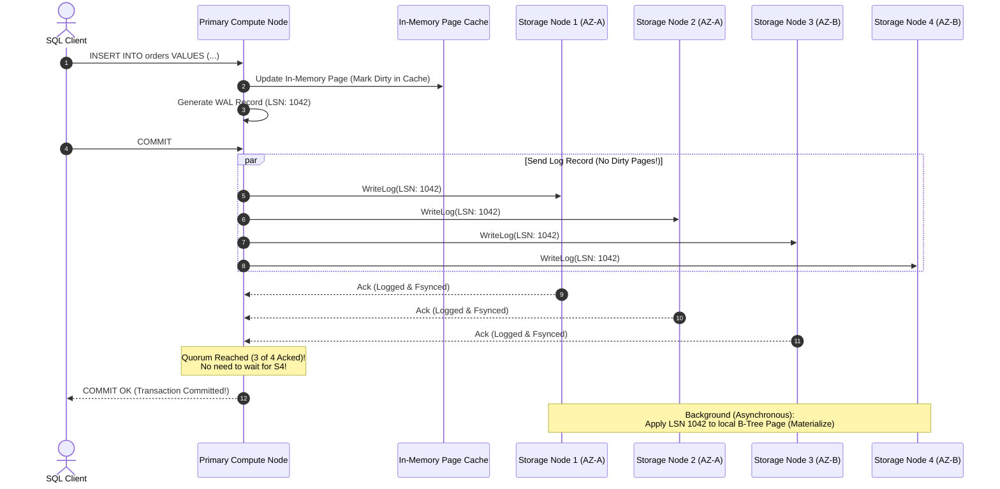
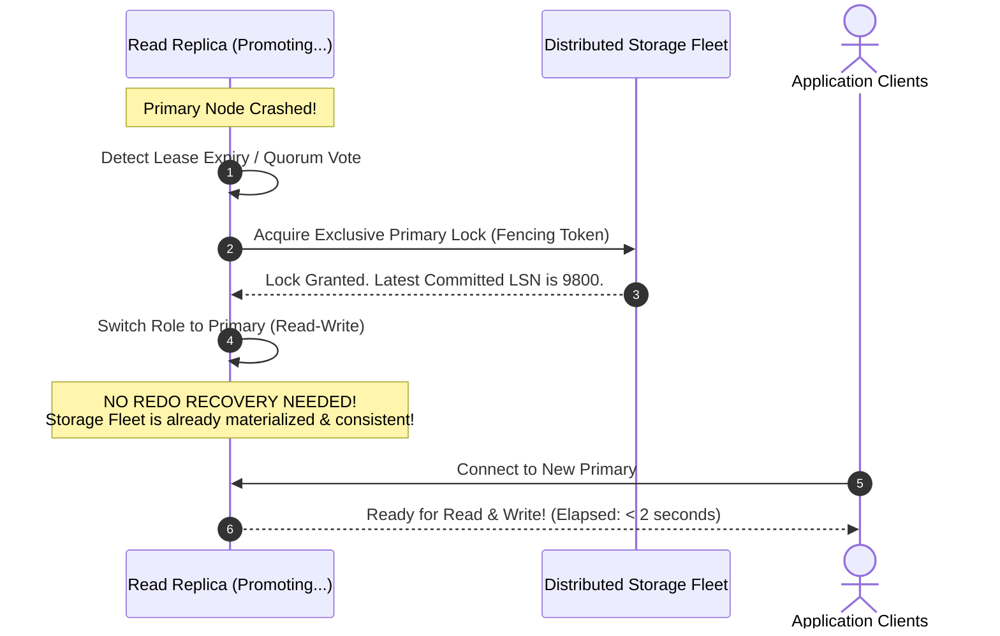
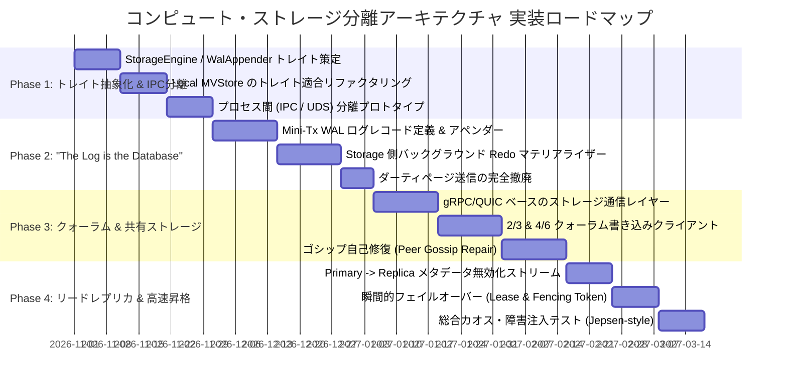

# 08. コンピュート・ストレージ分離アーキテクチャ設計 (Decoupled Storage-Compute Architecture / Aurora Model)

本ドキュメントは、**H2 Database in Rust (`h2database-rust`)** において、AWS Aurora や Google Cloud AlloyDB のような**「コンピュート層とストレージ層の完全分離（Decoupled Storage-Compute Architecture）」**および**「ログそのものがデータベースである（The Log is the Database）」**設計モデルを採用し、クラウドネイティブ環境における超高スループット、瞬間的リードレプリカ拡張、数秒以内の高速フェイルオーバーを実現するための包括的技術設計書です。

---

## 📑 目次
1. [概要と背景 (Executive Summary & Motivation)](#1-概要と背景)
2. [コア設計原則 (Core Design Principles)](#2-コア設計原則)
3. [システムアーキテクチャ概要 (System Architecture)](#3-システムアーキテクチャ概要)
4. [ストレージ層の抽象化とトレイト設計 (Trait & Interface Design)](#4-ストレージ層の抽象化とトレイト設計)
5. [書き込みパスとコミットプロトコル ("The Log is the Database")](#5-書き込みパスとコミットプロトコル)
6. [読み取りパスと共有ストレージ・リードレプリカ](#6-読み取りパスと共有ストレージリードレプリカ)
7. [スマートストレージノードの内部設計 (Smart Storage Engine)](#7-スマートストレージノードの内部設計)
8. [クォーラム合意と耐障害性 (Quorum Consensus & Self-Healing)](#8-クォーラム合意と耐障害性)
9. [高可用性フェイルオーバーとクラッシュリカバリ](#9-高可用性フェイルオーバーとクラッシュリカバリ)
10. [トランザクショナル・キューテーブル (MQ) との親和性](#10-トランザクショナルキューテーブル-mq-との親和性)
11. [段階的実装ロードマップ (Implementation Roadmap)](#11-段階的実装ロードマップ)

---

## 1. 概要と背景

### 1.1 従来のモノリシック RDBMS の課題
従来のデータベース（PostgreSQL、MySQL、Java版 H2 等）は、単一のノード内で「クエリ実行エンジン」と「ローカルファイルストレージ（ページキャッシュ、WAL、データファイル）」が密結合した**シェアードナッシング（Shared-Nothing）モノリシック構成**をとっています。

```text
【従来のモノリシック構成】
┌──────────────────────────────────────────────┐
│ Single Database Node                         │
│  ┌────────────────────────────────────────┐  │
│  │ SQL Parser / Query Engine              │  │
│  └───────────────────┬────────────────────┘  │
│                      │                       │
│  ┌───────────────────▼────────────────────┐  │
│  │ Buffer Pool (In-Memory Page Cache)     │  │
│  └───────────┬────────────────┬───────────┘  │
│              │                │              │
│       Dirty Pages (4-16KB)    │ WAL Log      │
│              │                │              │
│  ┌───────────▼────────────────▼───────────┐  │
│  │ Local Disk File System (Doublewrite)   │  │
│  └────────────────────────────────────────┘  │
└──────────────────────────────────────────────┘
```

この構成には以下の根本的な限界が存在します：
1. **I/O ボトルネックと二重書き込み (Doublewrite Penalty)**:
   ページの部分書き込み破損（Torn Page）を防ぐため、1行の更新に対して「WAL レコードの書き込み」と「8KB〜16KB のダーティページのディスク書き出し（Doublewrite Buffer 含む）」の両方が発生し、ネットワーク/ディスク帯域を激しく浪費します。
2. **レプリケーションの重さ**:
   Read Replica を追加するたびに、ストレージ容量が丸ごと 1 セット分必要になり、レプリカ側でも WAL 再生によるページ書き換え処理（CPU・I/O 負荷）が発生します。
3. **フェイルオーバーとリカバリの遅延**:
   クラッシュリカバリ時に、最後のチェックポイントから未適用の WAL をすべて走査してロールフォワードする必要があるため、リカバリ完了までに数分〜数十分を要します。

### 1.2 AWS Aurora 型アプローチのブレークスルー
AWS Aurora が提唱した**「コンピュート・ストレージ分離」**および**「ログそのものがデータベースである（The Log is the Database）」**というパラダイムシフトは、この問題を鮮やかに解決しました。

> **"The Log is the Database"**:
> データベースの実体は、ディスク上に書き出されたテーブルページではなく、**生成され続ける WAL（Redo Log）の不変ストリームそのもの**である。ページとは、ログストリームのある時点のスナップショットをキャッシュとしてマテリアライズ（具現化）したものに過ぎない。

コンピュートノードは**「WAL ログレコードのみ」**をネットワーク経由でストレージ層に送信し、ページ全体の書き出しやチェックポイントを完全に廃止します。ストレージ層自身がスマートな分散サービスとして動作し、バックグラウンドで自律的にログをページに合成（Redo 適用）します。

### 1.3 H2 Database in Rust におけるハイブリッドビジョン
本プロジェクトでは、SQLite ライクな**「ゼロ依存の超高速組み込みモード」**の手軽さを 100% 維持したまま、設定ひとつで**「Aurora 型コンピュート・ストレージ分離モード」**へシームレスに切り替えられる**「ハイブリッド・アーキテクチャ」**を目指します。

| 項目 | 組み込みモード (Embedded / Monolithic) | 分離モード (Decoupled Aurora Architecture) |
| :--- | :--- | :--- |
| **デプロイ形態** | 単一プロセス（アプリケーション組み込み） | コンピュートノード ＋ 分散ストレージノード群 |
| **ストレージ実体** | ローカル単一ファイル (`.db`) またはインメモリ | 分散 Log Storage Fleet (Quorum 共有ストレージ) |
| **I/O 転送内容** | メモリ内 CoW B-Tree チャンク直接書き込み | ネットワーク経由の WAL ログレコード転送のみ |
| **リードレプリカ** | `remote_apply` による P2P 同期転送 | **ストレージ共有（追加ストレージコスト 0）** |
| **耐障害性** | 単一ノードの ACID 保証 | 4/6 Quorum、AZ 障害耐性、自己修復 |
| **主な用途** | CLI ツール、エッジ、マイクロサービス、単体テスト | 大規模クラウド基盤、高可用性 OLTP、SaaS マルチテナント |

---

## 2. コア設計原則

本アーキテクチャを成立させるための 5 つの原則を定めます。

```text
┌────────────────────────────────────────────────────────────────────────┐
│                        5 Core Architectural Principles                 │
├────────────────────────────────────────────────────────────────────────┤
│ 1. The Log is the Database : ネットワーク越しには WAL ログレコードのみ送信 │
│ 2. Smart Storage Offloading : ページ生成・Redo適用はストレージ側で非同期実行 │
│ 3. Shared Distributed Store : 全レプリカが同一ストレージ層を共有（複製コスト0）│
│ 4. Pluggable Storage Trait  : 組み込み MVStore と分散 LogStore の完全透過性   │
│ 5. Quorum-based Reliability : 4/6 クォーラム書き込みによるディスク/AZ耐障害性 │
└────────────────────────────────────────────────────────────────────────┘
```

1. **The Log is the Database (ログのみ転送)**:
   コンピュートノードからストレージ層へは、8KB/16KBのデータページを一切転送しません。送るのは変更差分を表す軽量な **WAL ログレコード（Mini-Transaction Record）のみ** です。これによりネットワーク I/O を最大 80%〜90% 削減します。
2. **スマートストレージ層への Redo 処理オフロード**:
   ページへのログ適用（Log-to-Page Materialization）やガベージコレクション（GC / Compaction）は、コンピュートノードではなく**ストレージノードのバックグラウンドワーカー**が自律的に実行します。コンピュートノードの CPU と I/O をクエリ処理に 100% 集中させます。
3. **共有分散ストレージによるゼロストレージ・リードレプリカ**:
   すべてのリードレプリカ（Read-Only コンピュート）は、Primary と同一の分散ストレージ層を共有します。リードレプリカを追加してもストレージ容量は 1 バイトも増加せず、数秒で新しいレプリカノードを立ち上げることが可能です。
4. **プラガブルなストレージ境界 (`StorageEngine` トレイト)**:
   コンピュート層（SQL パーサ、オプティマイザ、実行エンジン、カタログ）は、統一された Rust の抽象トレイトを通じてストレージと対話します。ローカル MVStore 実装とリモート分散ストレージ実装を、コンピュート層のコードを 1 行も変更することなく差し替え可能にします。
5. **クォーラム合意による高可用性と自己修復**:
   データは複数のストレージノード（例: 6 ノード / 3 AZ）にストライピングされ、Quorum（4 of 6 書き込み、3 of 6 読み取り）により、1 AZ の完全喪失や低速ディスクの遅延（Slow Disk Tail Latency）を完全に隠蔽します。

---

## 3. システムアーキテクチャ概要

システムは**「コンピュート層（Compute Fleet）」**と**「分散スマートストレージ層（Storage Fleet）」**に物理的に二分されます。

```mermaid
graph TD
    Client[Application Client / PGWire / JMS] -->|SQL / Transactions| Primary[Primary Compute Node (Read-Write)]
    Client -->|Read-Only Queries| Replica1[Read Replica 1 (Read-Only)]
    Client -->|Read-Only Queries| Replica2[Read Replica 2 (Read-Only)]

    subgraph Compute Layer [Compute Layer (Stateless Caching Engines)]
        Primary
        Replica1
        Replica2
        Primary -.->|Metadata & Invalidation Stream (Log Streams)| Replica1
        Primary -.->|Metadata & Invalidation Stream (Log Streams)| Replica2
    end

    Primary ==>|1. Only WAL Records (Quorum Write)| SN1
    Primary ==>|1. Only WAL Records (Quorum Write)| SN2
    Primary ==>|1. Only WAL Records (Quorum Write)| SN3
    Primary ==>|1. Only WAL Records (Quorum Write)| SN4
    Primary ==>|1. Only WAL Records (Quorum Write)| SN5
    Primary ==>|1. Only WAL Records (Quorum Write)| SN6

    Replica1 -.->|On-Demand Page Read (Cache Miss)| SN1
    Replica2 -.->|On-Demand Page Read (Cache Miss)| SN4

    subgraph Storage Layer [Shared Distributed Storage Fleet (Log-Structured)]
        subgraph AZ1 [Availability Zone A]
            SN1[(Storage Node 1)]
            SN2[(Storage Node 2)]
        end
        subgraph AZ2 [Availability Zone B]
            SN3[(Storage Node 3)]
            SN4[(Storage Node 4)]
        end
        subgraph AZ3 [Availability Zone C]
            SN5[(Storage Node 5)]
            SN6[(Storage Node 6)]
        end
        SN1 <-->|Peer Gossip Repair| SN2
        SN3 <-->|Peer Gossip Repair| SN4
        SN5 <-->|Peer Gossip Repair| SN6
    end
```

### 3.1 各コンポーネントの責務

#### A. コンピュートノード (Compute Node)
- **Primary コンピュートノード (Read-Write)**:
  - クライアントからの接続受付（PostgreSQL v3 ワイヤプロトコル、埋め込み API、JMS）。
  - クエリの構文解析、論理・物理プラン生成、クエリ実行。
  - トランザクション制御（ACID、スナップショット分離、ロックマネージャー）。
  - インメモリバッファキャッシュ（ローカル LRU ページキャッシュ）。
  - **WAL レコーダー**: 変更を WAL ログレコードに直列化し、ストレージフリートへ並行送信。
- **Read Replica コンピュートノード (Read-Only)**:
  - 参照クエリの実行。
  - Primary から「コミット済み LSN」および「更新されたページ/マップ識別子」の軽量なメタデータ通知を受信。
  - ローカルバッファキャッシュの無効化（Cache Invalidation）。
  - キャッシュミス時にのみ、共有ストレージノードからオンデマンドでページを取得。

#### B. 分散スマートストレージノード (Storage Node)
- **ログアペンダー (Log Appender Engine)**:
  - コンピュートから送信された WAL レコードを受信し、ローカルのログディスク（NVMe / SSD）に追記（Append-Only）。
  - ディスクに fsync された時点でコンピュートへ ACK を返却。
- **ページマテリアライザー (Page Materializer / Background Redo Worker)**:
  - アペンドされた WAL レコードをバックグラウンドで非同期に再生し、CoW B-Tree のページ/チャンクを生成。
  - ページ要求（`GetPage`）が届いた際、要求されたバージョンまで未適用のログがあればオンデマンドで適用して返却。
- **ゴシップ自己修復ワーカー (Peer-to-Peer Gossip Repair)**:
  - 他のストレージノードと定期的に通信し、ネットワーク障害等で欠損した LSN 範囲を検出してピアから補修。

---

## 4. ストレージ層の抽象化とトレイト設計

コンピュートエンジンとストレージエンジンを疎結合に保つため、コンピュート層は具体的なストレージ実装を直接知らず、以下の Rust トレイトを通じて対話します。

### 4.1 コアトレイト定義

```rust
use std::sync::Arc;
use h2_types::{H2Result, Row, Value};

/// ログシーケンス番号 (Log Sequence Number)
pub type Lsn = u64;

/// ページ識別子 (データセグメント番号 + ページ番号)
#[derive(Debug, Clone, Copy, PartialEq, Eq, Hash)]
pub struct PageId {
    pub segment_id: u32,
    pub page_no: u32,
}

/// WAL ログレコード (Mini-Transaction Delta)
#[derive(Debug, Clone, Serialize, Deserialize)]
pub struct LogRecord {
    pub lsn: Lsn,
    pub prev_lsn: Lsn,
    pub tx_id: u64,
    pub op_type: LogOpType,
    pub map_name: String,
    pub key: Vec<u8>,
    pub value: Option<Vec<u8>>, // None は DELETE 操作
    pub timestamp_ms: u64,
}

#[derive(Debug, Clone, Serialize, Deserialize)]
pub enum LogOpType {
    Put,
    Delete,
    Commit,
    Rollback,
    CreateMap,
    DropMap,
}

/// コンピュート層からストレージ層への統一抽象インターフェース
#[async_trait::async_trait]
pub trait RemoteStorageEngine: Send + Sync {
    /// ログレコード群をクォーラムストレージノードへ送信 (Primary Compute -> Storage)
    async fn append_logs(&self, records: Vec<LogRecord>) -> H2Result<Lsn>;

    /// 指定 LSN がクォーラムノードで永続化（fsync）されるまで待機 (Commit Sync)
    async fn wait_for_quorum_lsn(&self, lsn: Lsn) -> H2Result<()>;

    /// 特定バージョンのページ/データを取得 (Cache Miss 時のストレージ読み出し)
    async fn get_page(&self, page_id: PageId, read_version: Lsn) -> H2Result<Vec<u8>>;

    /// 特定マップから単一キーの値を取得
    async fn get_key(&self, map_name: &str, key: &[u8], read_version: Lsn) -> H2Result<Option<Vec<u8>>>;

    /// レンジスキャン (Iterator)
    async fn scan_range(
        &self,
        map_name: &str,
        start_key: Option<&[u8]>,
        end_key: Option<&[u8]>,
        read_version: Lsn,
    ) -> H2Result<Vec<(Vec<u8>, Vec<u8>)>>;
}
```

### 4.2 プラガブルな実装切り替え
コンピュートノードは、設定に応じて以下のいずれかの実装を注入（DI）して動作します：
1. **`LocalMVStoreEngine`**:
   従来のモノリシック実装。内部で `h2_mvstore::MVStore` を直接呼び出し、ネットワークレイテンシ 0 でインメモリまたはローカルファイルに読み書き。
2. **`DistributedLogStorageEngine`**:
   Aurora 型分散クライアント実装。内部で Quorum Client（gRPC/QUIC）を保持し、複数のリモートストレージノードへログを並行送出し、クォーラム合意を管理。

---

## 5. 書き込みパスとコミットプロトコル

### 5.1 書き込みステップ ("The Log is the Database")



1. **トランザクション内変更**:
   コンピュートノードのバッファプール内でページを更新し、メモリ上で `LogRecord`（更新差分）を生成します。
2. **コミット時のクォーラム送信**:
   クライアントが `COMMIT` を発行すると、コンピュートノードは累積された `LogRecord` を 6 台（または 3 台）のストレージノードへ一斉に並行送信します。
3. **ディスク書き出しとクォーラム到達**:
   各ストレージノードは、受信したログをローカルのログリングバッファ（WAL ファイル）に書き込み、`fsync` して即座に ACK を返します。
4. **コミット確定（クライアントへの応答）**:
   コンピュートノードは、クォーラム数（例: 4 台または 2 台）の ACK を受信した瞬間に、**トランザクションコミット完了**としてクライアントへ成功を返します。遅いノードの応答を待つ必要はありません（Tail Latency の解消）。
5. **非同期マテリアライズ**:
   ストレージノード側で、バックグラウンドスレッドが WAL ログを自律的に B-Tree ページへマージします。この処理はトランザクションのコミットパスの外側（非同期）で行われるため、クライアントのレイテンシに一切影響を与えません。

---

## 6. 読み取りパスと共有ストレージ・リードレプリカ

### 6.1 リードレプリカの仕組み
Aurora 型アーキテクチャの最大のメリットの一つは、**「リードレプリカが専用のストレージを持たない」**という点です。

```text
┌─────────────────────────────────────────────────────────────┐
│                    Primary Compute Node                     │
│  - Executes Reads and Writes                                │
│  - Generates LSN: 5001 -> Appends to Storage                │
│  - Broadcasts "LSN 5001 Committed (Map: tbl_orders)"       │
└──────────────┬──────────────────────────────┬───────────────┘
               │                              │
         WAL Record Only               Lightweight Metadata
               │                              │
┌──────────────▼──────────────┐  ┌────────────▼───────────────┐
│ Shared Distributed Storage  │  │  Read Replica Node         │
│ - Node 1 .. Node 6          │  │  - Read-Only Queries       │
│ - Stores all Data & Logs    │  │  - Local Buffer Cache      │
│ - Serves Pages on Demand    │  │  - Invalidates Cached Pages│
└──────────────▲──────────────┘  └────────────┬───────────────┘
               │                              │
               └───────── On-Demand Page Read ┘
                          (Only on Cache Miss)
```

### 6.2 読み取りシーケンス
1. **キャッシュヒット時**:
   コンピュートノード（Primary または Read Replica）のローカルメモリバッファプールに要求ページが存在する場合、ストレージへのネットワーク I/O は発生せず、メモリ速度（ナノ秒単位）でクエリを処理します。
2. **キャッシュミス時 (オンデマンドページ取得)**:
   メモリにページがない場合、ストレージ層へ `GetPage(PageId, ReadLSN)` RPC を発行します。
   - ストレージノードは、要求された `ReadLSN` までのログが適用済みのページを返却します。
   - コンピュートノードは受け取ったページをローカルキャッシュに配置します。
3. **Primary から Read Replica へのキャッシュ無効化ストリーム**:
   Primary は、トランザクションコミット時に「どのマップ/ページのどの LSN が更新されたか」という軽量なメタデータメッセージ（数バイト）を Read Replica 群へストリーミングします。
   - Read Replica は、ローカルキャッシュにそのページが存在する場合のみ「無効化（Invalidate）」または最新化を行います。
   - Read Replica 側で WAL を一から再生してディスクに書くような重い処理は一切発生しません。

---

## 7. スマートストレージノードの内部設計

スマートストレージノードは、単なるリモートディスク（EBS や iSCSI）ではなく、**H2 の B-Tree ストレージ（MVStore）エンジンを内包した独立サービス**です。

```text
┌────────────────────────────────────────────────────────────────────────┐
│                   H2 Smart Storage Node Service                        │
│                                                                        │
│   ┌────────────────────────────────────────────────────────────────┐   │
│   │ gRPC / QUIC Transport Layer (Incoming RPCs from Compute Nodes) │   │
│   └──────────────────────┬─────────────────────────────────────────┘   │
│                          │                                             │
│   ┌──────────────────────▼─────────────────────────────────────────┐   │
│   │ Fast Append-Only Log Ring Buffer (NVMe SSD WAL)                │   │
│   │ - Sequential Write + Direct I/O (fsync) -> Immediate ACK       │   │
│   └──────────────────────┬─────────────────────────────────────────┘   │
│                          │                                             │
│   ┌──────────────────────▼─────────────────────────────────────────┐   │
│   │ In-Memory Log Index (LSN -> LogRecord Offset in Disk)          │   │
│   └──────────────────────┬─────────────────────────────────────────┘   │
│                          │                                             │
│   ┌──────────────────────▼─────────────────────────────────────────┐   │
│   │ Background Log-to-Page Materializer Worker (Redo Engine)       │   │
│   │ - Coalesce LogRecords into MVStore CoW B-Tree Chunks           │   │
│   │ - Write materialized data blocks                               │   │
│   └──────────────────────┬─────────────────────────────────────────┘   │
│                          │                                             │
│   ┌──────────────────────▼─────────────────────────────────────────┐   │
│   │ Storage Cleaner & Compactor (Background Vacuum Worker)         │   │
│   │ - Discard old log segments older than Oldest Visible LSN       │   │
│   │ - Reclaim unused chunks                                        │   │
│   └────────────────────────────────────────────────────────────────┘   │
└────────────────────────────────────────────────────────────────────────┘
```

### 7.1 ログマテリアライズのオンデマンド解決
もしコンピュートノードが `GetPage` を要求した時点で、バックグラウンドの Redo Worker によるページ合成が追いついていなかった場合：
- ストレージノードは、直近のベースページ（Base Page）をディスクから読み出します。
- メモリ上のログインデックスから未適用の `LogRecord` 群を抽出し、**メモリ上で即座に Redo 適用（動的マテリアライズ）**して最新ページを合成し、コンピュートノードへ返却します。
- これにより、コンピュートノードは常に一貫した最新データを待たされることなく参照できます。

---

## 8. クォーラム合意と耐障害性

### 8.1 4/6 クォーラム構成 (3 AZ デプロイモデル)
標準的なエンタープライズ構成として、3 つのアベイラビリティゾーン（AZ）に 2 ノードずつ、計 6 台のストレージノードを配置します。

| パラメータ | 設定値 | 説明 |
| :--- | :--- | :--- |
| **全ストレージノード数 ($V$)** | 6 | 3 AZ $\times$ 2 ノード |
| **書き込みクォーラム ($V_w$)** | 4 of 6 | 4 ノードのログ書込み ACK でコミット完了 |
| **読み取りクォーラム ($V_r$)** | 3 of 6 | 3 ノードから最新 LSN を持つデータを取得 |

### 8.2 耐障害性の保証
- **書き込み可能性の維持**:
  - $V_w + V_r > V$ ($4 + 3 = 7 > 6$) が常に成立するため、読み取りクォーラムには必ず最新の書き込みが含まれます。
  - **1 つの AZ（2 ノード）が完全停止しても、残り 4 ノードで書き込みクォーラム（4/6）が成立し、無停止でサービス継続可能**。
- **低速ノードの無視 (Tail Latency Elimination)**:
  - 6 ノード中、最も遅い 2 ノードのディスク書き込み遅延を完全に無視してコミットを確定できます。

### 8.3 ゴシップベースのピアツーピア自己修復 (Gossip Self-Healing)
一時的なネットワーク分断で特定のノードがログを受信できなかった場合：
1. ストレージノード同士がバックグラウンドで定期的にハートビートと所持 LSN 範囲を交換（Gossip Protocol）。
2. 「自ノードの LSN 1000〜1050 が欠落している」と判断したノードは、健全なピアノードから該当ログセグメントをストリーミング転送して補修（Self-Healing）。
3. コンピュートノードが補修処理に関与する必要は一切ありません。

---

## 9. 高可用性フェイルオーバーとクラッシュリカバリ

### 9.1 瞬間的フェイルオーバー (Crash Recovery in Seconds)
従来のモノリシック DB では、Primary ノードが停止すると数分〜数十分のリカバリ時間（Redo ログの総舐め）が必要でした。
本分離アーキテクチャでは、**1〜3 秒以内**のフェイルオーバーが完了します。



1. **フェンシングトークン (Fencing Token)**:
   新 Primary に昇格するノードは、ストレージ層から「排他的書き込みリース」を取得します。旧 Primary からの遅延パケットはストレージ層で弾かれ、Split-Brain を確実に防ぎます。
2. **リカバリ不要の即時起動**:
   コミット済みデータはすべてストレージ層に書き込まれ、ストレージ層自身が Redo を完了しているため、コンピュートノードは**起動時のログロールフォワードを一切行う必要がありません**。

---

## 10. トランザクショナル・キューテーブル (MQ) との親和性

先ほど実装した**「トランザクショナル・キューテーブル（Transactional Queue Table）」**は、本アーキテクチャと驚異的な親和性を持ちます。

1. **不変ログと WAL の完全一致**:
   - キューテーブルは `UPDATE` / `DELETE` を禁止した Append-Only コミットログです。
   - キューへの `INSERT` は、実質的に「WAL レコードの追記」そのものです。
   - ページ更新やインデックス更新のオーバーヘッドがなく、純粋なログストリームとしてストレージ層にアペンドされるため、**毎秒数十万〜数百万メッセージの超高スループットエンキュー**を達成します。
2. **共有ストレージによるゼロレイテンシ・コンシューム**:
   - Primary でエンキューされたメッセージは、即座に分散ストレージ層の最新 LSN として確定します。
   - Read Replica 上で動作するコンシューマ（JMS Consumer）は、Primary に負荷をかけることなく、同一ストレージ層から最新オフセットのメッセージを直接ストリーミング受信可能です。

---

## 11. 段階的実装ロードマップ

本アーキテクチャは極めて洗練されている反面、一度にすべてを実装するとリスクが高いため、以下の **4 つのフェーズ** で段階的に実装することを提案します。



### フェーズ 1: ストレージトレイト抽象化と境界の確立 (抽象化フェーズ)
- `StorageEngine`, `LogEngine`, `PageEngine` トレイトの策定。
- 既存の `h2-sql` が `MVStore` に直接触れず、トレイト越しにアクセスするようにリファクタリング（組み込みモードの性能劣化ゼロを担保）。
- 単一マシン上での Unix Domain Socket / 名前付きパイプによるプロセス間分離 PoC。

### フェーズ 2: "The Log is the Database" プロトコルの実装 (ログ中心化)
- `LogRecord`（更新差分）のシリアライザ・デシリアライザの実装。
- コンピュートノードからのページフラッシュを停止し、コミット時に WAL レコードのみを送出するパイプラインの実装。
- ストレージノード内での非同期 B-Tree マテリアライザー（`BackgroundRedoWorker`）の実装。

### フェーズ 3: クォーラム分散ストレージフリート (スケールアウト & 高可用性)
- `h2-storage-node` デーモンクレートの新設（独立プロセスとして起動可能に）。
- gRPC / QUIC 通信レイヤーの実装。
- 2 of 3（開発・小規模環境向け）および 4 of 6（エンタープライズ向け）の Quorum Client 実装。
- ノード間ゴシップによるログセグメント欠損の自己修復。

### フェーズ 4: ゼロストレージ・リードレプリカ & 高速昇格 (クラウドネイティブ完成)
- Primary から Read Replica へのキャッシュ無効化メタデータ通知機構。
- Fencing Token によるスプリットブレイン防止と数秒以内の Primary 昇格。
- Jepsen スタイルのネットワーク分断・ストレージプロセス Kill 耐性テスト。

---

## 12. まとめと提案

本アーキテクチャの導入により、**H2 Database in Rust** は以下の独自のポジションを確立します：

1. **「組み込み」から「クラウドネイティブ分散」への完全な連続性**:
   開発時はローカルのインメモリ／単一ファイルで手軽に動かし、本番環境ではバイナリをそのままコンピュートノードとして動かし、分散ストレージフリートに接続して Aurora 級のスケールと耐障害性を享受できます。
2. **圧倒的な書き込みスループットとコスト削減**:
   ネットワークを流れるのは WAL ログレコードのみであるため、クラウド環境でのネットワーク転送コストと I/O レイテンシを劇的に低減します。
3. **トランザクショナル MQ の極限性能**:
   不変コミットログとして設計されたキューテーブルが、分散ログストレージと一体化することで、Kafka や RabbitMQ を不要にする真の「All-in-One データ＆イベントプラットフォーム」へ進化します。

本提案の設計方針に基づき、まずは **Phase 1（ストレージ境界のトレイト抽象化）** から着手することを推奨します。
