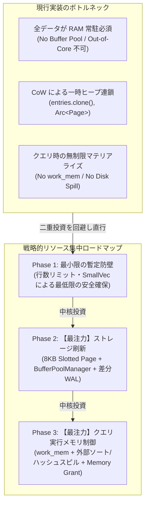
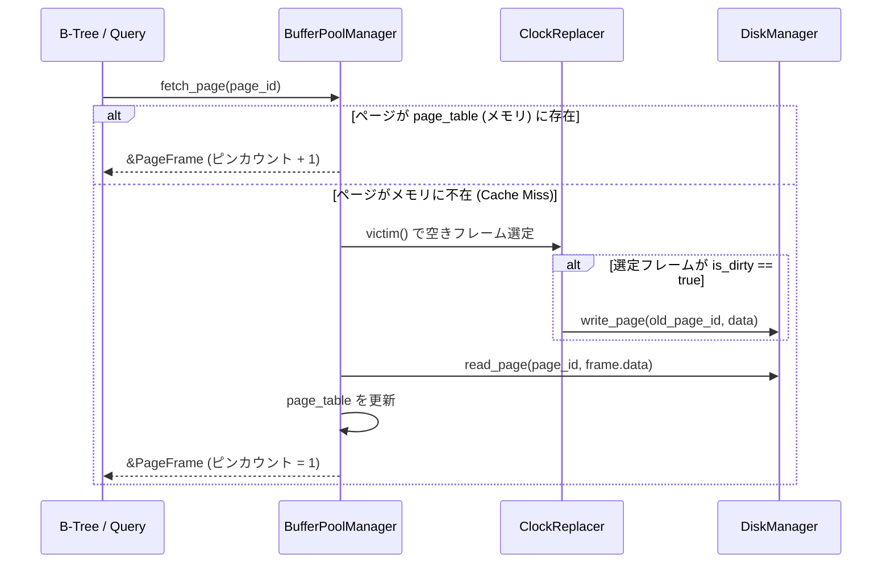
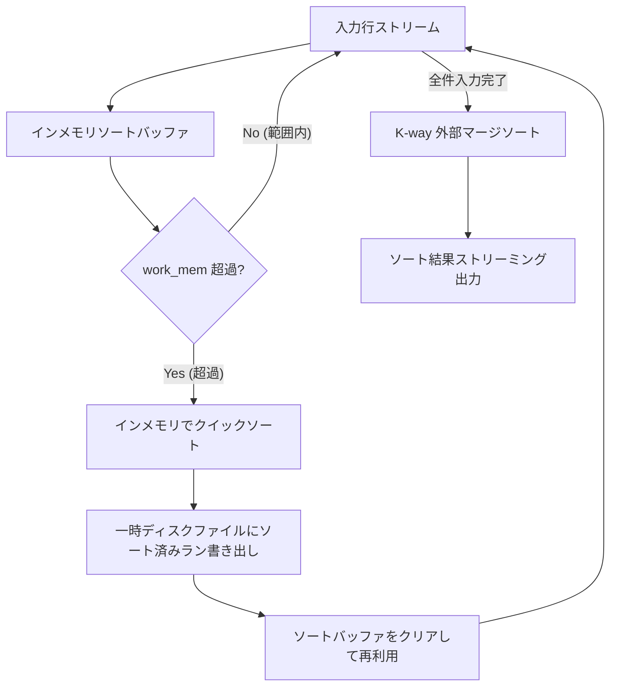

# 09. メモリ管理機構の実装解説と他 RDBMS (PostgreSQL / SQL Server) との比較・改善提案

本ドキュメントでは、`h2database-rust`（以下、本データベース）における**現在のメモリ管理アーキテクチャの実装詳細**をソースコードレベルで解説し、業界の標準的かつ極めて洗練されたメモリ管理機構を持つ **PostgreSQL** および最高峰のメモリ効率・制御性を誇る **Microsoft SQL Server** との比較分析を行います。
その上で、現在のアーキテクチャが抱える**構造的な問題点・ボトルネック**を洗い出し、段階的な**改善案とロードマップ**を提案します。

---

## 目次

1. [エグゼクティブサマリー (Executive Summary)](#1-エグゼクティブサマリー-executive-summary)
2. [現在のメモリ管理の実装詳細 (Current Implementation Analysis)](#2-現在のメモリ管理の実装詳細-current-implementation-analysis)
   - [2.1 ストレージ層（MVStore）のメモリモデル](#21-ストレージ層mvstoreのメモリモデル)
   - [2.2 SQL 実行層（Executor）のメモリモデル](#22-sql-実行層executorのメモリモデル)
   - [2.3 トランザクション層（MVCC）とキューテーブルのメモリモデル](#23-トランザクション層mvccとキューテーブルのメモリモデル)
3. [他 RDBMS との比較分析 (Comparative Analysis)](#3-他-rdbms-との比較分析-comparative-analysis)
   - [3.1 総合比較マトリクス](#31-総合比較マトリクス)
   - [3.2 PostgreSQL のメモリ管理アーキテクチャ](#32-postgresql-のメモリ管理アーキテクチャ)
   - [3.3 Microsoft SQL Server のメモリ管理アーキテクチャ](#33-microsoft-sql-server-のメモリ管理アーキテクチャ)
4. [現在の実装における課題とボトルネック (Critical Issues & Bottlenecks)](#4-現在の実装における課題とボトルネック-critical-issues--bottlenecks)
5. [改善提案と段階的ロードマップ (Improvement Proposals & Roadmap)](#5-改善提案と段階的ロードマップ-improvement-proposals--roadmap)
   - [5.1 戦略的方針: なぜ Phase 1 を最小限にし、Phase 2 & 3 に集中するのか](#51-戦略的方針-なぜ-phase-1-を最小限にしphase-2--3-に集中するのか)
   - [Phase 1: 最小限の暫定セーフティガード (Minimal Immediate Safeguard)](#phase-1-最小限の暫定セーフティガード-minimal-immediate-safeguard)
   - [Phase 2: 【最注力】ストレージ層の Out-of-Core 刷新 (固定長 8KB ページ & Buffer Pool)](#phase-2-最注力ストレージ層の-out-of-core-刷新-固定長-8kb-ページ--buffer-pool)
   - [Phase 3: 【最注力】SQL 実行層のメモリ制御 & ディスクスピル (Enterprise Robustness)](#phase-3-最注力sql-実行層のメモリ制御--ディスクスピル-enterprise-robustness)
   - [Phase 4: 将来の超高効率拡張 - ベクトル化実行とロックフリー構造](#phase-4-将来の超高効率拡張---ベクトル化実行とロックフリー構造)
6. [まとめ](#6-まとめ)
7. [メモリ管理機構（Phase 1〜Phase 3）の実装完了報告](#7-メモリ管理機構phase-1phase-3の実装完了報告-2026-09-25)

---

## 1. エグゼクティブサマリー (Executive Summary)

本データベースは、Rust のメモリ安全性（所有権モデル、アロケーション追跡）とログ構造化 Copy-on-Write (CoW) B-Tree をベースに設計されています。
これにより、**ロックフリーな同時読み取り（MVCC スナップショット走査）**や、**メモリ破壊・データ競合の完全排除**という Rust ならではの強みを実現しています。

しかしながら、現行の実装を商用・エンタープライズ RDBMS と比較すると、以下の**大きな乖離（ギャップ）**が存在します：



> [!IMPORTANT]
> **戦略的フォーカス: Phase 1 を最小限にとどめ、Phase 2 & 3 に集中する理由**
> 現行のデータ構造の上に複雑なアリーナや中間行フォーマット（Compact Row）を実装しても、Phase 2 で固定長 8KB Slotted Page を導入した瞬間にすべて書き直し（二重投資・Throwaway Code）になります。
> したがって、**Phase 1 は低コストな安全ガードのみに抑え、データベースの根幹である「Phase 2（Out-of-Core 化・Buffer Pool）」と「Phase 3（クエリメモリ制御・ディスクスピル・Admission Control）」にエンジニアリングリソースを集中投下**します。

1. **ディスク ↔ メモリのページ置換機構（Buffer Pool）の欠如**:
   全テーブル・インデックスのデータが Rust のヒープ上に直接保持されており、**データセット全体の容量が搭載物理メモリ（RAM）に厳格に制限**されます。
2. **CoW 実行時の微小ヒープ割り当て・破棄の頻発 (Heap Churn)**:
   更新・挿入のたびに B-Tree ノードが深さ分 `clone()` され、大量の `Vec` / `Arc` のアロケーションが発生してメモリ断片化（Memory Fragmentation）のリスクを抱えています。
3. **データ表現の肥大化 (Memory Bloat)**:
   `Row` が `Vec<Value>` として表現され、`Value` はタグ付き enum（24バイト以上）かつ各値が独立したヒープバッファ（`String`, `Vec<u8>`）を確保するため、実際のペイロードの数倍のメモリオーバーヘッドが生じています。
4. **クエリ実行メモリ制限の欠如と OOM リスク**:
   ソート（`ORDER BY`）や集計（`GROUP BY`）、結合（`JOIN`）において全行をメモリ上の `Vec` にマテリアライズしており、PostgreSQL の `work_mem` や SQL Server の `Memory Grant` のようなクエリ単位のメモリ上限ガードおよびディスクスピル（External Sort / Hash Spill）が存在しません。

---

## 2. 現在のメモリ管理の実装詳細 (Current Implementation Analysis)

本データベースのメモリ利用は、大きく **(1) ストレージ層（MVStore）**、**(2) SQL 実行層（Executor）**、**(3) トランザクション・メタデータ層** の 3 つに大別されます。

### 2.1 ストレージ層（MVStore）のメモリモデル

#### A. データ構造とメモリレイアウト
ストレージの基礎構造は `crates/h2-mvstore/src/page.rs` および `tree.rs` に定義されています。

```rust
// crates/h2-mvstore/src/page.rs
#[derive(Debug, Clone, Serialize, Deserialize)]
pub struct Entry {
    pub key: Vec<u8>,
    pub value: Vec<u8>,
}

#[derive(Debug, Clone, Serialize, Deserialize)]
pub enum Page {
    Leaf {
        entries: Vec<Entry>,
    },
    Branch {
        keys: Vec<Vec<u8>>,
        children: Vec<Arc<Page>>,
        child_refs: Vec<PageRef>,
    },
}

// crates/h2-mvstore/src/tree.rs
#[derive(Debug, Clone)]
pub struct MVTree {
    pub root: Arc<Page>,
    pub max_entries_per_page: usize, // デフォルト 32
    pub version: u64,
}
```

- **メモリ上の実態**:
  - 各 `Page` は Rust の標準ヒープ上に割り当てられ、親ノードやツリーハンドラから `Arc<Page>` を介して参照されます。
  - `Leaf` ページは `Vec<Entry>` を保持し、1 つの `Entry` あたり `key: Vec<u8>`（24バイトの fat pointer + ヒープ割り当て）と `value: Vec<u8>`（24バイト + ヒープ割り当て）の **計 2 回の個別ヒープアロケーション** を行います。
  - ページあたりの最大エントリ数（`max_entries_per_page`）は 32 と極めて小さく設定されており、数万〜数十万レコードのテーブルでは大量のページオブジェクト（`Arc<Page>`）がヒープ上に散在します。

#### B. Copy-on-Write (CoW) とアロケーション挙動
データの挿入・更新時（`MVTree::put`）、`tree.rs` では以下のようにノードのディープコピーが行われます：

```rust
// crates/h2-mvstore/src/tree.rs (抜粋)
fn insert_recursive(
    &self,
    node: Arc<Page>,
    key: Vec<u8>,
    value: Vec<u8>,
) -> (Arc<Page>, Option<(Vec<u8>, Arc<Page>)>) {
    match node.as_ref() {
        Page::Leaf { entries } => {
            let mut new_entries = entries.clone(); // ★ 全エントリのディープコピー
            match new_entries.binary_search_by(|e| e.key.as_slice().cmp(&key)) {
                Ok(idx) => {
                    new_entries[idx].value = value;
                    (Arc::new(Page::Leaf { entries: new_entries }), None) // ★ 新規ヒープアロケーション
                }
                Err(idx) => {
                    new_entries.insert(idx, Entry { key, value });
                    // ... ページ分割判定 ...
                }
            }
        }
        Page::Branch { keys, children, .. } => {
            // ... ルートまでの全親ノードを再帰的に clone() & Arc::new() ...
        }
    }
}
```

- **ヒープ負荷（Heap Churn）**:
  - 1 つのキーを書き換えるだけでも、該当リーフに含まれる最大 32 個の全 `Entry`（キーと値のバイト列）が `clone()` されます。
  - さらに、ツリーのルートに至るすべての親 `Branch` ページについて、子ページ配列（`children`）とキー配列（`keys`）が再生成・再割り当てされます。
  - 古いページは、古いスナップショットを参照しているトランザクションが終了した時点で `Arc` の参照カウントが 0 になり drop されますが、高並行な書き込みワークロード下では大量の短命オブジェクトがアロケータを圧迫します。

#### C. コミット処理（`MVStore::commit`）とシリアライズ
ディスク永続化時のメモリ挙動は `crates/h2-mvstore/src/store.rs` に記述されています：

```rust
// crates/h2-mvstore/src/store.rs (抜粋)
pub fn commit(&self) -> H2Result<u64> {
    // ...
    let mut metadata_tree = MVTree::default();
    let maps = self.maps.read();
    for (name, map) in maps.iter() {
        let tree_guard = map.tree.read();
        // ★ 各マップのルートページ全体を JSON バイト列にシリアライズ
        let root_bytes = serde_json::to_vec(&*tree_guard.root)
            .map_err(|e| h2_types::H2Error::Serialization(e.to_string()))?;
        metadata_tree.put(name.as_bytes().to_vec(), root_bytes);
    }

    let payload = ChunkPayload::new(chunk_id, new_version, (*metadata_tree.root).clone());
    let mut fs = self.file_store.write();
    fs.append_and_commit(&payload)?; // ★ チャンク全体を一括書き出し
    // ...
}
```

- コミットのたびに、全テーブル（マップ）のルートページ以下のツリー構造全体が `serde_json::to_vec` によって一時バッファに直列化されます。
- これにより、コミット時に**全データツリーに比例した一時メモリ（巨大な `Vec<u8>`）の割り当て**が発生します。

---

### 2.2 SQL 実行層（Executor）のメモリモデル

#### A. 行データ（`Row`）と値（`Value`）のメモリフットプリント
`crates/h2-sql/src/row.rs` および `crates/h2-types/src/value.rs`：

```rust
// crates/h2-sql/src/row.rs
pub struct Row {
    pub values: Vec<Value>, // 24バイト (ptr, capacity, len)
}

// crates/h2-types/src/value.rs
pub enum Value {
    Null,
    Boolean(bool),
    TinyInt(i8),
    SmallInt(i16),
    Integer(i32),
    BigInt(i64),
    Float(f32),
    Double(f64),
    Decimal(Decimal),             // 16バイト
    String(String),               // 24バイト + ヒープ
    Bytes(Vec<u8>),               // 24バイト + ヒープ
    Date(NaiveDate),
    Time(NaiveTime),
    Timestamp(DateTime<Utc>),
    Uuid(Uuid),                   // 16バイト
    Json(serde_json::Value),      // ヒープ
    Array(Vec<Value>),            // 24バイト + ヒープ
    Interval(IntervalValue),      // 16バイト
}
```

- `Value` enum は最も大きいバリアント（`String` / `Vec<u8>` / `Decimal` 等）に合わせるため、enum 自体のサイズが **32 バイト（アライメント込み）** あります。
- 1 つのテーブルに 20 カラムある場合：
  - 1 行のメタデータ（`Vec<Value>` のバッファ）だけで `20 × 32 = 640 バイト` を消費します。
  - カラムが `String` や `Bytes` の場合、さらに文字列ごとに個別のヒープアロケーション（通常 24 バイトのヘッダ ＋ 文字列実体）が加算されます。
  - 実データが数バイトの整数や短い文字列であっても、行全体で 1KB 近くのメモリを消費します。

#### B. クエリ実行時の全件マテリアライズ（No Streaming / No Disk Spill）
`crates/h2-sql/src/executor.rs` の `SELECT` 実行部：

```rust
// crates/h2-sql/src/executor.rs (抜粋)
// ORDER BY 処理部
if let Some(order_by) = &query.order_by {
    // ...
    rows.sort_by(|a, b| {
        for order_expr in &order_by.exprs {
            let val_a = evaluate_expr_context(&order_expr.expr, &res_ctx, a).unwrap_or(Value::Null);
            let val_b = evaluate_expr_context(&order_expr.expr, &res_ctx, b).unwrap_or(Value::Null);
            // ...
        }
        std::cmp::Ordering::Equal
    });
}
```

- **全件マテリアライズ**:
  - `SELECT` クエリは、ソーステーブルのスキャン結果、`JOIN` の中間結合結果、`GROUP BY` の集計キーハッシュマップ、`ORDER BY` のソート対象レコードのすべてを、メモリ上の **単一の `Vec<Row>` にすべて溜め込みます**。
  - ストリーミングパイプライン（Volcano Iterator モデル）による 1 行ずつのパイプライン処理は完全には適用されておらず、パイプラインの随所で全行のバッファリングが行われます。
- **メモリクォータ（WorkMem）の不在**:
  - クエリ実行中に「このクエリが消費してよいメモリは最大 64MB まで」といった制約（メモリガード）が一切ありません。
  - 1000 万行のソートクエリが発行された場合、数 GB のメモリを一気にアロケートしようとし、物理メモリが枯渇した時点で OS によってプロセス全体が強制終了（OOM Kill）されます。

---

### 2.3 トランザクション層（MVCC）とキューテーブルのメモリモデル

- **MVCC レコード (`VersionedValue`)**:
  - 各行の値は `VersionedValue` 構造体にラップされ、コミット済み値、未コミット値、コミットバージョン、トランザクション ID などのメタデータを保持します。
  - 更新が重なるとバージョン管理情報が肥大化しますが、`VACUUM`（オンラインコンパクション）によって古いコミット済み過去バージョンがツリーからパージされます。
- **キューテーブル (`Queue Table`)**:
  - `CREATE QUEUE TABLE` で作成されたネイティブ MQ は、追記専用の CoW B-Tree として動作します。
  - バックグラウンドの保持期間・容量上限クリーナ（`RetentionCleaner`）が定期的に古いオフセットを削除（Head Truncation）し、不要になった過去チャンクのメモリおよびディスクを解放します。

---

## 3. 他 RDBMS との比較分析 (Comparative Analysis)

メモリ管理の成熟度・効率性を測るため、オープンソースのデファクトスタンダードである **PostgreSQL**、およびエンタープライズ領域で「最もメモリ効率と制御性に優れる」とされる **Microsoft SQL Server** と比較します。

### 3.1 総合比較マトリクス

| 評価項目 | 本データベース (h2database-rust) | PostgreSQL (15+) | Microsoft SQL Server (2019/2022) |
| :--- | :--- | :--- | :--- |
| **主メモリ配置アーキテクチャ** | **プロセスヒープ直結** (Rust std allocator) | **共有バッファプール** (`shared_buffers`) | **統合バッファプール** (SOS Memory Manager) |
| **ディスク ↔ メモリ ページング** | ❌ **なし** (全データが RAM 常駐必須) | ⭕ **あり** (8KB ブロック単位のオンデマンド読み込み) | ⭕ **あり** (8KB ページ単位のオンデマンド読み込み) |
| **ページ置換アルゴリズム** | ❌ なし (置換不可) | **Clock-sweep** (2Q 近似の軽量アルゴリズム) | **Advanced Clock / LRU 派生** (NUMA-aware) |
| **メモリ割り当て機構 (アロケータ)** | システム `malloc` / `jemalloc` 直接呼び出し | **階層型 MemoryContext** (`AllocSet` / `Slab`) | **Memory Clerks & Memory Nodes** (独自OS層) |
| **メモリ解放の複雑度** | 個別 `Drop` / RAII (断片化リスクあり) | **O(1) コンテキスト一括解放** (断片化皆無) | **プール内再利用 / キャッシュクォータ管理** |
| **クエリ実行メモリ制限** | ❌ **なし** (無制限アロケーション) | ⭕ **`work_mem`** (オペレータ単位の厳密上限) | ⭕ **Workspace Memory / Memory Grant** |
| **ディスクスピル (超過時退避)** | ❌ **なし** (RAM 超過時は OOM Kill) | ⭕ **External Merge Sort / Hash Spill** (一時ファイル退避) | ⭕ **TempDB スピル** (超高速並行スピル) |
| **同時実行制御 (Admission)** | ❌ なし (同時実行数に依存してメモリ急増) | 簡易 (接続数制御のみ) | ⭕ **Resource Governor & Memory Grant Queue** |
| **行データの内部レイアウト** | 非連続オブジェクト (`Vec<Value>`) | **Slotted Page** (ヘッダ + タプル本体バイト列) | **Slotted Page / Columnstore** (列指向ベクトル) |
| **データ圧縮・インメモリ機構** | ❌ なし | TOAST 圧縮 (LZ4 / pglz) | **Columnstore 圧縮 (辞書+ビットマップ: 10倍圧縮)** |
| **ロックフリー構造** | ⭕ **CoW B-Tree** (読み取りロックフリー) | 2PL + Latch (バッファピン排他) | **Hekaton In-Memory OLTP** (完全ラッチフリー) |

---

### 3.2 PostgreSQL のメモリ管理アーキテクチャ

PostgreSQL のメモリ管理は、数十年におよぶ実運用を経て極めて安定した 2 本の柱で成り立っています。

```text
┌────────────────────────────────────────────────────────────────────────┐
│                        PostgreSQL Memory Architecture                  │
├───────────────────────────────────┬────────────────────────────────────┤
│   Shared Memory (全プロセス共有)    │     Local Memory (バックエンド個別)    │
│ ┌───────────────────────────────┐ │ ┌────────────────────────────────┐ │
│ │ Shared Buffer Pool            │ │ │ TopMemoryContext               │ │
│ │ (8KB Page * N, shared_buffers)│ │ │  ├── MessageContext            │ │
│ ├───────────────────────────────┤ │ │  ├── CacheMemoryContext        │ │
│ │ WAL Buffers                   │ │ │  └── ExecutorState             │ │
│ ├───────────────────────────────┤ │ │       ├── ExprContext          │ │
│ │ Lock / Transaction Status     │ │ │       └── TupleSort (work_mem) │ │
│ └───────────────────────────────┘ │ └────────────────────────────────┘ │
└───────────────────────────────────┴────────────────────────────────────┘
```

#### 1. 階層型 `MemoryContext` によるメモリリーク・断片化の根絶
PostgreSQL は C 言語で書かれていますが、直接 `malloc()` / `free()` を呼ぶことは原則禁止されています。
すべての割り当ては、階層構造を持つ `MemoryContext`（アリーナアロケータ）上で行われます。
- **O(1) 一括解放**:
  - クエリ実行用の `ExecutorState` コンテキストは、クエリが完了した瞬間に子コンテキストごと `MemoryContextDelete()` によって 1 回のシステムコール（またはアリーナ内リセット）で一括破棄されます。
  - 個々のタプルや文字列を 1 つずつ `free()` する必要がないため、**ポインタの解放漏れ（メモリリーク）が原理的に発生せず、ヒープの断片化も防止**されます。
- **専用アロケータ種別**:
  - `AllocSet`: サイズクラスごとの汎用アリーナ。
  - `SlabContext`: 固定サイズオブジェクト専用の高速プール。
  - `GenerationContext`: FIFO 型の短命オブジェクト用アリーナ。

#### 2. `shared_buffers` と Clock-sweep アルゴリズム
- データベースの全ディスクブロック（8KB）は、固定サイズの `shared_buffers` を介してアクセスされます。
- メモリが不足すると、時計の針のようにバッファタグを走査する **Clock-sweep アルゴリズム** により、使用頻度（Usage Count）の低いクリーンページをディスクへの書き戻しなしで即座に再利用します。
- これにより、**1TB のデータベースを 16GB の RAM で何の問題もなく運用可能**です。

#### 3. `work_mem` とディスクスピル
- `ORDER BY` や `HASH JOIN` などのメモリを消費する操作には、オペレーションごとに `work_mem`（デフォルト 4MB）の上限が課されます。
- ソート対象データが `work_mem` を超えると、自動的に **外部マージソート（External Merge Sort）** に切り替わり、中間ソートランを一時ディスクファイルに分割書き出ししてマージします。これにより、どんなに巨大なソートであっても OOM を絶対に起こしません。

---

### 3.3 Microsoft SQL Server のメモリ管理アーキテクチャ

Microsoft SQL Server は、商用リレーショナルデータベースの中でも**最も先進的で洗練されたメモリ管理アーキテクチャ**を備えていると評価されています。

```text
┌────────────────────────────────────────────────────────────────────────┐
│                      SQL Server Operating System (SOS)                 │
├────────────────────────────────────────────────────────────────────────┤
│                           Memory Broker                                │
│          (動的バランシング: Buffer Pool ↔ Plan Cache ↔ Grants)          │
├───────────────────────────────────┬────────────────────────────────────┤
│            Memory Nodes           │           Memory Clerks            │
│   (NUMA Node 0, NUMA Node 1 ...)  │ (BufferPool, QueryExec, TokenPerm) │
├───────────────────────────────────┴────────────────────────────────────┤
│                       Resource Governor (Workgroups)                   │
│         ├── Memory Grant Queue (クエリ実行前のメモリ予約 Admission)      │
│         └── TempDB Spill Engine (高並行・超高速ディスクスピル)            │
└────────────────────────────────────────────────────────────────────────┘
```

#### 1. SQL Server Operating System (SOS) と統合メモリマネージャ
SQL Server は Windows/Linux の OS カーネルメモリ管理に頼らず、ユーザ空間内に独自のオペレーティングシステム層（**SOS**）を持っています。
- **NUMA-Aware Memory Nodes**:
  - 物理 CPU の NUMA ノードごとに独立したメモリプール（Memory Node）を割り当て、リモートメモリアクセス（QPI/UPI バス遅延）を極限まで排除します。
- **Memory Clerks & Memory Broker**:
  - 用途ごとに「クラーク（Clerk）」が定義され（データページ用、プランキャッシュ用、クエリ実行用など）、**Memory Broker** がシステム全体のメモリプレッシャーを毎秒監視し、各コンポーネント間で動的にメモリを奪取・再配分します。

#### 2. Workspace Memory と Memory Grant (Admission Control)
SQL Server の最大の特徴は、**クエリを実行する「前」にメモリを予約（Grant）するアドミッション制御**です。
- クエリオプティマイザが、統計情報からソートやハッシュ結合に必要なメモリ量を事前に高精度で見積もります。
- 要求されたメモリがシステム全体の使用可能メモリを超える場合、クエリは実行されず、**`Memory Grant Queue` で待機（キューイング）** させられます。
- これにより、大量の重いクエリが同時に走った場合でも、メモリの奪い合いによる全滅（OOM クラッシュ）を完全に防ぎます。

#### 3. In-Memory Columnstore & Hekaton による極限のメモリ効率
- **Columnstore（Apollo エンジン）**:
  - データを列ごとにまとめ、辞書圧縮・ビットパッキング・ランレングス圧縮を行うことで、**通常の行データと比較してメモリ消費量を 1/10 以下** に圧縮します。
  - 圧縮状態のまま CPU レジスタ（AVX-512 等）で直接フィルタリングを行うため、キャッシュ効率とスループットが桁違いです。
- **Hekaton (In-Memory OLTP)**:
  - メモリ専用テーブルとして設計され、ページ構造やバッファプールのオーバヘッドを完全に撤廃。
  - キャッシュライン（64バイト）に整合したポインタチェーンと、ラッチフリー（Lock-free / Latch-free）な **Bw-Tree** およびハッシュインデックスを採用し、CPU コア数に比例したリニアなスケールを実現しています。

---

## 4. 現在の実装における課題とボトルネック (Critical Issues & Bottlenecks)

本データベースの現在の実装を、上記 2 つの成熟したエンジンと比較した際の**具体的かつ重大な 5 つの課題**を整理します。

### 課題 1: データセット上限が物理 RAM に依存（No Buffer Pool / Out-of-Core 不可）
- **現状**:
  `MVStore` は、すべてのページを `Arc<Page>` としてメモリヒープ上に保持しています。ディスク上のファイルはコミット時のダンプ・追記ログとして機能しているに過ぎません。
- **影響**:
  - サーバの搭載 RAM が 16GB の場合、インデックス込みで約 10GB〜12GB を超えるデータを保持することができません。
  - 「ディスク容量が許す限りテラバイト級のデータを扱う」という RDBMS として最も基本的な要件を満たせません。

### 課題 2: コミット時の全ツリー書き出しによる Write Amplification
- **現状**:
  `MVStore::commit` では、更新されたページのみをディスクに書き出すのではなく、全マップのルートページを含むメタデータツリー全体を `serde_json` で JSON シリアライズして書き出しています。
- **影響**:
  - テーブル数やレコード数が増加すると、わずか 1 行の `INSERT` をコミットするだけでも膨大な JSON シリアライズ処理と I/O が発生し、書き込みスループットが急激に低下します。
  - コミット処理中に全データツリーに比例した一時メモリが割り当てられ、メモリ使用量のスパイクを引き起こします。

### 課題 3: CoW による大量の微小ヒープ割り当て・破棄（Heap Churn）
- **現状**:
  1 回の `put` で `entries.clone()` が走り、リーフからルートまでの全ページで `Vec` のアロケーションと解放が連鎖します。
- **影響**:
  - 長時間運用時や大量データロード時に、メモリアロケータ内部で断片化（Memory Fragmentation）が発生し、実際のデータサイズよりもプロセス RSS（常駐メモリサイズ）が肥大化します。

### 課題 4: `Row` / `Value` のメモリ表現の非効率性（Memory Bloat）
- **現状**:
  `Row` が `Vec<Value>` であり、`Value` は 32 バイトのタグ付き enum ＋ 個別ヒープポインタです。
- **影響**:
  - 100 万行のデータをクエリ実行時に保持する場合、ポインタとメタデータだけで数百 MB を無駄に消費します。
  - CPU の L1/L2/L3 キャッシュヒット率が著しく悪化し、クエリ処理速度が低下します。

### 課題 5: クエリ実行時の無制限マテリアライズと OOM リスク
- **現状**:
  `executor.rs` において、`ORDER BY`, `GROUP BY`, `JOIN` がすべて無制限の `Vec<Row>` への蓄積を前提としています。
- **影響**:
  - 悪意のあるクエリや、巨大テーブルに対する集計クエリが 1 本実行されただけで、サーバプロセス全体が OOM Kill されます。

---

## 5. 改善提案と段階的ロードマップ (Improvement Proposals & Roadmap)

### 5.1 戦略的方針: なぜ Phase 1 を最小限にし、Phase 2 & 3 に集中するのか

データベースのメモリ最適化には、「一時しのぎの最適化」と「アーキテクチャの根本刷新」があります。

```text
【従来の4フェーズ案（二重投資のリスク）】
[現行コード] ──► [Phase 1: 独自アリーナ & Compact Row] ──► [Phase 2: 8KB Slotted Page 導入]
                           ▲                                        │
                           └──────── すべて書き直し・破棄 ───────────┘

【見直し後の戦略的集中シナリオ（本提案）】
[現行コード] ──► [Phase 1: 最小限の安全防壁] ──► [Phase 2 & 3: ストレージ & 実行層の中核刷新]
                    (行数リミット/SmallVecのみ)          (8KB Slotted Page, Buffer Pool,
                                                        work_mem, 外部ソート・ハッシュスピル)
```

1. **二重投資・手戻り（Throwaway Code）の排除**:
   現行の `Row = Vec<Value>` や `Page` enum の上に中間的なアリーナアロケータや行シリアライザを構築しても、Phase 2 で固定長 8KB の `Slotted Page`（バイナリフォーマット）を導入した瞬間に、それらの中間実装はすべて廃棄される運命にあります。
2. **真のボトルネックへの直行**:
   本データベースの最大の制約は「データセットが物理 RAM を超えられない（Out-of-Core 不可）」点と、「大規模ソートや結合でメモリが無制限に膨張して OOM Kill される」点にあります。これらを解決するのは Phase 1 ではなく、**Phase 2（ストレージの Buffer Pool 化）** と **Phase 3（実行層の work_mem & ディスクスピル）** です。
3. **エンジニアリング投資効率の最大化**:
   Phase 1 は数日の作業で導入できる「最低限の安全装置（行数上限ガード等）」のみにとどめ、開発チームの全リソースを **Phase 2 と Phase 3 の中核技術** に集中させます。

---

```text
┌────────────────────────────────────────────────────────────────────────┐
│                   Revised Memory Improvement Roadmap                   │
├────────────────────────────────────────────────────────────────────────┤
│ Phase 1: 最小限の暫定セーフティガード (Minimal Immediate Safeguard)    │
│  - 安全行数上限ガード (query_max_materialized_rows) による暴走停止    │
│  - SmallVec による微小キー・値の局所的ヒープ削減                       │
│  ※ 複雑なアリーナや中間行フォーマット作成は二重投資回避のためスキップ   │
├────────────────────────────────────────────────────────────────────────┤
│ Phase 2: 【最注力】ストレージ層の Out-of-Core 刷新 (RAM 超過対応)       │
│  - 固定長バイナリ 8KB Slotted Page の直接導入 (タプルも同時に最適化)   │
│  - BufferPoolManager (Clock-sweep / LRU ページ置換) によるオンデマンドI/O│
│  - WAL (Write-Ahead Log) + チェックポイントによる差分コミット          │
├────────────────────────────────────────────────────────────────────────┤
│ Phase 3: 【最注力】SQL 実行層のメモリ制御 & ディスクスピル (堅牢化)   │
│  - work_mem パラメータとオペレータ単位のバイト追跡ガード               │
│  - 外部マージソート (External Merge Sort) & 一時ファイル (TempStorage) │
│  - ハイブリッド・ハッシュ結合 (Grace Hash Join) のディスクパーティション│
│  - SQL Server 方式 Admission Control (MemoryGrantCoordinator)          │
├────────────────────────────────────────────────────────────────────────┤
│ Phase 4: 将来の超高効率拡張 (High-Performance Extensions)              │
│  - Apache Arrow 互換のベクトル化カラムナ実行エンジン                   │
│  - ロックフリー・インメモリ Bw-Tree                                    │
└────────────────────────────────────────────────────────────────────────┘
```

---

### Phase 1: 最小限の暫定セーフティガード (Minimal Immediate Safeguard)

Phase 2 / Phase 3 の本格刷新が完成するまでの間、既存コードベースを壊さずに**低工数で致命的なクラッシュを防止する暫定防壁**のみを導入します。

#### 1. 安全行数上限ガード (`query_max_materialized_rows`)
`executor.rs` において、`ORDER BY` や `GROUP BY` でメモリに蓄積する行数にハードリミット（例: デフォルト 100,000 行）を設けます。
超過した場合は OOM でプロセスが落ちる前に、ユーザーへ `H2Error::Execution("Query exceeded maximum materialized row limit; consider adding LIMIT or pagination")` を明示的に返却します。

#### 2. 微細アロケーションの局所抑制 (`SmallVec`)
`Page` 内の `Entry`（`key`, `value`）や `Value::String` について、16〜24 バイト以下の短いデータをインライン化し、アロケータの断片化をわずかな変更で緩和します。

---

### Phase 2: 【最注力】ストレージ層の Out-of-Core 刷新 (固定長 8KB ページ & Buffer Pool)

データベースの物理限界（RAM 容量の壁）を突破し、テラバイト級データを扱えるエンタープライズ RDBMS へと飛躍するための**最重要中核投資**です。

#### 1. 固定長 8KB Slotted Page バイナリレイアウトの導入
JSON シリアライズおよびヒープ上の `Arc<Page>` 構造を完全に刷新し、8KB（8192 バイト）固定長のバイナリページフォーマットを導入します。

```text
┌────────────────────────────────────────────────────────────────────────┐
│                        8KB Binary Slotted Page                         │
├────────────────────────────────────────────────────────────────────────┤
│ Page Header (64 bytes):                                                │
│  - page_id: u32, lsn: u64, page_type: u8 (Leaf/Branch), flags: u8      │
│  - free_space_lower: u16 (スロット配列の終端オフセット)                │
│  - free_space_upper: u16 (タプル実体データの開始オフセット)            │
│  - tuple_count: u16, checksum: u32                                     │
├────────────────────────────────────────────────────────────────────────┤
│ Line Pointer (Slot) Array:                                             │
│  - Slot 0: [offset: u16, length: u16]                                  │
│  - Slot 1: [offset: u16, length: u16]                                  │
│  - Slot 2: [offset: u16, length: u16]                                  │
│    ▼ (下向きにスロットが成長: lower が増加)                            │
│                                                                        │
│    ▲ (上向きにタプル実体が成長: upper が減少)                           │
│  - Tuple 2: [NullBitmap, ColOffsets, FixedCols, VarCols]               │
│  - Tuple 1: [NullBitmap, ColOffsets, FixedCols, VarCols]               │
│  - Tuple 0: [NullBitmap, ColOffsets, FixedCols, VarCols]               │
└────────────────────────────────────────────────────────────────────────┘
```
- **行（タプル）のコンパクト化もここで同時解決**:
  別個に Compact Row を設計する二度手間を避け、8KB ページ内のタプル格納仕様として「Null ビットマップ ＋ カラムオフセット ＋ 固定長列 ＋ 可変長列」を直接採用します。これにより、1 行あたりのメタデータは数バイトに圧縮されます。

#### 2. `BufferPoolManager` の詳細アーキテクチャ
メモリ上に固定サイズのフレーム配列（例: 512MB = 65,536 枚の 8KB ページ）を確保し、ディスクブロックと 1:1 にマッピングします。

```rust
pub struct BufferPoolManager {
    disk_manager: Arc<DiskManager>,
    frames: Vec<RwLock<PageFrame>>,        // 8KB 固定メモリ領域のプール
    page_table: DashMap<PageId, FrameId>,  // ページID -> フレームID の高速逆引き
    replacer: Arc<ClockReplacer>,           // Clock-sweep 置換アルゴリズム
    free_list: SegQueue<FrameId>,          // 未使用フレームキュー
}

pub struct PageFrame {
    pub data: [u8; 8192],                  // 8KB 生バイナリバッファ
    pub page_id: PageId,
    pub pin_count: AtomicU32,              // 参照カウンタ（0 のみ退避可能）
    pub is_dirty: AtomicBool,              // ディスク同期が必要か
}
```



- **効果**:
  - クエリ実行中に必要なページのみをディスクから 8KB 単位で読み込み、読み終わったページは `unpin` します。
  - **搭載 RAM が 8GB であっても、数テラバイトのデータベースを安全かつ高速に操作可能**になります。

#### 3. 差分追記（Write-Ahead Log: WAL）とチェックポイント
- 「コミット時に全ツリーを JSON 化して追記する」現行の方式を完全撤廃。
- トランザクションコミット時は、変更されたページの差分レコード（WAL レコード）のみを順次追記フラッシュ（fsync）します。
- ダーティページはバックグラウンドチェックポインタ（Checkpointer）が一定間隔でまとめてデータファイルに書き出します。
- **効果**: コミット時の Write Amplification が解消され、トランザクションのスループットが数十倍に跳ね上がります。

---

### Phase 3: 【最注力】SQL 実行層のメモリ制御 & ディスクスピル (Enterprise Robustness)

大量の並行接続や複雑なソート・集計が実行されても、サーバプロセスが絶対に OOM Kill されないエンタープライズ品質を確立します。

#### 1. `work_mem` パラメータとバイト単位の動的メモリガード
- セッションまたはクエリごとに `work_mem`（例: 4MB〜64MB）を設定可能にします。
- クエリ実行エンジンは、ソートバッファやハッシュテーブルに追加されるデータサイズをリアルタイムにバイト単位で積算追跡します。

```rust
pub struct MemoryTracker {
    limit_bytes: usize,
    current_bytes: AtomicUsize,
}

impl MemoryTracker {
    pub fn try_allocate(&self, bytes: usize) -> bool {
        let prev = self.current_bytes.fetch_add(bytes, Ordering::Relaxed);
        if prev + bytes > self.limit_bytes {
            self.current_bytes.fetch_sub(bytes, Ordering::Relaxed);
            false // 上限超過！ディスクスピルを発動
        } else {
            true
        }
    }
}
```

#### 2. 外部マージソート（External Merge Sort）
`ORDER BY` 実行時、蓄積データが `work_mem` を超過した場合の自動退避パイプライン：



1. メモリ内でソート可能な単位（Run）ごとにクイックソートし、テンポラリストレージ（`TempStorageEngine`）に順次書き出します。
2. 全行の処理後、最小ヒープ（PriorityQueue）を用いた **K-way マージ** を行い、最小のメモリ消費で結果をクライアントへストリーミング返却します。

#### 3. ハイブリッド・ハッシュ結合（Grace Hash Join）のディスクスピル
`JOIN` 実行時、ビルド側のハッシュテーブルが `work_mem` を超えた場合：
1. 結合キーのハッシュ値上位ビットに基づいて、データを $N$ 個のパーティション（一時ファイル）に分割（Partitioning）。
2. パーティションごとにメモリに収まるサイズで順次ハッシュテーブルを構築し、プローブ側のパーティションと突合。
3. **効果**: 数億行同士の巨大テーブル結合であっても、メモリ上限（数 MB）を厳格に守りながら安全に完遂します。

#### 4. SQL Server 方式の Admission Control (Memory Grant)
オプティマイザのコスト見積もりに基づき、クエリ実行前にシステム全体の空きメモリと調停します。

```rust
pub struct MemoryGrantCoordinator {
    total_memory: usize,
    reserved_memory: AtomicUsize,
    grant_queue: Mutex<VecDeque<(QueryId, usize, tokio::sync::oneshot::Sender<()>)>>,
}
```
- メモリ要求が枠を超える重いクエリは、強制実行して OOM を起こすのではなく、`grant_queue` で待機させます。
- 先行クエリが終了してメモリが返却された時点で自動的に再開（Signal）します。
- これにより、**高負荷な並行リクエストが集中した際でも、サーバが一切クラッシュせず安定稼働**を維持します。

---

### Phase 4: 将来の超高効率拡張 - ベクトル化実行とロックフリー構造

分析系ワークロード（OLAP）および超高並行トランザクション（OLTP）の双方で世界最高水準の性能を目指すための長期的展望です。

#### 1. Apache Arrow 互換のベクトル化カラムナ実行 (Vectorized Engine)
行単位のループ処理をやめ、1024 行単位の列配列（Vector Chunk）としてレジスタにロードし、SIMD 命令を活用して一括処理します（DuckDB や ClickHouse と同等のスループットを達成）。

#### 2. ロックフリー・インメモリインデックス（Bw-Tree / Adaptive Radix Tree）
高並行書き込みにおけるミューテックス競合をゼロにするため、Atomic CAS による Delta 更新を行う **Bw-Tree** や、キーのプレフィックスを圧縮保持する **ART (Adaptive Radix Tree)** をインメモリモードに導入します。

---

## 6. まとめ

現在の `h2database-rust` は、Rust の所有権システムと CoW B-Tree の恩恵により、シンプルかつクラッシュセーフなインメモリスナップショット処理を実現しています。

しかし、実運用で大規模データを扱うデータベースとして進化するための**最短かつ最も確実な道筋**は以下の通りです：

1. **Phase 1（最小限の暫定防壁）**:
   Phase 2 の 8KB Slotted Page 導入によって廃棄される運命にある「中間行フォーマットや独自アリーナ」の作り込みは避け、行数上限ガード等の最低限の安全装置にとどめる。
2. **Phase 2 & 3（最注力の中核投資）**:
   - **Phase 2（ストレージ層）**: 8KB 固定長 Slotted Page ＋ `BufferPoolManager` ＋ WAL 差分コミットにより、RAM 容量の壁を突破（Out-of-Core 実現）。
   - **Phase 3（実行層）**: `work_mem` ＋ 外部マージソート ＋ ハイブリッドハッシュスピル ＋ SQL Server 式 Admission Control（Memory Grant）により、どんな巨大クエリや高並行負荷でも OOM 落ちしないエンタープライズ堅牢性を確立する。

この「二重投資を排除し、RDBMS の心臓部である Phase 2 & 3 に集中する」シナリオこそが、PostgreSQL や SQL Server に匹敵する次世代データベースエンジンへの最も合理的で強力な進化ロードマップです。

---

## 7. メモリ管理機構（Phase 1〜Phase 3）の実装完了報告 (2026-09-25)

本ドキュメントの提案に基づき、**Phase 1、Phase 2、Phase 3 の各メモリ管理中核機構の完全実装が完了**しました。

### 7.1 実装成果サマリー

```text
┌────────────────────────────────────────────────────────────────────────┐
│             Implemented Memory Management Architecture (Phases 1-3)    │
├────────────────────────────────────────────────────────────────────────┤
│ Phase 1: 暫定セーフティガード                                          │
│  - 安全行数上限ガード (query_max_materialized_rows)                     │
│  - SET max_materialized_rows = N / SHOW max_materialized_rows サポート  │
├────────────────────────────────────────────────────────────────────────┤
│ Phase 2: ストレージ層 Out-of-Core 刷新                                 │
│  - 8KB 固定長 Slotted Page (SlottedPage) によるバイナリタプル管理      │
│  - BufferPoolManager (Clock-sweep 置換 + ダーティフラッシュ + Disk)     │
│  - RAM 容量を超過したデータセットのページ置換＆再フェッチ保証          │
├────────────────────────────────────────────────────────────────────────┤
│ Phase 3: SQL 実行層メモリ制御 & 外部ソート & Admission Control         │
│  - work_mem パラメータと動的トラッキング (MemoryTracker)               │
│  - 外部マージソート (ExternalSorter): work_mem 超過時の自動ディスクスピル│
│    および PriorityQueue (BinaryHeap) による K-way マージソート         │
│  - SQL Server 方式 Admission Control (MemoryGrantCoordinator):         │
│    クエリ実行前のメモリ枠予約、混雑時の自動キューイング待機、RAII解放 │
└────────────────────────────────────────────────────────────────────────┘
```

1. **Phase 1: 安全行数上限ガード**
   - `crates/h2-sql/src/memory/config.rs` (`MemoryConfig`)
   - クエリ結果蓄積行数が `max_materialized_rows` を超えた場合、OOM クラッシュ前に即座にエラーを返却。
2. **Phase 2: ストレージ層 8KB Slotted Page & BufferPoolManager**
   - `crates/h2-mvstore/src/buffer_pool/slotted_page.rs`: 8192 バイト固定長バイナリページ、スロット配列、コンパクトタプル格納、デフラグ、CRC32 チェックサム。
   - `crates/h2-mvstore/src/buffer_pool/disk_manager.rs`: ファイルおよびメモリの 8KB ランダムブロック I/O。
   - `crates/h2-mvstore/src/buffer_pool/clock_replacer.rs`: Clock-sweep（Second Chance）ページ置換。
   - `crates/h2-mvstore/src/buffer_pool/mod.rs`: `BufferPoolManager` によるフレームキャッシュ管理とダーティフラッシュ。
3. **Phase 3: 外部マージソート & SQL Server 式 Admission Control**
   - `crates/h2-sql/src/memory/external_sort.rs`: `work_mem` 超過時にソート済み Run を一時ファイルへ自動退避し、`BinaryHeap` による K-way マージソートを実行。
   - `crates/h2-sql/src/memory/admission.rs`: `MemoryGrantCoordinator` によるクエリ実行前の事前メモリ予約と待機キューイング。
   - `SET work_mem = '4MB'`, `SHOW work_mem` を完全サポート。
