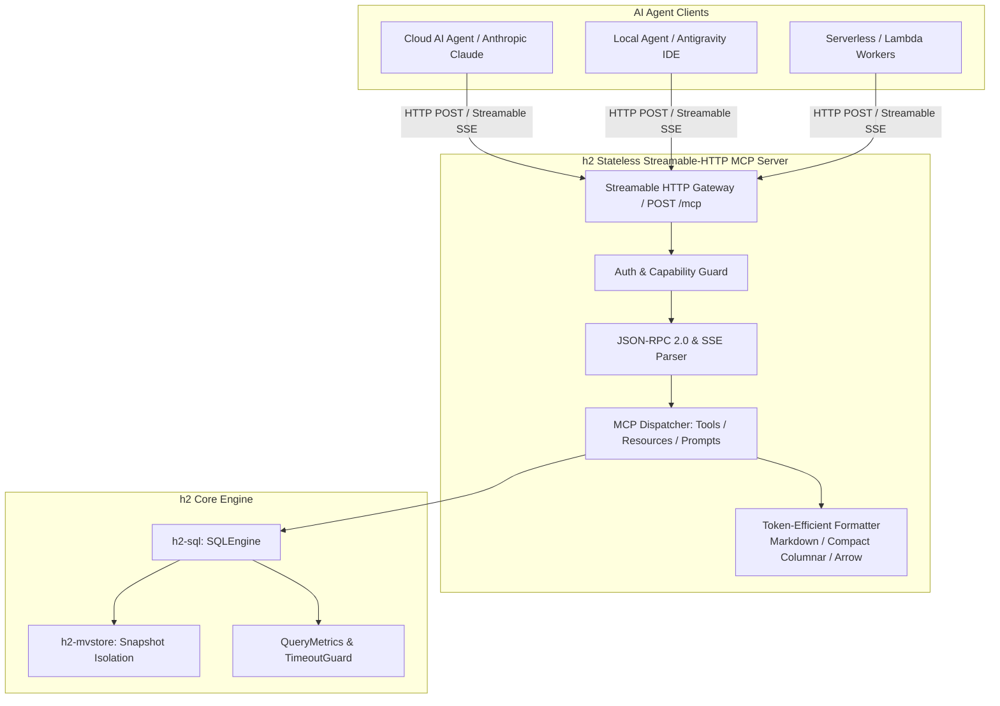

# 20. Stateless Streamable-HTTP MCP Server 設計方針

## 1. 背景と目的

近年、AI エージェント（Claude、ChatGPT、Gemini、ローカル LLM 等）が外部データソースと自律的に対話する標準プロトコルとして、**MCP (Model Context Protocol)** の採用が急速に拡大しています。

`h2database-rust` はこれまで、高エルゴノミクスな組込み Rust API、および PostgreSQL 互換ワイヤプロトコル（PGWire）を提供してきました。しかし、AI エージェントやサーバーレス環境からデータベースを利用する場合、従来の接続モデルには以下の課題が存在します：

1. **ステートフル接続のオーバーヘッド**:
   PGWire などの従来の DB プロトコルは持続的な TCP コネクションおよびセッション状態を前提としており、サーバーレス関数、エッジランタイム、あるいは大量の分散 AI ワーカーからのアクセス時にコネクション枯渇やロードバランシングの複雑化を招きます。
2. **トークン消費とコンテキストウィンドウの圧迫**:
   AI が理解しやすいスキーマ情報やクエリ結果を標準的な行指向 JSON で返却すると、カラム名が全行で重複し、LLM のコンテキストウィンドウとトークンコストを激しく浪費します。
3. **AI の誤動作（ハルシネーション等）に対する安全ガードレールの欠如**:
   エージェントが誤って意図しない DDL や無制限の全件走査を実行した場合、システム全体の可用性低下やデータ破損を引き起こすリスクがあります。
4. **長時間実行クエリの可視性**:
   数百万行の集約走査時にレスポンスが途絶すると、エージェント側でタイムアウトと誤認されます。

これらの課題を解決するため、`h2database-rust` の**オプション機能（`--features mcp`）**として、HTTP トランスポート上で軽量かつ完全ステートレスに動作し、進捗通知やチャンク配信をストリーミング可能な **Stateless Streamable-HTTP MCP Server** の設計方針を策定します。

---

## 2. 設計原則



1. **完全ステートレス (Stateless by Default)**:
   サーバー側に接続セッションを持たず、各 HTTP リクエストが自己完結します。任意のロードバランサー（Nginx、Envoy、Cloudflare 等）を介して水平スケール可能であり、Kubernetes やサーバーレス環境へのデプロイに最適化します。
2. **Streamable-HTTP / SSE トランスポート**:
   MCP 最新仕様の Streamable HTTP トランスポートに準拠します。単一の HTTP POST エンドポイント（`/mcp`）に対し、クライアントが `Accept: text/event-stream` を指定することで、クエリ進捗通知（Progress Notifications）や巨大結果セットのチャンク配信をリアルタイムにストリーミング（SSE: Server-Sent Events）します。
3. **ゼロコスト・モジュール設計 (Feature-gated)**:
   MCP 機能はスタンドアロンのクレート [`crates/h2-mcp`](file:///d:/workspace/h2database-rust/crates/h2-mcp) または `h2-server` のオプショナル Feature (`mcp`) として提供し、組み込み DB としてのみ利用するユーザーのバイナリサイズや依存関係に一切影響を与えません。
4. **AI に特化した安全ガードレール (Safety & Guardrails)**:
   デフォルトで安全な読み取り専用（Read-Only）トランザクションを強制し、最大行数・最大バイト数の厳格な上限、クエリタイムアウト強制、危険コマンド（`DROP TABLE` 等）の遮断機構をネイティブに備えます。
5. **トークン効率の高いレスポンス形式 (Token-Efficient Ergonomics)**:
   通常の冗長な JSON に加え、Markdown テーブル形式やカラム指向（Columnar）JSON、さらには分析用途向けの Apache Arrow IPC ストリームを選択可能にし、LLM のコンテキストトークン消費を最大 60〜80% 削減します。

---

## 3. システムアーキテクチャ

### 3.1 クレート構造と依存関係

```
h2database-rust/
├── crates/
│   ├── h2/              # 統合クレート
│   ├── h2-mvstore/      # MVCC ストレージエンジン
│   ├── h2-sql/          # SQL パーサー & 実行エンジン
│   ├── h2-server/       # PGWire サーバー
│   └── h2-mcp/          # [新規] Stateless Streamable-HTTP MCP Server クレート
```

`Cargo.toml` における定義方針：

```toml
[dependencies]
# h2-mcp クレート内
h2-types = { workspace = true }
h2-mvstore = { workspace = true }
h2-sql = { workspace = true }
axum = { version = "0.8", default-features = false, features = ["http1", "tokio", "json"] }
tokio = { workspace = true, features = ["sync", "time", "macros"] }
tokio-stream = { version = "0.1", features = ["sync"] }
serde = { workspace = true, features = ["derive"] }
serde_json = { workspace = true }
tower = { version = "0.5", features = ["timeout", "limit"] }
tower-http = { version = "0.6", features = ["cors", "trace"] }
tracing = { workspace = true }
```

### 3.2 HTTP エンドポイント仕様

| メソッド | パス | ヘッダー | 説明 |
| :--- | :--- | :--- | :--- |
| `POST` | `/mcp` | `Content-Type: application/json`<br/>`Accept: application/json, text/event-stream` | MCP JSON-RPC 2.0 リクエストのエントリポイント。ストリーミング指定時は SSE で結果や進捗を返却。 |
| `GET` | `/mcp` | `Accept: text/event-stream` | 双方向 SSE セッション確立用（オプション、MCP 2024-11 仕様互換）。 |
| `GET` | `/health` | なし | サーバー稼働状態および DB 接続チェック用ヘルスチェック。 |

---

## 4. MCP プロトコル・プリミティブ定義

MCP は **Tools（ツール）**, **Resources（リソース）**, **Prompts（プロンプト）** の3つの主要プリミティブで構成されます。

### 4.1 Tools（エージェントが実行するアクション）

AI がデータベースの探索・分析を安全かつ柔軟に行えるよう、以下のツールを公開します：

#### 1. `query_read` (推奨・デフォルト)
- **概要**: 読み取り専用クエリ（`SELECT`, `EXPLAIN`, `SHOW` 等）を安全に実行。
- **入力引数**:
  - `sql` (string, 必須): 実行する SQL 文。
  - `format` (string, オプション, デフォルト: `"markdown"`): 出力形式（`"markdown"`, `"compact_json"`, `"json"`, `"csv"`）。
  - `max_rows` (integer, オプション, デフォルト: `100`, 最大: `1000`): 返却する最大行数。
  - `timeout_ms` (integer, オプション, デフォルト: `5000`): クエリタイムアウト。
- **動作**: 暗黙の読み取り専用スナップショットトランザクション下で実行。万が一更新文（`UPDATE`, `INSERT`, `DELETE`）が含まれる場合は実行前に即座に拒否。

#### 2. `query_write`
- **概要**: データの挿入・更新・削除（DML/DDL）を実行。
- **入力引数**:
  - `sql` (string, 必須): 実行する SQL 文。
  - `dry_run` (boolean, オプション, デフォルト: `false`): `true` の場合、トランザクション内で実行した後に自動ロールバックし、変更予定件数のみを返却。
- **セキュリティ制約**: サーバー起動時に `--allow-write` フラグが明示的に指定されている場合、または認証トークンに書込み権限が含まれる場合のみ利用可能。

#### 3. `list_tables`
- **概要**: データベース内に存在する全テーブル、ビュー、キューテーブルの一覧とメタデータを返却。
- **返却情報**: テーブル名、スキーマ名、種類（TABLE/VIEW/QUEUE）、概算行数、物理ストレージ容量。

#### 4. `describe_table`
- **概要**: 特定テーブルの正確なスキーマ詳細を取得。
- **入力引数**:
  - `table_name` (string, 必須): 対象テーブル名。
- **返却情報**: 各カラムの名前、データ型、Nullable、主キー、デフォルト値、インデックス定義、外部キー制約。

#### 5. `explain_query`
- **概要**: SQL の実行計画を取得し、インデックス適用可否や推定コストを診断。
- **入力引数**:
  - `sql` (string, 必須): 診断対象 SQL。

#### 6. `get_table_statistics`
- **概要**: オプティマイザが保持する統計情報（NDV: 異なり値数、NULL 率、最頻値ヒストグラム）を取得。AI がクエリの結合順序や条件句を最適化する際の判断材料を提供。

---

### 4.2 Resources（AI に文脈として提供する静的・準静的データ）

LLM のプロンプトやコンテキストに直接注入できる URI スキームを提供します：

| URI | 説明 | 形式 |
| :--- | :--- | :--- |
| `h2://schema` | データベース全体の最新 DDL スキーマ定義 | `text/x-sql` |
| `h2://tables/{table_name}` | 指定テーブルのスキーマ定義および先頭サンプル 5 行 | `text/markdown` |
| `h2://metrics/live` | `SHOW QUERY STATS` による直近のクエリ性能メトリクスとホットスポット | `application/json` |

---

### 4.3 Prompts（AI の推論を補助するプロンプトテンプレート）

LLM クライアント（Claude Desktop や IDE 等）がワンクリックで呼び出せる定型ワークフローを提供します：

1. **`sql_analyst`**:
   - 目的: ユーザーの自然言語の問いを、`h2database-rust` の方言とインデックス特性に最適化された SQL に変換して実行・解説する。
   - コンテキスト: `h2://schema` を自動ロード。
2. **`performance_tuner`**:
   - 目的: 遅いクエリに対して `explain_query` と統計情報を参照し、インデックス追加案やクエリ書き換え案を提案する。

---

## 5. AI 特化の安全性ガードレールとトークン最適化

### 5.1 トークン消費削減フォーマットの対比

100 件のクエリ結果（カラム数 5）を返却する場合のトークン比較：

| フォーマット種別 | 表現例 | トークン消費量 (推定) | 特徴 |
| :--- | :--- | :---: | :--- |
| **標準 JSON** | `[{"id":1,"name":"Alice",...},{"id":2,...}]` | 100% (基準: ~2,500 tok) | カラム名が全行で重複し極めて非効率。 |
| **Compact Columnar** | `{"columns":["id","name"],"rows":[[1,"Alice"],[2,"Bob"]]}` | 約 45% (~1,100 tok) | カラム名が 1 回のみ。機械可読性が高く効率的。 |
| **Markdown Table** (推奨) | `\| id \| name \| ...\n\| 1 \| Alice \|` | **約 35% (~850 tok)** | LLM のアテンション機構が最も自然に構造認識でき、最少トークン。 |
| **CSV / TSV** | `id,name\n1,Alice\n2,Bob` | 約 30% (~750 tok) | 最小だが区切り文字のエスケープに注意が必要。 |

> [!TIP]
> `h2-mcp` では、ツールのデフォルト返却形式を **Markdown Table** とし、LLM のトークンコスト削減と認識精度の向上を両立させます。

### 5.2 安全性制御（Safety Limits）

```rust
pub struct McpSafetyConfig {
    /// デフォルト読み取り専用モード
    pub default_read_only: bool,
    /// 1クエリ当たりの最大返却行数（ハードリミット）
    pub max_rows_hard_limit: usize, // 例: 5,000
    /// 1クエリ当たりの最大レスポンスバイト数
    pub max_response_bytes: usize,  // 例: 4 MiB
    /// クエリ実行タイムアウト
    pub default_timeout: Duration,   // 例: 5秒
    /// 実行を拒否する危険コマンド
    pub blocked_statements: Vec<String>, // 例: ["VACUUM", "DROP DATABASE"]
}
```

1. **タイムアウトの確実な強制**:
   既存の [`h2_types::set_query_timeout`](file:///d:/workspace/h2database-rust/crates/h2-types/src/lib.rs) および `check_query_timeout()` 機構と連携し、B+Tree 走査中であっても指定時間を超過した瞬間に `QueryTimeout` エラーで即座に中断。
2. **メモリ上限による DoS 防止**:
   巨大な `SELECT * FROM pgbench_accounts` が要求されても、指定された `max_rows`（デフォルト 100 行）に達した時点で走査を打ち切り、`"Truncated: showing first 100 rows (total matches > 100)"` の警告を付与。

---

## 6. Streamable-HTTP 通信フロー

### 6.1 単一リクエスト/レスポンス (JSON モード)

クライアントが通常の JSON リクエストを送る場合：

```http
POST /mcp HTTP/1.1
Host: localhost:8080
Content-Type: application/json
Accept: application/json

{
  "jsonrpc": "2.0",
  "id": 1,
  "method": "tools/call",
  "params": {
    "name": "query_read",
    "arguments": {
      "sql": "SELECT aid, abalance FROM probe_accounts WHERE aid <= 3"
    }
  }
}
```

レスポンス：
```http
HTTP/1.1 200 OK
Content-Type: application/json

{
  "jsonrpc": "2.0",
  "id": 1,
  "result": {
    "content": [
      {
        "type": "text",
        "text": "| aid | abalance |\n|---|---|\n| 1 | 1000 |\n| 2 | 1000 |\n| 3 | 1000 |"
      }
    ],
    "isError": false
  }
}
```

### 6.2 ストリーミング / 進捗通知 (SSE モード)

時間のかかる大規模集約やチャンク走査時、クライアントが `Accept: text/event-stream` を送信した場合：

```http
POST /mcp HTTP/1.1
Host: localhost:8080
Content-Type: application/json
Accept: text/event-stream

{
  "jsonrpc": "2.0",
  "id": 2,
  "method": "tools/call",
  "params": {
    "name": "query_read",
    "arguments": {
      "sql": "SELECT COUNT(*), AVG(abalance) FROM pgbench_accounts"
    }
  }
}
```

レスポンス（Server-Sent Events による逐次配信）：

```http
HTTP/1.1 200 OK
Content-Type: text/event-stream
Cache-Control: no-cache
Transfer-Encoding: chunked

event: message
data: {"jsonrpc":"2.0","method":"notifications/progress","params":{"progressToken":2,"progress":250000,"total":1000000,"message":"Scanned 250,000 rows..."}}

event: message
data: {"jsonrpc":"2.0","method":"notifications/progress","params":{"progressToken":2,"progress":750000,"total":1000000,"message":"Scanned 750,000 rows..."}}

event: message
data: {"jsonrpc":"2.0","id":2,"result":{"content":[{"type":"text","text":"| count | avg |\n|---|---|\n| 1000000 | 1000.00 |"}]}}
```

> [!NOTE]
> SSE 接続を切断することなく、同一 HTTP トランスポート内で進捗率を通知できるため、AI エージェント側の「応答なしタイムアウト」を完全に防止できます。

---

## 7. 実装計画とロードマップ

### フェーズ 1: コアクレート新設と基本ツール実装
- [`crates/h2-mcp`](file:///d:/workspace/h2database-rust/crates/h2-mcp) クレートの作成。
- Axum ベースの Streamable-HTTP Gateway (`POST /mcp`) 実装。
- JSON-RPC 2.0 ディスパッチャの実装。
- コアツール: `query_read`, `list_tables`, `describe_table` の実装（Markdown 出力対応）。
- ガードレール（Read-Only 強制、行数制限、タイムアウト）の組み込み。

### フェーズ 2: 高度なツールとリソース・プロンプト拡充
- `explain_query`（実行計画取得）および `get_table_statistics` ツールの実装。
- MCP Resources (`h2://schema`, `h2://tables/{name}`) の実装。
- 認可・ケーパビリティ保護付き `query_write` ツールの実装（Dry-Run / Rollback 検証機能）。

### フェーズ 3: SSE ストリーミングとトークン最適化
- `text/event-stream` による進捗通知（Progress Notifications）ストリーミング。
- 巨大結果セットのチャンク別ストリーミング配信。
- Compact Columnar JSON および Arrow IPC 出力フォーマッタの実装。

### フェーズ 4: CLI およびスタンドアロンサーバー統合
- `h2-cli` に `--mcp` または `h2 mcp-server --port 8080 --database ./my_db.h2` コマンドを追加。
- Dockerfile および Kubernetes マニフェスト用設定の提供。
- Claude Desktop / Cursor / VSCode 等の AI ツール設定テンプレートの作成。

---

## 8. 期待される効果とまとめ

1. **AI ネイティブな DB アクセス基盤の確立**:
   PGWire ドライバーのセットアップや言語バインディングを必要とせず、AI エージェントが標準 MCP 経由で即座にデータベースを自律探索・分析可能になります。
2. **エッジ・サーバーレス適合性**:
   ステートレスな HTTP インターフェースにより、クラウド、Kubernetes、コンテナ、ローカル開発環境のいずれにおいてもコネクション管理不要でシームレスに運用できます。
3. **安全性の担保とトークンコストの大幅削減**:
   厳格なガードレールと Markdown/Columnar 出力により、AI による事故を防ぎつつ、最小限の LLM トークン消費で最大限のコンテキストを提供します。
