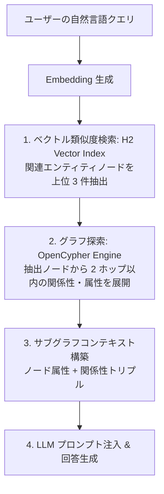

# 21. Neo4j 互換グラフデータベース（OpenCypher / Bolt）エンジン設計方針

## 1. ビジョンと開発背景

### 1.1 なぜ h2database-rust にグラフ機能を統合するのか

今日のリレーショナルデータベース（RDBMS）とグラフデータベースは、互いに異なる強みを持つ一方で、深刻なデータのサイロ化を引き起こしています：
- **RDBMS**: 高度なトランザクション整合性（ACID）、集約分析、厳格なスキーマ検証に優れるが、多対多の複雑な再帰的リレーションシップや多ホップの探索（Nホップの JOIN）において急激に性能が劣化する。
- **グラフデータベース（Neo4j 等）**: ソーシャルネットワーク、不正検知、レコメンデーション、ナレッジグラフなどのネットワーク走査・パス探索に特化しているが、重量な専用 JVM サーバーが必要で運用コストが高く、通常のリレーショナル業務データや集約クエリとのリアルタイムな連携が極めて困難。

さらに、近年の **生成 AI / LLM エコシステム（Knowledge Graph, GraphRAG）** の台頭により、「エンティティ間の関係性を辿るグラフ構造」と「非構造化データのベクトル表現」、そして「正確な業務テーブル」を同一のデータベース内で一気通貫に扱いたいという需要が爆発的に高まっています。

`h2database-rust` は、極めて高速な CoW B+Tree ストレージ（`MVStore`）とスナップショット分離（MVCC）を備えています。この強固な基盤の上に **Neo4j 互換のラベル付きプロパティグラフ（LPG: Labeled Property Graph）モデル** と **OpenCypher クエリ言語**、および **Bolt プロトコル** を統合することで、**「SQLite のように手軽に組み込め、リレーショナル × グラフ × ベクトル（GraphRAG）を同一 ACID トランザクション下で横断できる世界初のマルチモデル RDBMS」** を実現します。

---

## 2. コア設計原則

```mermaid
graph TD
    subgraph "External Graph Clients"
        N1[Neo4j Official Drivers<br/>Python, JS/TS, Java, Go]
        N2[Neo4j Browser / Cypher Shell]
        N3[LangChain / LlamaIndex / GraphRAG Agents]
    end

    subgraph "Interface Layer"
        Bolt[Bolt v4/v5 Protocol Server<br/>Port 7687]
        SQL_Cypher[Cypher-in-SQL Bridge<br/>GRAPH_TABLE / CYPHER clause]
        MCP_Graph[MCP Graph Tools<br/>graph_query, graph_traverse]
    end

    subgraph "Graph Engine (h2-graph)"
        Parser[OpenCypher AST Parser]
        Planner[Graph Logical/Physical Planner]
        Traversal[Graph Traversal Engine<br/>BFS / DFS / ShortestPath / Variable-Length]
    end

    subgraph "Multi-Model Storage Layer (h2-mvstore)"
        Nodes[Node Map: _g_nodes<br/>node_id -> Labels + Props]
        Edges[Edge Map: _g_edges<br/>edge_id -> Type + Src + Dst + Props]
        AdjOut[Outgoing Adjacency Index<br/>(src_id, type, edge_id) -> dst_id]
        AdjIn[Incoming Adjacency Index<br/>(dst_id, type, edge_id) -> src_id]
        LabelIdx[Label & Prop Inverted Index<br/>(label, prop_name, val) -> node_id]
    end

    N1 --> Bolt
    N2 --> Bolt
    N3 --> Bolt
    N3 --> MCP_Graph
    Bolt --> Parser
    SQL_Cypher --> Parser
    MCP_Graph --> Parser
    Parser --> Planner --> Traversal
    Traversal --> Nodes
    Traversal --> Edges
    Traversal --> AdjOut
    Traversal --> AdjIn
    Traversal --> LabelIdx
```

1. **Labeled Property Graph (LPG) の完全互換**:
   Neo4j と同一のデータモデル（ノード、有向エッジ、複数ラベル、キー・バリュー形式の動的プロパティ）をサポート。
2. **OpenCypher (ISO GQL 準拠) のネイティブ実行**:
   `MATCH`, `WHERE`, `RETURN`, `CREATE`, `MERGE`, `SET`, `DELETE`, 可変長パス探索（`-[:KNOWS*1..5]->`）、最短経路探索（`shortestPath()`）を高速実行。
3. **Neo4j Bolt Protocol (v4.4/v5.x) のネイティブ実装**:
   公式の `neo4j` Python ドライバ、JavaScript ドライバ、Neo4j Browser、Cypher-Shell からポート `7687` 経由でそのまま接続可能。
4. **MVStore 上での仮想 Index-Free Adjacency (B+Tree 隣接リスト)**:
   CoW B+Tree のプレフィックス走査（`scan_prefix_visible`）と範囲走査を活用し、エッジ走査を $O(\text{degree}(v))$ の局所探索として実現。
5. **完全な ACID / MVCC スナップショット整合性**:
   グラフの更新（ノード・エッジの作成・削除）は、リレーショナルテーブルと同一のトランザクション、UndoLog、WAL エンジンに統合され、完全な ACID 保証とロールバックを提供。
6. **GraphRAG（知識グラフ × ベクトル検索）のシームレス統合**:
   ノードのプロパティに `VECTOR(1536)` 等の埋め込みベクトルを持たせ、コサイン類似度で抽出したノードからグラフ探索を即座に開始可能。

---

## 3. ストレージ設計 (MVStore への LPG マッピング)

グラフデータを高速に探索・更新するため、グラフごとに以下の 5 つの内部マップを `h2-mvstore` 上に構築します。

### 3.1 物理マップ構成

| マップ名 | キー構造 | 値（Value）構造 | 役割・アクセス特性 |
| :--- | :--- | :--- | :--- |
| `_g_{name}_nodes` | `node_id: u64` (8 bytes) | `NodeRecord`:<br/>- `labels: Vec<String>`<br/>- `props: HashMap<String, Value>` | ノードの全プロパティおよびラベルを保持。点取得 $O(\log N)$。 |
| `_g_{name}_edges` | `edge_id: u64` (8 bytes) | `EdgeRecord`:<br/>- `edge_type: String`<br/>- `src_id: u64`<br/>- `dst_id: u64`<br/>- `props: HashMap<String, Value>` | エッジの全属性を保持。 |
| `_g_{name}_adj_out` | `(src_id, type_id, edge_id)` | `dst_id: u64` | **出エッジ隣接リスト**: `src_id` から伸びるエッジをプレフィックス走査で一括抽出。 |
| `_g_{name}_adj_in` | `(dst_id, type_id, edge_id)` | `src_id: u64` | **入エッジ隣接リスト**: `dst_id` に流入する逆方向エッジを高速逆引き。 |
| `_g_{name}_idx_label`| `(label, prop_name, prop_val)` | `node_id: u64` | **ラベル・プロパティ索引**: `MATCH (n:Person {email: '...'})` の開始点を $O(\log N)$ で特定。 |

### 3.2 仮想 Index-Free Adjacency の実現

専用グラフ DB（Neo4j）はディスク上の二重ポインタ（物理ポインタチェイン）による Index-Free Adjacency を誇りますが、クラッシュ耐性や断片化、ページキャッシュ整合性に課題を抱えます。

`h2database-rust` では、**Memcomparable 複合キーを用いた B+Tree プレフィックス走査** により、メモリ局所性の極めて高い走査を実現します：

```rust
// 出エッジ探索キーのエンコード
// [src_id: 8B big-endian] + [type_id: 4B] + [edge_id: 8B]
pub fn encode_adj_key(src_id: u64, type_id: Option<u32>) -> Vec<u8> {
    let mut buf = Vec::with_capacity(12);
    buf.extend_from_slice(&src_id.to_be_bytes());
    if let Some(t) = type_id {
        buf.extend_from_slice(&t.to_be_bytes());
    }
    buf
}
```

ノード $v$ から特定タイプのエッジを辿る場合：
1. `encode_adj_key(v, Some(type_id))` でプレフィックスを生成。
2. `tx.scan_prefix_visible(&adj_out_map, &prefix)` を呼出し。
3. B+Tree の同一リーフノード内に連続配置されたエッジ先（`dst_id`）がゼロコピーで瞬時に走査される（キャッシュミスを最小化）。

---

## 4. OpenCypher クエリ処理系

### 4.1 サポートする主要構文

```cypher
// 1. 基本パターンマッチ
MATCH (p:Person)-[:WORKS_AT]->(c:Company {name: 'Acme'})
WHERE p.age >= 30
RETURN p.name, p.age, c.location

// 2. 多ホップおよび可変長パス探索 (Variable-Length Path)
MATCH path = (a:Person {name: 'Alice'})-[:KNOWS*1..3]->(b:Person)
RETURN b.name, length(path)

// 3. 最短経路探索 (Shortest Path)
MATCH (start:Person {name: 'Alice'}), (target:Person {name: 'Bob'})
MATCH p = shortestPath((start)-[:KNOWS*]-(target))
RETURN p

// 4. データ操作 (Mutation)
CREATE (u:User {id: 101, name: 'Carol'})
MATCH (a:User {id: 100}), (b:User {id: 101})
CREATE (a)-[:FOLLOWS {since: 2026}]->(b)

// 5. MERGE (Upsert)
MERGE (c:Country {code: 'JP'})
ON CREATE SET c.created = timestamp()
ON MATCH SET c.accessed = timestamp()
```

### 4.2 グラフ実行プランナと探索アルゴリズム

```mermaid
graph LR
    CypherText[OpenCypher Query] --> Lexer[Cypher Lexer / Parser]
    Lexer --> AST[Cypher AST]
    AST --> Analyzer[Graph Semantic Analyzer]
    Analyzer --> LPlan[Graph Logical Plan]
    LPlan --> Optimizer[Cost-Based Graph Optimizer]
    Optimizer --> PPlan[Physical Execution Plan]
    
    subgraph "Graph Operators"
        NodeScan[NodeByLabelScan]
        Expand[Expand (1-Hop Traversal)]
        VarExpand[VarLengthExpand (BFS/DFS)]
        Shortest[ShortestPath (Bidirectional BFS)]
        Filter[Property Filter]
        Project[Cypher Projection]
    end

    PPlan --> NodeScan --> Expand --> Filter --> Project
```

1. **始点ノードの決定 (Anchor Selection)**:
   `MATCH (a:Person {email: '...'})-[:KNOWS]->(b)` において、最も選択率の低い（件数が絞り込める）ノードを統計情報から選択し、`_g_idx_label` を用いて開始ノードを特定。
2. **1-Hop 展開 (Expand Operator)**:
   出エッジ/入エッジマップを B+Tree シークし、接続先ノードをパイプラインストリーミング。
3. **可変長パス展開 (VarLengthExpand)**:
   - 深さ優先探索（DFS）: 長いパスの探索やパス全体の列挙に適用。
   - 幅優先探索（BFS）: 浅い探索（1〜2ホップ）や最短経路探索に適用。
   - 双方向探索（Bidirectional Search）: 両端ノードが固定された `shortestPath()` において、始点と終点の双方から同時に探索境界（Frontier）を広げ、交差した時点で即時終了（探索空間を $O(b^d)$ から $O(b^{d/2})$ に圧縮）。

---

## 5. Neo4j Bolt Protocol (v4.4/v5.x) サーバー設計

Neo4j の公式エコシステム（ドライバ、GUI、ツール）と無改造で接続できるよう、Bolt バイナリプロトコルをネイティブ実装します。

### 5.1 Bolt プロトコルの基本構造

- **デフォルトポート**: `7687`（TCP）
- **マジックバイト**: `0x60 0x60 0xB0 0x17`
- **ハンドシェイク**: クライアントとサーバー間で対応バージョン（5.0, 4.4 等）をネゴシエーション。
- **PackStream エンコーディング**:
  Neo4j 独自のマジックプレフィックス付きバイナリシリアライザ。
  - 基本型: Null, Boolean, Integer, Float, String, List, Map
  - グラフ構造体: Node (`N`), Relationship (`R`), Path (`P`), UnboundRelationship (`r`)

### 5.2 メッセージシーケンス

```
Client                                Server
  │                                     │
  │─── Magic + Version Negotiation ────>│
  │<── Agreed Version (e.g. 5.0) ───────│
  │                                     │
  │─── HELLO {scheme: "basic", ...} ───>│
  │<── SUCCESS {server: "h2-graph/0.1"}─│
  │                                     │
  │─── RUN "MATCH (n:Person) RETURN n" ─>│
  │─── PULL {n: 100} ──────────────────>│
  │<── SUCCESS {fields: ["n"]} ─────────│
  │<── RECORD [ Node(1, ["Person"], ..)]│
  │<── SUCCESS {has_more: false} ───────│
  │                                     │
  │─── GOODBYE ────────────────────────>│
```

> [!TIP]
> 既存の `h2-server`（PGWire サーバー）と同様に、Tokio 非同期タスクプール上で Bolt リスナーを並行稼働させることで、同一バイナリで PostgreSQL ポート（5433）と Neo4j ポート（7687）を同時に待ち受けることが可能です。

---

## 6. GraphRAG & ポリグロット（マルチモデル）連携

### 6.1 リレーショナル SQL 内での Cypher 実行 (Cypher-in-SQL)

業務システム内の既存 SQL クエリからグラフエンジンをシームレスに呼び出せるよう、SQL 関数 `CYPHER()` および SQL/PGQ 標準ライクな `GRAPH_TABLE` を提供します：

```sql
-- 顧客テーブルとグラフ推薦エンジンのリアルタイム結合
SELECT 
    u.id, 
    u.email, 
    g.recommended_product_id,
    g.score
FROM users u
CROSS JOIN CYPHER('social_graph', 
    'MATCH (p:Person {user_id: ' || u.id || '})-[:FRIENDS_WITH]->(f)-[:BOUGHT]->(prod:Product)
     RETURN prod.id AS recommended_product_id, count(*) AS score
     ORDER BY score DESC LIMIT 5'
) AS g
WHERE u.status = 'active';
```

### 6.2 知識グラフ × ベクトル検索（GraphRAG アーキテクチャ）



```cypher
// ベクトル類似度による始点特定 + グラフコンテキスト探索
MATCH (n:Document)
WHERE vector_similarity(n.embedding, $query_vector) > 0.85
MATCH path = (n)-[:REFERENCES|AUTHORED_BY*1..2]-(context)
RETURN n.title, relationships(path), context
```

---

## 7. 実装計画とクレート分割

### 7.1 ディレクトリ構成

```
crates/
├── h2-graph/              # グラフモデル、OpenCypher パーサー/プランナ/実行器
│   ├── Cargo.toml
│   └── src/
│       ├── model.rs       # Node, Edge, Path, Value 定義
│       ├── parser/        # Cypher 字句解析・構文解析
│       ├── planner/       # 論理/物理プランナ
│       ├── traversal/     # BFS, DFS, ShortestPath アルゴリズム
│       └── store/         # MVStore への B+Tree マッピング実装
├── h2-bolt/               # Neo4j Bolt v4/v5 プロトコルサーバー
│   ├── Cargo.toml
│   └── src/
│       ├── packstream.rs  # PackStream バイナリシリアライザ
│       ├── session.rs     # Bolt セッション状態管理
│       └── server.rs      # Tokio ベースの Bolt リスナー
```

### 7.2 段階的開発マイルストーン

| フェーズ | 開発項目 | 成果物・検証基準 |
| :--- | :--- | :--- |
| **Phase 1** | コア LPG ストレージと基本 Cypher | ノード・エッジの CRUD、隣接 B+Tree マッピング、基本 `MATCH (n)-[r]->(m)` の実行。組み込み API での動作。 |
| **Phase 2** | 高度なパスマッチと最短経路 | 可変長パス（`*1..N`）、`shortestPath()`、`MERGE`、`SET`、集約関数の実装。 |
| **Phase 3** | Neo4j Bolt プロトコルサーバー | Bolt v4.4/v5.0 ハンドシェイク、PackStream、公式 Python `neo4j` ドライバからの接続・クエリ実行の完全パス。 |
| **Phase 4** | SQL 連携と GraphRAG | `CYPHER()` SQL テーブル関数、`VECTOR` 型とのハイブリッド検索、MCP ツール（`graph_query`）の提供。 |

---

## 8. まとめ

`h2database-rust` に Neo4j 互換のグラフエンジンを統合することにより：
1. **運用の劇的シンプル化**: 高価で重量な専用グラフ DB クラスタを運用することなく、単一の軽量バイナリでリレーショナルとグラフを完結。
2. **Neo4j エコシステムの即時活用**: Bolt プロトコル準拠により、既存のクライアントコードや BI/可視化ツール（Neo4j Browser、Bloom、Cypher Shell 等）を無改造で接続可能。
3. **AI 時代（GraphRAG）の決定打**: 同一 ACID トランザクション内で業務データ・知識グラフ・ベクトル埋め込みが融合し、次世代 AI エージェント開発に最適なデータ基盤を提供します。
