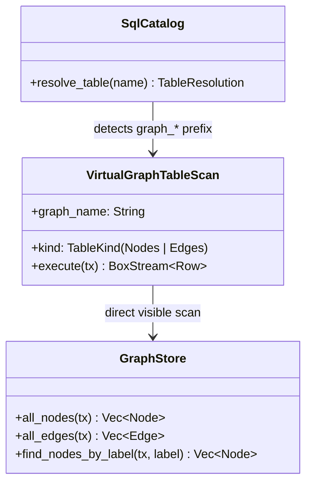
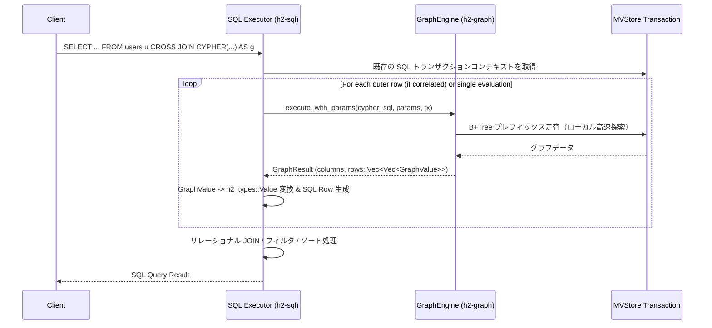
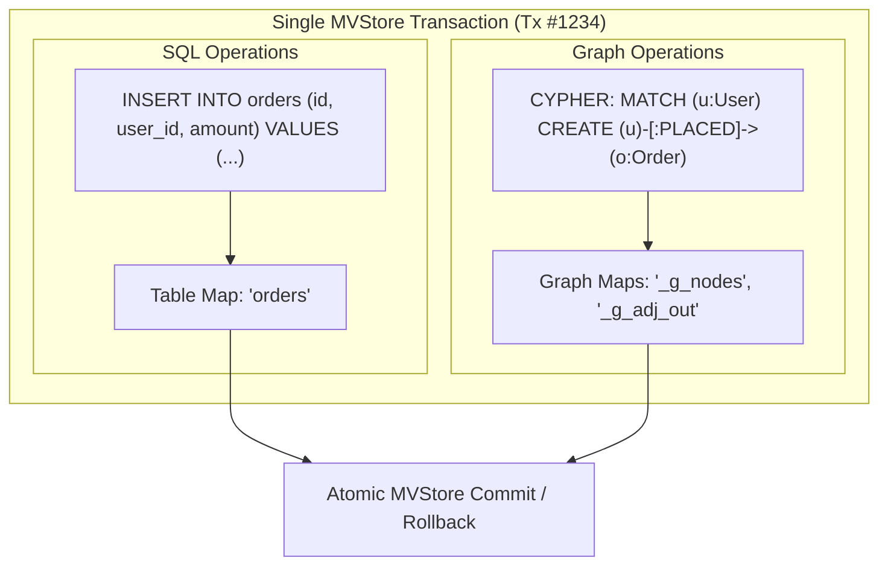
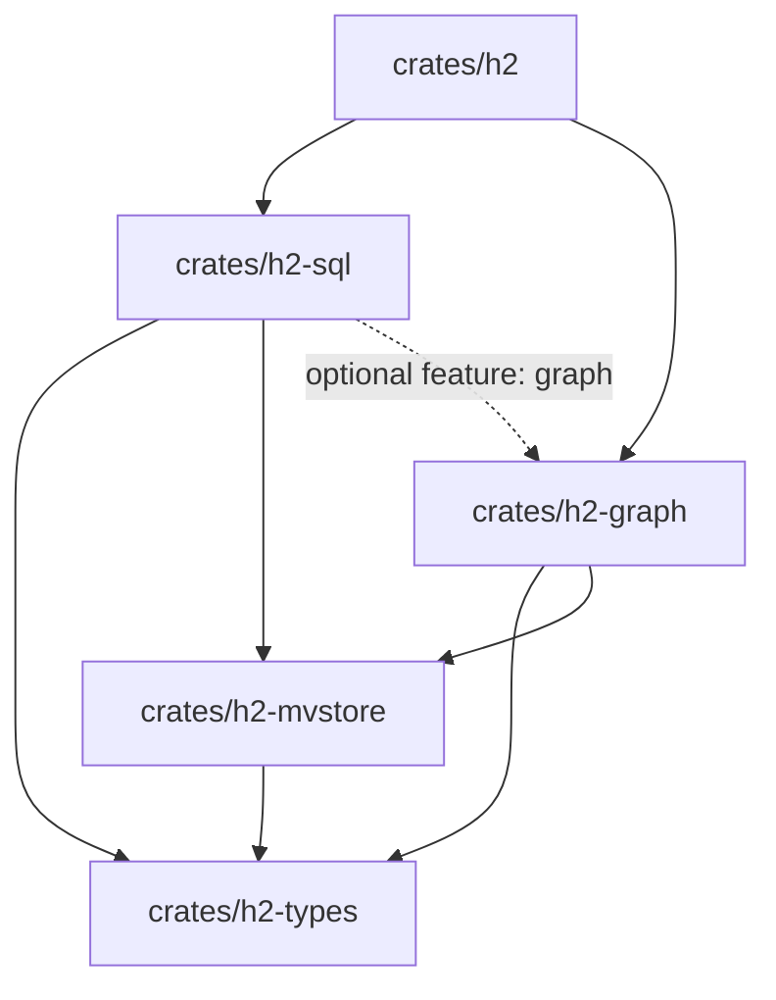

# 22. グラフDB × リレーショナル SQL 統合アクセス機能設計方針 (Cypher-in-SQL / Virtual Graph Tables / SQL:2023 PGQ)

## 1. 背景と目的

`h2database-rust` は、リレーショナル SQL エンジン（`h2-sql`）と、Neo4j 互換の Labeled Property Graph（LPG）エンジン（`h2-graph` / `h2-bolt`）を単一のストレージエンジン（`h2-mvstore`）上で稼働させるマルチモデル（Polyglot / Multi-Model）データベース基盤を備えています。

しかし、現行の実装ではグラフデータへのアクセスは主に Neo4j Bolt プロトコルおよび組み込み Cypher 実行エンジン経由に限定されており、**「既存の SQL クエリや BI ツール、PostgreSQL 互換クライアントからグラフノードやエッジを直接参照・結合（JOIN）したい」** という要求を満たすには、両者の境界をシームレスにブリッジする仕組みが不可欠です。

本設計書では、リレーショナル SQL からグラフデータベースのノード・エッジへ柔軟かつ高速にアクセス可能とするための方式を比較検討し、`h2database-rust` に最適な統合アーキテクチャと段階的実装計画を提案します。

---

## 2. 達成すべきゴールと主要ユースケース

```mermaid
graph TD
    subgraph "SQL Engine (h2-sql)"
        SQLQuery[SQL Query / BI Tools / PGWire Client]
        SQLParser[SQL Parser & Catalog]
        SQLExec[SQL Query Planner & Executor]
    end

    subgraph "Graph Integration Layer"
        VTab[1. Virtual Graph Tables<br/>graph_nodes / graph_edges]
        TVF[2. Cypher Table-Valued Function<br/>CYPHER('graph', 'MATCH...')]
        PGQ[3. SQL:2023 SQL/PGQ<br/>GRAPH_TABLE(...)]
        Views[4. Typed Label Views<br/>v_person / v_company]
    end

    subgraph "Storage & Graph Engine (h2-mvstore / h2-graph)"
        GraphEng[GraphEngine / OpenCypher Executor]
        StoreMap[GraphStore B+Tree Maps<br/>_g_nodes / _g_edges / _g_adj / _g_idx]
        MVS[MVStore Shared ACID Transaction]
    end

    SQLQuery --> SQLParser --> SQLExec
    SQLExec --> VTab --> StoreMap
    SQLExec --> TVF --> GraphEng --> StoreMap
    SQLExec --> PGQ --> GraphEng
    SQLExec --> Views --> VTab
    StoreMap --> MVS
```

### ユースケース 1: 仮想テーブルによる透過的 SQL 照会 (Virtual Graph Tables)
- ノード一覧（`nodes`）やエッジ一覧（`edges`）を、特別な前準備なしに通常の SQL テーブルとして参照。
- 既存の BI ツール（Metabase, DBeaver, Tableau 等）から標準 SQL で直接データウェアハウス分析や可視化を実行。
  ```sql
  SELECT labels, count(*) AS node_count
  FROM graph_social_nodes
  GROUP BY labels;
  ```

### ユースケース 2: Cypher-in-SQL テーブル値関数 (Table-Valued Function)
- 複雑なグラフ探索（可変長パス展開や最短経路探索など、SQL 再帰 CTE では記述が困難または非効率な処理）を Cypher で実行し、結果を SQL テーブルとして取り出してリレーショナルテーブルと結合（JOIN）。
  ```sql
  SELECT u.id, u.name, r.recommended_product_id, r.score
  FROM users u
  CROSS JOIN CYPHER('recommender',
      'MATCH (p:Person {user_id: ' || u.id || '})-[:FRIENDS_WITH*1..2]->(f)-[:BOUGHT]->(prod:Product)
       RETURN prod.id AS recommended_product_id, count(*) AS score
       ORDER BY score DESC LIMIT 5'
  ) AS r;
  ```

### ユースケース 3: 国際標準 SQL:2023 Property Graph Queries (SQL/PGQ)
- ISO/IEC 9075:2023 (SQL:2023) に準拠した `GRAPH_TABLE` 構文のサポート。
- 標準的な SQL 構文のみでグラフパターンマッチングを行い、リレーショナル結果セットへ射影。
  ```sql
  SELECT a_name, b_name, friendship_years
  FROM GRAPH_TABLE ( social_graph
      MATCH (a:Person)-[r:KNOWS]->(b:Person)
      COLUMNS (a.name AS a_name, b.name AS b_name, r.since AS friendship_years)
  ) AS gt
  WHERE friendship_years >= 3;
  ```

### ユースケース 4: ラベル別型付き仮想ビュー (Typed Label Views)
- グラフ内のプロパティは JSON/Map として格納されているが、頻出ラベル（例: `Person`, `Company`）に対してスキーマ推論または DDL 定義に基づいて型付きカラム（`id BIGINT, name TEXT, age INT`）を持つ SQL ビューを自動/手動公開。

### ユースケース 5: 同一トランザクション内での双方向 CRUD (Bidirectional Mutations)
- SQL トランザクション内で RDBMS テーブルへの書き込みと、グラフノード・エッジへの書き込みを同時に行い、アトミックにコミット（Two-Phase Commit 不要）。

---

## 3. アプローチ比較と技術選定

他主要 RDBMS およびグラフ拡張（PostgreSQL + Apache AGE, Oracle Database 23ai + PGQL, DuckDB + DuckPGQ, SQL Server Graph）のアーキテクチャを比較します。

| 方式 | 概要 | 長所 | 短所 | 本プロジェクトでの採用方針 |
| :--- | :--- | :--- | :--- | :--- |
| **A. 仮想テーブル方式 (Virtual Tables)** | `graph_<name>_nodes`, `graph_<name>_edges` をシステム仮想テーブルとして SQL カタログへ自動露出。 | - 実装が素直で既存オプティマイザ・Executor をそのまま活用可能。<br/>- 全 BI ツールが無改造で動作。 | - 複数ホップのトラバーサルを行う場合、SQL 上で多重 JOIN が必要になり非効率。 | **◎ コア機能として必須採用（Phase 1）** |
| **B. テーブル値関数方式 (Cypher-in-SQL)** | `CYPHER(graph_name, query_text)` を SQL テーブル値関数（TVF）として提供。 | - 多ホップ探索・最短経路をグラフエンジンの高速 B+Tree シーク（$O(\text{deg}(v))$）で解ける。<br/>- RDBMS テーブルとの `CROSS JOIN / LATERAL` が極めて強力。 | - クエリ内の Cypher が文字列リテラルになるため、構文エラーが実行時まで遅延。 | **◎ 最重要機能として採用（Phase 2）** |
| **C. SQL:2023 PGQ 方式 (`GRAPH_TABLE`)** | ISO SQL:2023 標準の `GRAPH_TABLE ( graph MATCH ... COLUMNS ... )` 構文をネイティブ解析。 | - 国際標準準拠。<br/>- IDE の構文ハイライトや静的型チェックが効く。 | - `sqlparser-rs` の構文パーサ拡張または AST 変換レイヤが必要。 | **○ 発展的拡張として採用（Phase 3）** |
| **D. 自動動的ビュー方式 (Auto Views)** | ノードのラベルごとに、プロパティをカラム展開したビュー `v_<label>` を自動定義。 | - ユーザーが `properties->>'age'` などの JSON 演算子を書かずに済む。 | - 属性がスキーマレスで動的な場合、ビューの型定義更新コストが発生。 | **○ オプション機能として採用（Phase 4）** |

---

## 4. 詳細アーキテクチャ設計

### 4.1 仮想グラフテーブル・プロバイダ (Virtual Graph Tables)

`h2-sql` のカタログ管理（`catalog.rs`）およびエグゼキュータ（`executor.rs`）を拡張し、テーブル名がプレフィックス `graph_<name>_nodes` および `graph_<name>_edges` にマッチした場合、MVStore の内部グラフ B+Tree マップをダイレクトにスキャンします。



#### テーブルスキーマ定義

1. **ノードテーブル (`graph_<name>_nodes`)**:
   | カラム名 | データ型 | 説明 |
   | :--- | :--- | :--- |
   | `id` | `BIGINT` | ノードの一意識別子（内部 ID） |
   | `labels` | `ARRAY(TEXT)` | 付与されているラベル一覧（例: `['Person', 'Admin']`） |
   | `properties` | `JSON` | ノード属性の JSON オブジェクト（例: `{"name":"Alice","age":30}`） |

2. **エッジテーブル (`graph_<name>_edges`)**:
   | カラム名 | データ型 | 説明 |
   | :--- | :--- | :--- |
   | `id` | `BIGINT` | エッジの一意識別子 |
   | `src_id` | `BIGINT` | 始点ノード ID |
   | `dst_id` | `BIGINT` | 終点ノード ID |
   | `type` | `VARCHAR(128)` | エッジの種類（関係性タイプ、例: `'KNOWS'`） |
   | `properties` | `JSON` | エッジ属性の JSON オブジェクト |

#### クエリ実行例
```sql
-- 1. ノード一覧の取得と JSON 属性展開
SELECT 
    id, 
    labels, 
    properties->>'name' AS name, 
    CAST(properties->>'age' AS INTEGER) AS age
FROM graph_social_nodes
WHERE 'Person' = ANY(labels)
ORDER BY age DESC;

-- 2. ノードとエッジの結合（1-Hop トラバーサル）
SELECT 
    src.properties->>'name' AS from_user,
    e.type AS relation,
    e.properties->>'since' AS since_year,
    dst.properties->>'name' AS to_user
FROM graph_social_edges e
JOIN graph_social_nodes src ON e.src_id = src.id
JOIN graph_social_nodes dst ON e.dst_id = dst.id
WHERE e.type = 'KNOWS';
```

---

### 4.2 テーブル値関数 `CYPHER()` の構文と実行モデル

SQL の `FROM` 句において、テーブル値関数（TVF: Table-Valued Function）として `CYPHER()` を呼び出し可能にします。

#### 構文定義
```sql
CYPHER(
    graph_name_expr, 
    cypher_query_expr 
    [, json_parameters_expr ]
) [ AS alias [ ( column_alias, ... ) ] ]
```

#### 実行パイプライン



1. **AST レベルの処理**:
   `sqlparser::ast::TableFactor::TableFunction { expr, alias, .. }` において、関数名が `CYPHER` であるかを識別。
2. **型推論と射影**:
   - `AS g(col1, col2)` のようにカラムエイリアスが明示されている場合は、そのカラム名を採用。
   - 省略された場合は、Cypher の `RETURN` 句で指定された列名（または alias）をそのまま SQL のカラム名として採用。
   - `GraphValue` から `h2_types::Value` への変換（スカラー値、JSON、文字列等）。
3. **パラメータ連携**:
   第 3 引数に JSON オブジェクトや外部クエリのパラメータマップを渡すことで、Cypher 内の `$param` をバインド可能。

---

### 4.3 ISO SQL:2023 (SQL/PGQ) `GRAPH_TABLE` 構文

SQL:2023 規格で正式導入された Property Graph Queries (PGQ) 構文をサポートします。

```sql
SELECT g.source_name, g.target_name, g.hops
FROM GRAPH_TABLE ( social_graph
    MATCH (a:Person)-[e:KNOWS*1..3]->(b:Person)
    WHERE a.country = 'JP'
    COLUMNS (
        a.name AS source_name,
        b.name AS target_name,
        length(e) AS hops
    )
) AS g
JOIN customers c ON c.name = g.source_name;
```

#### 実装方式: Cypher トランスパイル方式
- SQL パーサが `GRAPH_TABLE` ブロックを検知した際、内部的に等価な Cypher 表現へ変換：
  ```
  GRAPH_TABLE(graph MATCH pattern WHERE cond COLUMNS (expr AS alias, ...))
  ==> CYPHER('graph', 'MATCH pattern WHERE cond RETURN expr AS alias, ...')
  ```
- この変換により、既存の `GraphEngine` の高度な最適化器（最短経路、双方向 BFS、ラベルインデックス）を 100% 再利用し、二重実装のオーバーヘッドをゼロにします。

---

### 4.4 同一トランザクション（ACID / MVCC）連携モデル

`h2database-rust` の最大の強みは、リレーショナル SQL とグラフデータベースが **同一の `h2-mvstore` エンジンおよび同一トランザクション ID** で動作する点にあります。



1. **スナップショット分離の統一**:
   SQL クエリが開始された際のスナップショットバージョンでグラフエンジンも走査を行うため、**ファントムリードやダーティリードのない完全な一貫性** が保たれます。
2. **アトミックコミット**:
   SQL 側の `COMMIT` または `ROLLBACK` 一発で、リレーショナルテーブルとグラフの更新が完全に同期して確定・取り消しされます。外部の分散トランザクション（XA / 2PC）は一切不要です。

---

### 4.5 プッシュダウン最適化 (Filter Pushdown & Index Seek)

仮想テーブル `graph_<name>_nodes` に対するクエリを最適化します：

```sql
SELECT * FROM graph_social_nodes 
WHERE 'Person' = ANY(labels) AND properties->>'email' = 'alice@example.com';
```

- **ナイーブな実行**: `all_nodes` で全ノードを走査し、SQL 実行エンジン上でフィルタ。
- **最適化された実行 (CBO Pushdown)**:
  1. SQL プランナが `WHERE` 句内の `'Person' = ANY(labels)` 条件を抽出。
  2. `GraphStore::find_nodes_by_label_and_prop("Person", "email", "alice@example.com")` へプッシュダウン。
  3. B+Tree インデックス `_g_social_idx_label` を用いて、該当する数件のノードのみを直接シーク。
  4. データスキャン量を数万〜数百万倍削減。

---

## 5. 具体的なクエリ・連携シナリオ

### シナリオ 1: 顧客テーブル（SQL）× ソーシャルグラフ（Cypher）のリアルタイム推薦
```sql
-- 過去 30 日間にアクティブなユーザーについて、友人ネットワーク経由の推薦商品をリアルタイム集計
SELECT 
    u.id AS user_id,
    u.name AS user_name,
    rec.product_id,
    p.title AS product_title,
    p.price,
    rec.recommendation_score
FROM users u
CROSS JOIN LATERAL CYPHER('recommendation_graph',
    'MATCH (me:User {id: ' || u.id || '})-[:FOLLOWS]->(f:User)-[:FAVORITED]->(prod:Product)
     WHERE NOT (me)-[:FAVORITED]->(prod)
     RETURN prod.id AS product_id, count(f) AS recommendation_score
     ORDER BY recommendation_score DESC LIMIT 3'
) AS rec
JOIN products p ON p.id = rec.product_id
WHERE u.status = 'active';
```

### シナリオ 2: 不正送金検知（Anti-Money Laundering / Fraud Detection）
```sql
-- リレーショナル口座テーブルから高額送金口座を抽出し、マネーロンダリングの循環送金パスを最短経路で特定
WITH SuspiciousAccounts AS (
    SELECT account_id, sum(amount) AS total_outflow
    FROM transactions
    WHERE tx_time >= NOW() - INTERVAL '24 HOURS'
    GROUP BY account_id
    HAVING sum(amount) > 10000000
)
SELECT 
    s.account_id,
    path_info.cycle_length,
    path_info.path_summary
FROM SuspiciousAccounts s
CROSS JOIN CYPHER('banking_graph',
    'MATCH p = (acc:Account {id: ' || s.account_id || '})-[:TRANSFERRED*2..5]->(acc)
     RETURN length(p) AS cycle_length, [n in nodes(p) | n.id] AS path_summary
     LIMIT 1'
) AS path_info;
```

### シナリオ 3: GraphRAG（知識グラフ × ベクトル類似度検索）
```sql
-- ベクトル検索で上位類似文書を抽出し、知識グラフで引用・共著者関係を展開して AI コンテキストを生成
WITH RelevantDocs AS (
    SELECT id, title, embedding
    FROM documents
    ORDER BY vector_distance(embedding, $query_vector) ASC
    LIMIT 3
)
SELECT 
    rd.id,
    rd.title,
    ctx.entities,
    ctx.citations
FROM RelevantDocs rd
CROSS JOIN CYPHER('knowledge_graph',
    'MATCH (d:Doc {id: ' || rd.id || '})-[r:CITES|MENTIONS*1..2]->(entity)
     RETURN collect(DISTINCT entity.name) AS entities, count(r) AS citations'
) AS ctx;
```

---

## 6. 実装計画とクレート設計

### 6.1 クレート依存関係

循環参照を防ぐため、依存関係は以下のように整理します：



- `crates/h2-sql/Cargo.toml` に `graph = ["dep:h2-graph"]` feature を追加。
- `h2-sql` が `h2-graph` の `GraphEngine` を呼び出して `CYPHER()` 関数および仮想テーブルを解決。

### 6.2 段階的開発マイルストーン

| フェーズ | 実装項目 | 内容・検証基準 |
| :--- | :--- | :--- |
| **Phase 1** | 仮想グラフテーブル (`graph_*_nodes`, `graph_*_edges`) | - カタログの動的テーブル解決機能。<br/>- ノード/エッジの全件 SELECT、WHERE、JOIN、COUNT の動作確認。 |
| **Phase 2** | Cypher-in-SQL テーブル値関数 `CYPHER()` | - `TableFactor::TableFunction` 解析と Executor への組み込み。<br/>- Cypher 実行結果（GraphValue）から SQL 行への動的バインディング。<br/>- `CROSS JOIN CYPHER(...)` 結合テスト。 |
| **Phase 3** | プッシュダウン最適化 (Index Pushdown) | - WHERE 句のラベル・プロパティ条件を `GraphStore` のインデックス探索へプッシュダウン。<br/>- 大規模グラフでの SELECT 実行計画とベンチマーク検証。 |
| **Phase 4** | SQL:2023 PGQ 構文 (`GRAPH_TABLE`) & 動的型付きビュー | - `GRAPH_TABLE (...)` の Cypher トランスパイル実行。<br/>- `v_<label>` 型付きビューの自動生成ユーティリティ。 |

---

## 7. まとめ

本設計方針により、`h2database-rust` は以下の価値を提供します：

1. **境界のないマルチモデル統合**:
   リレーショナルデータとグラフデータが同一プロセス・同一トランザクション内でシームレスに結合し、データ複製や同期遅延の課題を根絶。
2. **既存エコシステムとの 100% 互換**:
   BI ツールや PostgreSQL クライアントからは標準 SQL テーブルとして見え、グラフ専門ツールや Python アプリからは Neo4j Bolt プロトコルとして見える「デュアルインターフェース」の実現。
3. **GraphRAG・次世代 AI ワークロードへの即時対応**:
   SQL テーブル関数 `CYPHER()` を用いることで、ベクトル検索とグラフ探索を 1 本の SQL クエリに融合し、洗練された知識グラフ RAG パイプラインを容易に構築可能。
