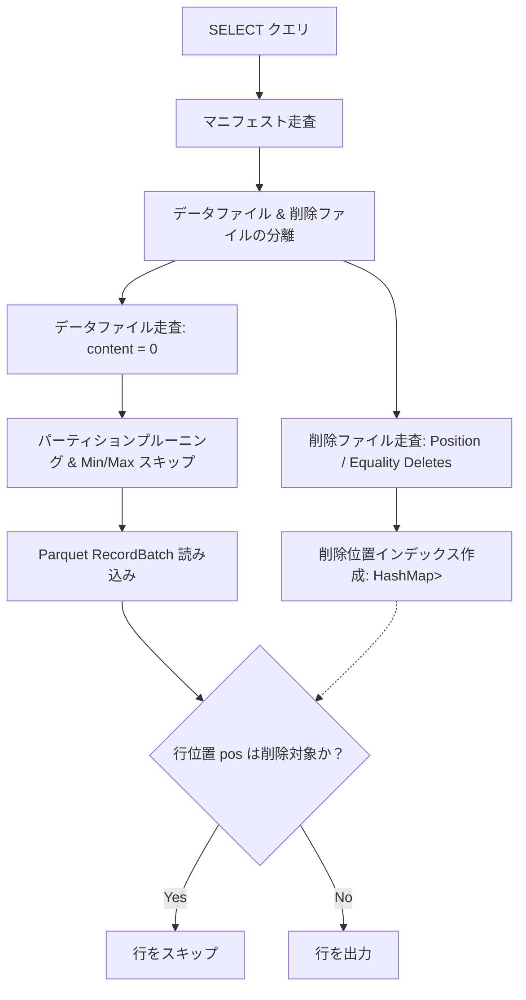

# 30. Apache Iceberg 形式外部テーブル統合（読み込み・書き込み・タイムトラベル）設計方針書

## 1. 概要と背景・目的

### 1.1 背景
現代のデータ基盤アーキテクチャでは、オブジェクトストレージや分散ストレージ上のオープンなテーブルフォーマットとして **Apache Iceberg** がデファクトスタンダードとして広く普及しています。
従来、リレーショナルデータベース（RDBMS）とレイクハウス（Lakehouse）は別系統のシステムとして運用され、ETL/ELT ツールを介してデータをバッチ同期するのが一般的でした。しかし、これには以下の課題が存在します：
- **データ二重化と同期遅延**: レイクハウス上の Parquet/Iceberg データを RDB 側に複製するための遅延とストレージコスト。
- **アーキテクチャのサイロ化**: 高速トランザクション（OLTP）エンジンと大規模分析（OLAP）ストレージのクエリインターフェースの分断。
- **メタデータ管理の重複**: スキーマ定義やスナップショット管理が各エンジンで個別に行われる。

### 1.2 目的
本設計は、H2 データベースエンジンに対して **Apache Iceberg Table Spec (v2) 準拠の外部テーブル（External Table）** 機能を統合し、以下の要件を実現することを目的とします：
1. **外部テーブルとしての透過的定義**:
   標準 SQL の DDL（`CREATE EXTERNAL TABLE ... STORED AS ICEBERG LOCATION '...'` または `WITH (TYPE = 'ICEBERG', LOCATION = '...')`）により、指定したディレクトリ/ストレージパスの Iceberg データを外部テーブルとして定義可能にする。
2. **標準 Parquet カラムナーファイルの直接読み込み（Read）**:
   Apache Arrow / Parquet 公式クレート（`parquet`, `arrow`）を活用し、Iceberg のマニフェストファイルおよびマニフェストリストを走査して対象の Parquet データファイルを直接高速走査。射影プッシュダウン（Column Projection）や統計情報（Min/Max）に基づくデータスキッピング（ファイル枝刈り）をサポート。
3. **新規スナップショット生成を伴う書き込み（Write / INSERT）**:
   `INSERT INTO` により、Arrow `RecordBatch` を介して実 Parquet ファイルを生成し、列統計（Min/Max/Null Count等）を算出してマニフェストファイル、マニフェストリスト、および新バージョンのテーブルメタデータ（`v<N+1>.metadata.json`）をアトミックにコミット生成。
4. **タイムトラベル（Time Travel）とメタデータ検査（Inspection）**:
   過去のスナップショットバージョンを指定したクエリ走査（Time Travel）や、Iceberg 内部スナップショット・データファイル一覧を取得するテーブル関数（`iceberg_snapshots`, `iceberg_files`）を提供。

---

## 2. アーキテクチャとディレクトリ構造

### 2.1 ストレージディレクトリ配置 (FileSystem / Local / S3 互換)
Iceberg テーブルのロケーション（`location`）は、標準的な Iceberg テーブルレイアウトに従います：

```text
<table_location>/
├── metadata/
│   ├── version-hint.text                     # 最新のメタデータバージョン番号（例: "2"）
│   ├── v1.metadata.json                      # 初期作成時のテーブルメタデータ (Iceberg v2 Spec)
│   ├── v2.metadata.json                      # 追記コミット後の新テーブルメタデータ
│   ├── snap-847291049281726-1.json           # スナップショット 847291049281726 のマニフェストリスト
│   ├── snap-918273645019283-2.json           # スナップショット 918273645019283 のマニフェストリスト
│   ├── m-0a1b2c3d-4e5f-....json              # マニフェストファイル（実データファイルのパスや統計情報を保持）
│   └── ...
└── data/
    ├── 00000-data-uuid1.parquet              # 本格的な Apache Parquet 形式のカラムナー実データ
    ├── 00000-data-uuid2.parquet
    └── ...
```

### 2.2 レイヤ構成図

```mermaid
graph TD
    Client[SQL クライアント / JDBC / CLI] --> SQLEngine[SQLEngine]
    
    subgraph Execution Layer
        SQLEngine --> TableFactor[TableFactor / resolve_table_factor]
        SQLEngine --> InsertExecutor[Statement::Insert]
        SQLEngine --> TableFunctions[Table Functions: iceberg_snapshots / iceberg_files]
    end
    
    subgraph Iceberg Layer
        TableFactor --> Reader[IcebergTableReader]
        InsertExecutor --> Writer[IcebergTableWriter]
        TableFunctions --> MetadataInspector[IcebergMetadataInspector]
        
        Reader --> ManifestReader[Manifest / ManifestList Parser]
        Writer --> ManifestWriter[Manifest / ManifestList Builder]
        
        ManifestReader --> DataSkipper[Data Skipping / Min-Max Evaluator]
        DataSkipper --> ParquetReader[parquet::arrow::arrow_reader]
        ManifestWriter --> ParquetWriter[parquet::arrow::ArrowWriter]
    end
    
    subgraph Storage Layout
        ParquetReader --> DataFiles["<location>/data/*.parquet"]
        ParquetWriter --> DataFiles
        ManifestReader --> MetadataFiles["<location>/metadata/v*.metadata.json"]
        ManifestWriter --> MetadataFiles
    end
```


---

## 3. Iceberg Table Spec (v2) メタデータ定義

### 3.1 テーブルメタデータ (`v<N>.metadata.json`)
Iceberg v2 仕様に準拠した JSON 構造体：

```json
{
  "format-version": 2,
  "table-uuid": "3b29c9a0-6c98-4c8d-8a5c-5b29b61d3e8a",
  "location": "/path/to/warehouse/my_table",
  "last-sequence-number": 1,
  "last-updated-ms": 1727360000000,
  "last-column-id": 4,
  "current-schema-id": 0,
  "schemas": [
    {
      "type": "struct",
      "schema-id": 0,
      "fields": [
        { "id": 1, "name": "id", "required": true, "type": "long" },
        { "id": 2, "name": "name", "required": false, "type": "string" },
        { "id": 3, "name": "price", "required": false, "type": "double" },
        { "id": 4, "name": "created_at", "required": false, "type": "timestamp" }
      ]
    }
  ],
  "default-spec-id": 0,
  "partition-specs": [
    { "spec-id": 0, "fields": [] }
  ],
  "last-partition-id": 0,
  "current-snapshot-id": 847291049281726,
  "snapshots": [
    {
      "snapshot-id": 847291049281726,
      "parent-snapshot-id": null,
      "sequence-number": 1,
      "timestamp-ms": 1727360000000,
      "manifest-list": "metadata/snap-847291049281726-1.json",
      "summary": {
        "operation": "append",
        "added-data-files": "1",
        "added-records": "100",
        "total-records": "100"
      }
    }
  ],
  "snapshot-log": [
    {
      "timestamp-ms": 1727360000000,
      "snapshot-id": 847291049281726
    }
  ]
}
```

### 3.2 マニフェストリスト (`snap-<snapshot_id>-<seq>.json`)
スナップショットに紐づくマニフェストファイルのインデックス：
```json
[
  {
    "manifest_path": "metadata/m-0a1b2c3d.json",
    "manifest_length": 512,
    "partition_spec_id": 0,
    "added_snapshot_id": 847291049281726,
    "added_data_files_count": 1,
    "existing_data_files_count": 0,
    "deleted_data_files_count": 0,
    "partitions": []
  }
]
```

### 3.3 マニフェストファイル (`m-<uuid>.json`)
実データファイル単位のファイルパス・フォーマット・レコード数・列統計（Min/Max/Null Count）：
```json
[
  {
    "status": 1,
    "snapshot_id": 847291049281726,
    "data_file": {
      "file_path": "data/00000-data-uuid1.parquet",
      "file_format": "PARQUET",
      "record_count": 100,
      "file_size_in_bytes": 4096,
      "column_sizes": { "1": 800, "2": 1500, "3": 800, "4": 800 },
      "value_counts": { "1": 100, "2": 100, "3": 100, "4": 100 },
      "null_value_counts": { "1": 0, "2": 2, "3": 0, "4": 0 },
      "lower_bounds": { "1": "1", "3": "10.5" },
      "upper_bounds": { "1": "100", "3": "999.0" }
    }
  }
]
```

---

## 4. DDL 構文とカタログ定義

### 4.1 SQL DDL 構文
標準的なレイクハウス SQL に準拠し、以下の構文をサポートします：

```sql
-- 構文 1: STORED AS ICEBERG LOCATION '...'
CREATE EXTERNAL TABLE lake_products (
    id BIGINT,
    name VARCHAR(64),
    price DOUBLE,
    category VARCHAR(32)
) STORED AS ICEBERG
LOCATION '/data/iceberg/lake_products';

-- 構文 2: WITH (TYPE = 'ICEBERG', LOCATION = '...')
CREATE TABLE lake_sales (
    order_id BIGINT PRIMARY KEY,
    amount DOUBLE,
    order_date DATE
) WITH (
    TYPE = 'ICEBERG',
    LOCATION '/data/iceberg/lake_sales'
);
```

### 4.2 カタログ管理と初期化
- `TableDef` に `is_iceberg: bool` および `iceberg_location: Option<String>` を追加。
- カタログ登録時：
  1. `LOCATION` で指定されたディレクトリが存在しない、または空である場合：
     ディレクトリ階層（`metadata/`, `data/`）を自動作成し、指定された列定義から `v1.metadata.json`（スナップショットなし）および `version-hint.text = "1"` を初期化。
  2. 既存の Iceberg テーブルディレクトリが指定された場合：
     `metadata/version-hint.text` または `v*.metadata.json` から既存のスキーマ・スナップショットを読み込み、スキーマ整合性を自動検証。

---

## 5. 読み込み（Read）実行パス

### 5.1 スキャンフロー
1. クエリ実行時（`SELECT ... FROM lake_products WHERE id > 50`）：
   - `resolve_table_factor` が `table_def.is_iceberg` を検出。
   - `IcebergTableReader` を呼び出す。
2. **メタデータ解決**:
   - `metadata/version-hint.text` から最新バージョン番号 `N` を読み出し、`metadata/v<N>.metadata.json` をロード。
   - タイムトラベル指定（特定 Snapshot ID）があれば対象スナップショットを選択。なければ `current-snapshot-id` を取得。
   - スナップショットが存在しない場合は空行（0 行）を即時返却。
3. **マニフェスト走査**:
   - `manifest-list` の JSON を開き、マニフェストファイル一覧を取得。
   - 各マニフェスト内の `data_file` エントリ（`status != DELETED`）を収集。
4. **データスキッピング（Min/Max Pruning）**:
   - WHERE 句の等値条件（`col = X`）や範囲条件（`col > X`, `col < X`）を解析。
   - `data_file.lower_bounds` および `upper_bounds` と比較。
   - 範囲が完全に重複しない Parquet ファイルは物理 I/O を行わずにスキップ。
5. **Parquet デシリアライズ & Arrow/Row 変換**:
   - 残った Parquet ファイルを `parquet::arrow::arrow_reader::ParquetRecordBatchReaderBuilder` でオープン。
   - 射影列（Projection）を指定して不要なカラムの I/O を削減。
   - 読み出された Arrow `RecordBatch` を `record_batch_to_row` を介して H2 内部の `Row` へ変換。
   - H2 の集約、結合（JOIN）、並び替え（ORDER BY）、LIMIT 等の演算器にパイプライン結合。

---

## 6. 書き込み（Write / INSERT）実行パス

### 6.1 コミットフロー
1. クエリ実行時（`INSERT INTO lake_products (id, name, price, category) VALUES (...)`）：
   - `Statement::Insert` が `table_def.is_iceberg` を検出。
   - `IcebergTableWriter` を呼び出す。
2. **Arrow RecordBatch 構築**:
   - テーブル定義の Arrow スキーマ（`create_arrow_schema`）に基づき、挿入された `Row` 群から Arrow `RecordBatch` をゼロコピー/コンパクトに生成。
3. **Parquet ファイル生成**:
   - ファイルパス: `<location>/data/00000-<uuid>.parquet`
   - `parquet::arrow::ArrowWriter` を用いて圧縮・カラムナーエンコーディングを施した Parquet ファイルをディスクへフラッシュ。
4. **列統計情報の計算**:
   - レコード数、ファイルバイトサイズ、各列の Min 値、Max 値、Null 値カウントを算出。
5. **マニフェストの追加**:
   - 新規マニフェストファイル `<location>/metadata/m-<uuid>.json` を生成。
   - 直前スナップショットが存在する場合は既存の有効データファイルを `status = 0 (EXISTING)`、新規 Parquet ファイルを `status = 1 (ADDED)` として記録。
6. **マニフェストリストの生成**:
   - 新規スナップショット ID（ミリ秒タイムスタンプ + エントロピー）を割り当て。
   - `<location>/metadata/snap-<snapshot_id>.json` を書き出し。
7. **アトミックコミット（メタデータ前進）**:
   - 現在のメタデータバージョン `N` に対し、新スナップショットを追加した `v<N+1>.metadata.json` を書き込み。
   - `<location>/metadata/version-hint.text` をアトミックに `N+1` に更新。
8. 挿入件数（`ExecutionResult::Dml { affected_rows }`）を返却。

---

## 7. タイムトラベル（Time Travel）とメタデータ検査

### 7.1 タイムトラベル構文
特定時点のスナップショットを対象としてクエリを実行可能：
```sql
-- 特定スナップショット ID によるタイムトラベルクエリ
SELECT * FROM lake_products FOR SYSTEM_VERSION AS OF 847291049281726;

-- セッションまたはヒント指定によるタイムトラベル
SELECT * FROM lake_products /*+ SNAPSHOT_ID(847291049281726) */;
```

### 7.2 メタデータ検査用テーブル関数
DBA やデータエンジニアがレイクハウスの内部状態を可視化するためのシステム関数を提供：
```sql
-- スナップショット履歴一覧
SELECT * FROM iceberg_snapshots('lake_products');
-- 出力列: snapshot_id, parent_snapshot_id, timestamp_ms, operation, added_records, total_records, manifest_list

-- 登録データファイル一覧とサイズ・レコード数
SELECT * FROM iceberg_files('lake_products');
-- 出力列: snapshot_id, file_path, file_format, record_count, file_size_in_bytes, lower_bounds, upper_bounds
```

---

---

## 8. パーティショニング（Partitioning & Pruning）

### 8.1 パーティション変換仕様（Transforms）
Iceberg テーブルのパーティショニングは、ソース列の値を論理変換（Transform）してディレクトリ階層およびメタデータ上のパーティション値に射影します。

| 変換種別 | 構文例 | 変換ロジック | ディレクトリ例 |
|---|---|---|---|
| **Identity** | `identity(col)` または `col` | 値をそのまま文字列化 | `category=Books/` |
| **Year** | `year(ts)` | 日付・タイムスタンプから年（YYYY）を抽出 | `ts_year=2024/` |
| **Month** | `month(ts)` | 日付・タイムスタンプから年月（YYYY-MM）を抽出 | `ts_month=2024-09/` |
| **Day** | `day(ts)` | 日付・タイムスタンプから年月日（YYYY-MM-DD）を抽出 | `ts_day=2024-09-26/` |
| **Bucket** | `bucket(N, col)` | ハッシュ値 modulo N を計算（`0` 〜 `N-1`） | `id_bucket=3/` |
| **Truncate** | `truncate(W, col)` | 文字列先頭 W 文字、または整数 `v - (v % W)` | `name_trunc=A/` |

### 8.2 DDL による定義
```sql
CREATE EXTERNAL TABLE partitioned_lake (
    id BIGINT,
    name VARCHAR(64),
    category VARCHAR(32),
    created_at TIMESTAMP
) STORED AS ICEBERG
LOCATION '/data/lake/partitioned_lake'
PARTITIONED BY (category, year(created_at), bucket(4, id));
```

### 8.3 ディレクトリ配置とパーティションプルーニング
- **書き込み時**: 行の各パーティション変換値を計算し、`<location>/data/<field1>=<val1>/<field2>=<val2>/00000-<uuid>.parquet` にグループ化して配置。`DataFile` メタデータの `partition` フィールドに `{ "category": "Books", ... }` を記録。
- **読み込み時（Pruning）**: クエリの `WHERE` 句の述語（等値・範囲条件など）を解析し、`DataFile.partition` の値と照合。不一致のデータファイルは Parquet ファイルを一切オープンせずに枝刈り（スキップ）し、IO を最小化。

---

## 9. Iceberg v2 Delete Files & Merge-on-Read (MoR)

### 9.1 削除ファイル形式（Delete Files）
Iceberg v2 仕様に基づき、実データファイルを再書き込みすることなく差分のみを記録する削除ファイル（Delete Files）をサポート：

1. **Position Deletes (`content = 1`)**:
   - 特定のデータファイル名と、そのファイル内での 0-indexed 行インデックス（`pos: Int64`）を記録する Parquet ファイル（`data/deletes/delete-pos-<uuid>.parquet`）。
   - スキーマ: `file_path: Utf8, pos: Int64`。
2. **Equality Deletes (`content = 2`)**:
   - 削除対象キーの値を記録する Parquet ファイル。

### 9.2 `DELETE FROM` による Position Deletes 生成フロー
1. クライアントが `DELETE FROM <iceberg_table> WHERE ...` を発行。
2. エンジンが対象 Iceberg テーブルの現行スナップショットの全データファイルをスキャンし、`WHERE` 条件に合致する行の `(file_path, pos)` を特定。
3. 抽出された削除位置リストを Arrow RecordBatch として Parquet ファイルに書き出し。
4. `content = 1` を持つ `DataFile` エントリを作成し、マニフェストに追加。
5. `operation = "delete"` の新スナップショットを生成し、`v<N+1>.metadata.json` および `version-hint.text` をアトミックに更新。

### 9.3 Merge-on-Read (MoR) スキャンパイプライン


---

## 10. テスト検証方針

| テストケース | 対象シナリオ | 検証項目 |
|---|---|---|
| `test_iceberg_ddl_and_initialization` | `CREATE EXTERNAL TABLE` | ディレクトリ作成、`v1.metadata.json`、`version-hint.text` の初期化検証 |
| `test_iceberg_insert_and_select` | `INSERT` & `SELECT` | Parquet ファイルの生成、RecordBatch 読み出し、値の正確性 |
| `test_iceberg_data_skipping_min_max` | 範囲述語フィルタ | 列の Min/Max 統計に基づくデータスキッピング（ファイル枝刈り） |
| `test_iceberg_multiple_snapshots_and_commits` | 連続 INSERT | スナップショットチェーン（v1 -> v2 -> v3）、レコード累計の追跡 |
| `test_iceberg_time_travel` | `FOR SYSTEM_VERSION AS OF` | 過去のスナップショットを指定した正確な過去時点データの取得 |
| `test_iceberg_metadata_inspection_functions` | `iceberg_snapshots`, `iceberg_files` | スナップショット一覧および Parquet ファイル一覧のメタデータ取得 |
| `test_iceberg_join_with_relational_table` | Iceberg 外部テーブル × 内部 MVCC テーブル | レイクハウス外部データと RDB 内部トランザクションテーブルの透過的結合 |
| `test_iceberg_partitioning_transforms_and_pruning` | パーティショニング（Identity/Year/Bucket/Truncate） | パーティション階層ディレクトリの生成、およびパーティションプルーニングの動作検証 |
| `test_iceberg_v2_mor_position_deletes` | Iceberg v2 Position Deletes & MoR | `DELETE FROM` による差分削除ファイル生成と、SELECT 走査時の Merge-on-Read 正確性 |

---

## 11. 今後の拡張性（Roadmap）

1. **リモートオブジェクトストレージ統合（AWS S3 / GCP GCS / Azure Blob）**:
   `s3://` や `gcs://` などのクラウドストレージ URI からの直接読み書き。
2. **バックグラウンドコンパクション（Compaction）**:
   多数の小さなデータファイルおよび Position Delete ファイルを単一の最適化 Parquet ファイルにマージ（Copy-on-Write 化）。

