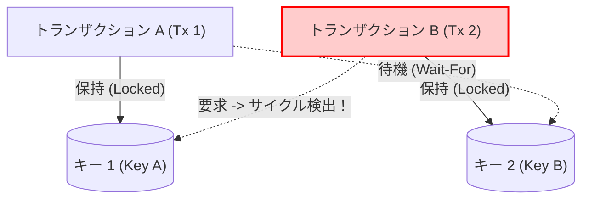

# H2 Database in Rust - 開発者・メンテナー向けガイド (Developer Guide)

本ドキュメントは、`h2database-rust` の保守・機能拡張・デバッグ・リファクタリングを担当する開発者およびメンテナーのための包括的な技術ガイドです。
内部アーキテクチャ、データ構造、ロック設計、新規機能追加の手順、テスト方針について解説します。

---

## 📚 目次

- [1. 全体アーキテクチャとクレート依存関係](#1-全体アーキテクチャとクレート依存関係)
- [2. ストレージエンジン (`h2-mvstore`) の内部仕様](#2-ストレージエンジン-h2-mvstore-の内部仕様)
  - [2.1 CoW (Copy-on-Write) B-Tree の構造](#21-cow-copy-on-write-b-tree-の構造)
  - [2.2 チャンク・ファイルフォーマットと CRC32 検証](#22-チャンクファイルフォーマットと-crc32-検証)
  - [2.3 MVCC トランザクション & スナップショット分離](#23-mvcc-トランザクション--スナップショット分離)
  - [2.4 コンパクション (Vacuum) の仕組み](#24-コンパクション-vacuum-の仕組み)
- [3. SQL 処理系 (`h2-sql`) の内部仕様](#3-sql-処理系-h2-sql-の内部仕様)
  - [3.1 クエリ実行パイプライン](#31-クエリ実行パイプライン)
  - [3.2 カタログとマップ命名規則](#32-カタログとマップ命名規則)
  - [3.3 セカンダリインデックス & IndexScan 最適化](#33-セカンダリインデックス--indexscan-最適化)
  - [3.4 全文検索エンジン (FTS)](#34-全文検索エンジン-fts)
  - [3.5 スキーマ変更 (ALTER TABLE) & TRUNCATE TABLE & 診断構文](#35-スキーマ変更-alter-table--truncate-table--診断構文)
  - [3.6 高度なクエリ実行パイプライン (FROM句なしSELECT, サブクエリ展開, 派生テーブル, UNION)](#36-高度なクエリ実行パイプライン-from句なしselect-サブクエリ展開-派生テーブル-union)
  - [3.7 外部キー制約の検証とカスケード連動処理メカニズム](#37-外部キー制約の検証とカスケード連動処理メカニズム)
  - [3.8 共通テーブル式 (CTE: WITH 句) と INSERT INTO ... SELECT](#38-共通テーブル式-cte-with-句-と-insert-into--select)
  - [3.9 集合演算 (UNION, INTERSECT, EXCEPT) の処理機構](#39-集合演算-union-intersect-except-の処理機構)
  - [3.10 ウィンドウ関数の事前計算・射影置換パイプライン](#310-ウィンドウ関数の事前計算射影置換パイプライン)
  - [3.11 仮想ビュー (VIEW) のカタログ永続化と動的展開](#311-仮想ビュー-view-のカタログ永続化と動的展開)
  - [3.12 セーブポイント (SAVEPOINT) を非採用とするアーキテクチャ上の決定理由](#312-セーブポイント-savepoint-を非採用とするアーキテクチャ上の決定理由)
- [4. サーバー層 (`h2-server`) の内部仕様](#4-サーバー層-h2-server-の内部仕様)
- [5. 最上位ファサード (`h2`) と API 設計](#5-最上位ファサード-h2-と-api-設計)
- [6. 新機能追加の手順 (How-to Guides)](#6-新機能追加の手順-how-to-guides)
  - [6.1 新しい SQL データ型を追加する](#61-新しい-sql-データ型を追加する)
  - [6.2 新しい SQL 構文・文を追加する](#62-新しい-sql-構文文を追加する)
  - [6.3 新しい SQL 関数・演算子を追加する](#63-新しい-sql-関数演算子を追加する)
- [7. 並行性・ロック設計とデッドロック防止ルール](#7-並行性ロック設計とデッドロック防止ルール)
- [8. テスト戦略と品質保証](#8-テスト戦略と品質保証)
- [9. 開発コマンド・チートシート](#9-開発コマンドチートシート)

---

## 1. 全体アーキテクチャとクレート依存関係

本プロジェクトは **Cargo ワークスペース** による明確なレイヤードアーキテクチャを採用しています。

```
                  ┌─────────────────────────────────────┐
                  │          demo/* (各種デモ)          │
                  └──────────────────┬──────────────────┘
                                     │
           ┌─────────────────────────┼─────────────────────────┐
           │                         ▼                         │
┌──────────┴──────────┐   ┌─────────────────────┐   ┌──────────┴──────────┐
│  h2-cli (対話シェル) │   │ h2 (最上位ファサード)│   │  外部アプリケーション │
└──────────┬──────────┘   └──────────┬──────────┘   └─────────────────────┘
           │                         │
           │         ┌───────────────┴───────────────┐
           │         ▼                               ▼
           │  ┌──────────────┐                ┌──────────────┐
           └─►│  h2-server   │                │    h2-sql    │
              │  (PG-Wire)   │───(クエリ実行)─►│(SQL実行エンジン│
              └──────────────┘                └──────┬───────┘
                                                     │
                                                     ▼
                                              ┌──────────────┐
                                              │  h2-mvstore  │
                                              │(追記CoW BTree│
                                              └──────┬───────┘
                                                     │
                                                     ▼
                                              ┌──────────────┐
                                              │   h2-types   │
                                              │(型・エラー定義)│
                                              └──────────────┘
```

### 各クレートの責務とルール

| クレート名 | パス | 責務 | 依存ルール |
| :--- | :--- | :--- | :--- |
| **`h2-types`** | `crates/h2-types/` | 基本データ型（`DataType`, `Value`）、`FromSql` トレイト、エラー型（`H2Error`, `H2Result`）。 | **他内部クレートへの依存は禁止**（最下層）。純粋なデータ型定義のみ。 |
| **`h2-mvstore`** | `crates/h2-mvstore/` | ログ構造化 CoW B-Tree、ファイル I/O、MVCC トランザクション、Undo Log、Vacuum コンパクション。 | `h2-types` のみに依存。**SQL の概念（テーブルやカラム）は一切持たない**（純粋なキーバリューストア）。 |
| **`h2-sql`** | `crates/h2-sql/` | SQL パーサ、カタログ（`_catalog`）、オプティマイザ、クエリ実行器、JOIN/GROUP BY/集約、全文検索（FTS）。 | `h2-types`, `h2-mvstore`, `sqlparser` に依存。ネットワークの概念は持たない。 |
| **`h2-server`** | `crates/h2-server/` | PostgreSQL v3 ワイヤプロトコルハンドラ、Tokio ネットワークサーバー。 | `h2-types`, `h2-sql` に依存。 |
| **`h2-cli`** | `crates/h2-cli/` | スタンドアロンの対話型 REPL 実行バイナリ。 | `h2` ファサードに依存。 |
| **`h2`** | `crates/h2/` | 利用者向けトップレベルファサード。同期 `Connection`、`params!` マクロ、非同期 `AsyncConnection`、PG サーバー起動。 | 全クレートを統合して再公開。 |

---

## 2. ストレージエンジン (`h2-mvstore`) の内部仕様

Java 版 H2 Database のコアである **MVStore** のアーキテクチャを Rust でゼロから実装した追記型ストレージエンジンです。

### 2.1 CoW (Copy-on-Write) B-Tree の構造

- **ファイル**: [`crates/h2-mvstore/src/tree.rs`](file:///d:/workspace/h2database-rust/crates/h2-mvstore/src/tree.rs), [`page.rs`](file:///d:/workspace/h2database-rust/crates/h2-mvstore/src/page.rs)
- **イミュータビリティ**: ページノード（`Arc<Page>`）は一度生成されると変更されません。更新・挿入・削除が発生した場合、ルートから対象リーフノードまでのパスのみを新しく複製・生成（Copy-on-Write）します。
- **ロックフリー読み取り**: 過去バージョンのルートページへの参照（`Arc<Page>`）を保持しているリーダーは、ライターの更新動作と一切競合せず、ロックフリーで過去スナップショットを探索できます。

### 2.2 チャンク・ファイルフォーマットと CRC32 検証

- **ファイル**: [`crates/h2-mvstore/src/file_store.rs`](file:///d:/workspace/h2database-rust/crates/h2-mvstore/src/file_store.rs)
- **ファイル先頭 (Header)**: マジックバイト `b"H2MV"` (4 bytes) + フォーマットバージョン (4 bytes)。
- **チャンク (Chunk)**:
  ```text
  [Chunk Length: 4B][CRC32: 4B][Serialized ChunkPayload (JSON / Bincode)]
  ```
- **コミット処理 (`commit`)**:
  各マップの最新ルートノードをルートツリー（メタデータツリー）に格納し、ペイロードをファイル末尾に追記。追記完了後に `sync_all()` でディスクにフラッシュします。
- **クラッシュリカバリ**: ファイル末尾から後方へ走査し、CRC32 チェックサムが正当な最後のチャンクを特定して安全に復元します（破損した途中書き込みチャンクは自動で破棄）。

### 2.3 MVCC トランザクション & スナップショット分離

- **ファイル**: [`crates/h2-mvstore/src/tx/`](file:///d:/workspace/h2database-rust/crates/h2-mvstore/src/tx/)
- **`VersionedValue`**:
  各キーの値は単一のバイト列ではなく、以下の構造で保存されます：
  - `active_tx_id`: 現在変更中のトランザクション ID（コミット前）。
  - `committed_history`: 過去に確定した `(version, value)` の履歴ベクタ。
- **書き込み競合 (Write Conflict)**:
  他トランザクションの `active_tx_id` が残っているキーを更新しようとすると、`H2Error::Transaction("Write conflict detected")` が発生します。
- **Undo Log & 自動ロールバック**:
  トランザクション内で行われた変更は `undo_log` に記録されます。`rollback()` 実行時、または `Transaction` 構造体がコミットされずに `Drop` された場合、Undo Log を逆順に再生して未確定値を破棄し、直前のコミット済み値に復元します。

### 2.4 コンパクション (Vacuum) の仕組み

- **ファイル**: [`crates/h2-mvstore/src/store.rs#L112`](file:///d:/workspace/h2database-rust/crates/h2-mvstore/src/store.rs#L112), [`file_store.rs#L95`](file:///d:/workspace/h2database-rust/crates/h2-mvstore/src/file_store.rs#L95)
- 追記型ストレージは更新を重ねるとファイルサイズが肥大化します。
- `compact()`（SQL の `VACUUM`）が呼ばれると：
  1. 現在アクティブな全マップの最新ルートページのみを抽出。
  2. 新しいチャンク `ChunkPayload` を構築。
  3. ファイルヘッダー直後（Offset 8）から新チャンクのみを書き直し、ファイルサイズを `set_len()` で物理的に切り詰めます（Truncate）。

---

## 3. SQL 処理系 (`h2-sql`) の内部仕様

### 3.1 クエリ実行パイプライン

```
SQL文字列 ──► parse_sql() ──► Statement ──► SQLEngine::execute_statement()
                                                    │
             ┌──────────────────────────────────────┴──────────────────────────────────────┐
             ▼                                      ▼                                      ▼
      DDL (CreateTable,                      DML (Insert, Update,                     DQL (Query)
       CreateIndex, Drop)                          Delete)                                 │
             │                                      │                                      ▼
             ▼                                      ▼                               execute_query()
     Catalog更新 + Commit                   Tx経由でマップ更新                              │
                                            + インデックス自動同期                          ├─ IndexScan / TableScan
                                                                                            ├─ JOIN (Nested Loop / Hash)
                                                                                            ├─ WHERE 評価
                                                                                            ├─ GROUP BY & 集約
                                                                                            ├─ HAVING 評価
                                                                                            └─ ORDER BY & LIMIT
```

### 3.2 カタログとマップ命名規則

テーブルやインデックスの定義は、システム専用マップ **`_catalog`** に JSON シリアライズされて永続化されます。

| オブジェクト | カタログ上のキー | ストレージ上の MVMap 名 | 格納される値 |
| :--- | :--- | :--- | :--- |
| **テーブルデータ** | `tbl:<table_name>` | `tbl_<table_name>` | キー: `row_id` (u64 LE)<br>値: `Row` の JSON バイト列 |
| **セカンダリインデックス** | `idx:<index_name>` | `idx_<table_name>_<index_name>` | キー: `Value` シリアライズ + `0x00` + `row_id` (BE)<br>値: 空ベクタ `vec![]` |
| **全文検索インデックス** | `fts:<table_name>_<col>` | `fts_<table_name>_<col>_<type>` | キー: トークン文字列<br>値: `HashSet<RowId>` のシリアライズ |

> [!WARNING]
> **大文字・小文字の正規化ルール**:
> SQL ではテーブル名やカラム名は大文字小文字を区別しない（Case-Insensitive）ため、カタログへの登録・検索時およびマップ名生成時は **必ず `.to_lowercase()` で正規化** してください。

### 3.3 セカンダリインデックス & IndexScan 最適化

- **ファイル**: [`crates/h2-sql/src/executor.rs#L480`](file:///d:/workspace/h2database-rust/crates/h2-sql/src/executor.rs#L480)
- `WHERE column = <literal>` のクエリが実行された際、対象カラムにセカンダリインデックスが存在する場合、オプティマイザが自動的に **IndexScan** を選択します。
- 全テーブルスキャンを行わず、`idx_...` マップから該当キーをプレフィックス走査して `row_id` を即座に特定し、O(log N) でレコードを取得します。
- **インデックス自動同期**:
  - `INSERT`: レコード保存と同時に各インデックスマップへキーを投入。一意インデックスの場合は重複を検知してエラー返却。
  - `UPDATE`: 変更前のカラム値に対するインデックスキーを `tx.remove` し、新値のキーを `tx.put`。
  - `DELETE`: 削除行のインデックスキーを `tx.remove`。

### 3.4 全文検索エンジン (FTS)

- **ファイル**: [`crates/h2-sql/src/fts/`](file:///d:/workspace/h2database-rust/crates/h2-sql/src/fts/)
- **`NGramTokenizer`**: 日本語・アルファベット・数字を 2-gram（文字単位バイグラム）に分解。
- **`MorphTokenizer`**: 漢字・ひらがな・カタカナ・アルファベットの文字種変化境界（Unicode Block境界）で分割し、意味のある単語トークンを抽出。
- **転置インデックス**: 各トークンをキーとし、出現行 ID の集合（`HashSet<u64>`）を B-Tree に保持。クエリ時は複数トークンの積集合（AND 演算）で高速絞り込み。

### 3.5 スキーマ変更 (ALTER TABLE) & TRUNCATE TABLE & 診断構文

- **ファイル**: [`crates/h2-sql/src/executor.rs`](file:///d:/workspace/h2database-rust/crates/h2-sql/src/executor.rs)
- **`ALTER TABLE ... RENAME TO`**:
  - `tbl_<old>` から `tbl_<new>` へレコードを移行し、関連する `idx_<old>_<idx>` も `idx_<new>_<idx>` へ移行して古いマップを `store.remove_map` で破棄。カタログのテーブル定義およびインデックス定義を更新します。
- **`ALTER TABLE ... ADD COLUMN`**:
  - カタログの `TableDef` に新カラムを追加。既存レコードの末尾に `Value::Null` を補完して保存します。
- **`ALTER TABLE ... DROP COLUMN`**:
  - カタログの `TableDef` からカラムを削除。既存レコードから該当位置の値を削除して保存します。
- **`TRUNCATE TABLE`**:
  - テーブルマップおよび関連インデックスマップ内のキーを全件削除し、カタログの `next_row_id` を 1 にリセットします。
- **`EXPLAIN`**:
  - クエリ AST を解析し、スキャン種別（`IndexScan` vs `TableScan`）、結合アルゴリズム（`NestedLoopJoin`）、Filter 条件、Aggregate、Sort、Limit/Offset を分かりやすいツリー構造で出力します。
- **`SHOW TABLES` / `SHOW COLUMNS`**:
  - カタログ情報を走査し、対話型 CLI や GUIツールで扱いやすい結果セット形式（Table 列、Field/Type/Null/Key 列）で返却します。

### 3.6 高度なクエリ実行パイプライン (FROM句なしSELECT, サブクエリ展開, 派生テーブル, UNION)

- **ファイル**: [`crates/h2-sql/src/executor.rs#L720`](file:///d:/workspace/h2database-rust/crates/h2-sql/src/executor.rs#L720), [`crates/h2-sql/src/expression.rs`](file:///d:/workspace/h2database-rust/crates/h2-sql/src/expression.rs)
- **FROM 句なしの SELECT**:
  - `select.from.is_empty()` の場合、空のコンテキストとダミー行 `Row::new(vec![])` を生成し、プロジェクションリストの式評価（リテラル、四則演算、スカラ関数、CASE WHEN）を実行。
- **サブクエリ事前展開 (`preprocess_subqueries`)**:
  - クエリ実行前に AST を走査し、`Expr::Subquery`（スカラサブクエリ）、`Expr::InSubquery`（IN サブクエリ）、`Expr::Exists`（EXISTS 判定）を再帰実行。
  - `InSubquery` はサブクエリ結果から第0列の値を抽出して `Expr::InList` に変換し、`Exists` は行の有無を `Expr::Value(Boolean)` に置換して既存の高速評価器へ引き渡します。
- **派生テーブル (FROM / JOIN Subqueries)**:
  - `TableFactor::Derived` を検知すると、内部サブクエリを再帰的に `execute_query` で実行。得られた列メタデータからインメモリ一時 `TableDef` を構築し、結果行を `current_rows` または `join_rows` にバインドして透過的に結合・集約・ソートを行います。
- **集合演算 (`UNION` / `UNION ALL`)**:
  - `SetExpr::SetOperation` をインターセプトし、左右のクエリを並行実行して結果をマージ。`UNION`（デフォルト）の場合は重複行を `O(N)` で排除。

### 3.7 外部キー制約の検証とカスケード連動処理メカニズム

- **ファイル**: [`crates/h2-sql/src/catalog.rs`](file:///d:/workspace/h2database-rust/crates/h2-sql/src/catalog.rs), [`crates/h2-sql/src/parser.rs`](file:///d:/workspace/h2database-rust/crates/h2-sql/src/parser.rs), [`crates/h2-sql/src/executor.rs`](file:///d:/workspace/h2database-rust/crates/h2-sql/src/executor.rs)
- **データ構造 (`ForeignKeyDef`, `ForeignKeyAction`)**:
  - `TableDef` に `foreign_keys: Vec<ForeignKeyDef>` を保持。
  - カタログの `get_tables_referencing(parent_table)` により、親テーブル名から逆引きで被参照子テーブル群を一括取得可能。
- **挿入・更新時の参照整合性検証 (`validate_foreign_keys_for_row`)**:
  - INSERT または UPDATE 時に子テーブルの各外部キーを走査。値が `NULL` でない場合、親テーブルのマップ `tbl_<parent>` をスキャンし、一致する親キーが存在しない場合は `H2Error::Execution("Foreign key constraint violation: ...")` を即座に返却。
- **削除時・更新時の連動アクション (`handle_foreign_keys_on_delete`, `handle_foreign_keys_on_update`)**:
  - 親テーブルからレコードが削除される際、子テーブルを探索：
    - `Restrict` / `NoAction`: 子レコードが存在すればエラーを発生させ削除を阻止。
    - `Cascade`: 子レコードを自動削除し、関連インデックスからもキーを除去。さらに子テーブルが別のテーブルの親となっている場合は再帰的に連動削除。
    - `SetNull`: 子レコードの外部キー列を `Value::Null` に更新し、インデックスキーを更新。
- **スキーマ保護**:
  - 他テーブルから参照されているテーブルに対する `DROP TABLE` および `TRUNCATE TABLE` は、子テーブルが存在・データ保持している場合に安全に拒絶。

### 3.8 共通テーブル式 (CTE: WITH 句) と INSERT INTO ... SELECT

- **ファイル**: [`crates/h2-sql/src/executor.rs`](file:///d:/workspace/h2database-rust/crates/h2-sql/src/executor.rs)
- **CTE の再帰的スコープ解決 (`execute_query_with_ctes`)**:
  - `Query.with` を検知すると、各 `Cte` を先行 CTE を引き継いだコンテキスト `current_ctes: HashMap<String, (TableDef, Vec<Row>)>` 上で順次評価。
  - 後続の CTE やメインクエリ、JOIN 句、派生テーブル内の `TableFactor::Table` において、ストレージマップよりも優先して `current_ctes` を探索・インメモリテーブルとして解決。
- **`INSERT INTO ... SELECT ...` のパイプライン**:
  - `Statement::Insert` の `insert.source` が `Values` 以外のクエリ（`Select`、`SetOperation`、`WITH ... SELECT`）である場合、`execute_query` でクエリを実行。
  - 生成された各結果行について、列インデックス対応付け、データ型キャスト、外部キー参照整合性検証、一意インデックス検証、インデックス登録、CoW B-Tree への `tx.put` を透過的に実行。

### 3.9 集合演算 (UNION, INTERSECT, EXCEPT) の処理機構

- **ファイル**: [`crates/h2-sql/src/executor.rs`](file:///d:/workspace/h2database-rust/crates/h2-sql/src/executor.rs)
- **`SetExpr::SetOperation` の統合パイプライン**:
  - `left` クエリおよび `right` クエリを `execute_query_with_ctes` で並行/順次実行し、それぞれの行リスト（`l_rows`, `r_rows`）を取得。
  - `SetOperator` に応じた集合処理:
    - **`Union`**:
      - `DISTINCT`: 重複行（`r.values`）を排除してマージ。
      - `ALL`: 全行をそのまま連結。
    - **`Intersect`**:
      - `DISTINCT`: `l_rows` のユニーク行のうち、`r_rows` にも存在する行を抽出。
      - `ALL`: `l_rows` と `r_rows` の双方に存在する個数の最小値（$\min(N_l, N_r)$）分だけ出力。
    - **`Except`**:
      - `DISTINCT`: `l_rows` のユニーク行のうち、`r_rows` に存在しない行を抽出。
      - `ALL`: `l_rows` の個数から `r_rows` の個数を減算（$\max(0, N_l - N_r)$）して出力。
  - 集合演算後の結果行セットに対して、外側の `ORDER BY` および `LIMIT/OFFSET` を一貫して適用。

### 3.10 ウィンドウ関数の事前計算・射影置換パイプライン

- **ファイル**: [`crates/h2-sql/src/executor.rs`](file:///d:/workspace/h2database-rust/crates/h2-sql/src/executor.rs)
- **非破壊的 2 フェーズ評価アーキテクチャ**:
  1. **解析フェーズ (`collect_window_functions`)**:
     - 射影リスト（`select.projection`）を構文走査し、`func.over.is_some()` を持つウィンドウ関数ノードを抽出。
  2. **事前計算フェーズ (`compute_window_functions`)**:
     - `WHERE` 適用後の `filtered_rows` に対し、`PARTITION BY` 式の評価値キーごとにグループ（パーティション）を分割。
     - 各グループ内で `ORDER BY` 式の昇順・降順に基づいて行インデックスを安定ソート。
     - 関数種別に応じた値の割り当て:
       - `ROW_NUMBER`: 各行に $1, 2, 3...$ を割り当て。
       - `RANK`: ソートキーが直前行と等しい場合は同一順位を割り当て、タイ発生時はインデックス番号でスキップ ($1, 1, 3...$)。
       - `DENSE_RANK`: 同一順位割り当て後もスキップせず連番を付与 ($1, 1, 2...$)。
     - 各行に対する計算結果を `HashMap<String, Vec<Value>>`（関数シグネチャ $\to$ 行ごとの値配列）として保持。
  3. **リライト＆射影フェーズ (`replace_window_function`)**:
     - 各行の射影式を評価する際、式木内の対象ウィンドウ関数ノードを計算済みリテラルノード（`value_to_sql_expr`）へ置換。
     - これにより、`ROW_NUMBER() OVER (...) + 1` や `CASE WHEN RANK() OVER (...) = 1 THEN ...` のような複合式・条件式内でも、既存の式評価エンジンを変更することなく 100% 透過的・安全に動作。

### 3.11 仮想ビュー (VIEW) のカタログ永続化と動的展開

- **ファイル**: [`crates/h2-sql/src/catalog.rs`](file:///d:/workspace/h2database-rust/crates/h2-sql/src/catalog.rs), [`crates/h2-sql/src/executor.rs`](file:///d:/workspace/h2database-rust/crates/h2-sql/src/executor.rs)
- **カタログ永続化 (`ViewDef`)**:
  - ビュー名、定義 SQL 文字列、明示的カラム名リストを `_catalog` マップ内に `view:<name>` キーで JSON シリアライズ永続化。
  - テーブル作成時およびビュー作成時における相互の名前重複チェック（同一名のテーブルとビューの共存を阻止）。
- **クエリ実行時動的展開 (`resolve_view_query`)**:
  - クエリの `FROM` 句および `JOIN` 句における `TableFactor::Table` の探索順序:
    1. CTE (`current_ctes`)
    2. システムテーブル (`information_schema.tables`, `columns`)
    3. 実テーブル (`catalog.get_table`)
    4. **仮想ビュー (`catalog.get_view`)**
  - ビューがヒットした場合、保存された定義 SQL を内部パースし、現在のトランザクションスナップショット上で `execute_query_with_ctes` を再帰実行。
  - 得られた行と列メタデータから透過的に `TableDef` を動的構築し、通常のテーブルや派生テーブル（Derived Table）と全く同じパイプラインで結合・射影・集約を実行。

### 3.12 セーブポイント (SAVEPOINT) を非採用とするアーキテクチャ上の決定理由

- **設計方針 (Design Rationale)**:
  - 本エンジンのストレージアーキテクチャは、**追記型 CoW B-Tree によるスナップショット分離**と、トランザクション開始バージョンへの**逆順 Undo Log 再生**を基礎としています。
  - トランザクション内部での任意時点への部分巻き戻し（`SAVEPOINT`）を実装する場合、Undo ログの階層的セグメント化、アクティブページ変更セットの部分破棄、追記ログのインデックス管理など、ストレージ層とトランザクション層の双方で複雑性が指数関数的に増大し、最も重要な「極小のフットプリントと高速なインメモリ/組み込み実行」を損なう要因となります。
  - したがって、PostgreSQL 互換機能の中でも `SAVEPOINT` は明確に**実装対象外（No Support by Design）**とし、トランザクションの失敗時は `ROLLBACK` による全体巻き戻しを基本設計としています。

---

## 4. サーバー層 (`h2-server`) の内部仕様

- **ファイル**: [`crates/h2-server/src/pg_server.rs`](file:///d:/workspace/h2database-rust/crates/h2-server/src/pg_server.rs)
- Tokio の `TcpListener` で非同期待機。クライアントが接続するとセッションタスクを `tokio::spawn` します。
- **プロトコルハンドシェイク**:
  1. SSL 要求 (`SSLRequest: 80877103`): 平文接続を促すため `'N'` を返却。
  2. スタートアップメッセージ (`StartupMessage: 196608`): ユーザー名と DB 名を取得。
  3. 認証要求 (`AuthenticationOk: 'R', 0`): パスワードなしで即座に承認。
  4. パラメータステータス通知 (`client_encoding=UTF8`, `server_version=15.0 (h2database-rust)` 等) を送信。
  5. 準備完了通知 (`ReadyForQuery: 'Z', 'I'`): アイドル状態でクエリ待機。
- **Simple Query (`'Q'`) の処理**:
  クエリ文字列を受信し、`SQLEngine::execute()` を呼び出し。結果に応じて `RowDescription` (`'T'`), `DataRow` (`'D'`), `CommandComplete` (`'C'`), `ReadyForQuery` (`'Z'`) を返却。エラー時は `ErrorResponse` (`'E'`) を送出。

---

## 5. 最上位ファサード (`h2`) と API 設計

- **ファイル**: [`crates/h2/src/lib.rs`](file:///d:/workspace/h2database-rust/crates/h2/src/lib.rs), [`async_conn.rs`](file:///d:/workspace/h2database-rust/crates/h2/src/async_conn.rs)
- **`Connection`**:
  - `store: Arc<MVStore>` と `engine: Arc<SQLEngine>` を保持。
  - `current_tx: Arc<Mutex<Option<Transaction>>>` を内蔵し、SQL 文字列としての `BEGIN`, `COMMIT`, `ROLLBACK` が発行された場合にセッション内トランザクションを自動追跡。
- **`Row::get_as::<T: FromSql>(idx)`**:
  - `FromSql` トレイトによって、SQL の `Value` から Rust のネイティブ型（`i32`, `String`, `Decimal`, `Uuid`, `Option<T>` など）へ安全にデシリアライズ。
- **`AsyncConnection` / `AsyncTransaction`**:
  - `tokio::task::spawn_blocking` を活用し、イベントループをブロッキングすることなく非同期実行。

---

## 6. 新機能追加の手順 (How-to Guides)

メンテナーがよく行う拡張作業のステップバイステップ手順です。

### 6.1 新しい SQL データ型を追加する

1. **`crates/h2-types/src/data_type.rs`**:
   - `DataType` 列挙型に新しいバリアントを追加。
2. **`crates/h2-types/src/value.rs`**:
   - `Value` 列挙型に内部表現バリアントを追加。
   - `PartialOrd`（順序比較）、`Display`（文字列表現）、`From<T>` を実装。
   - `FromSql` トレイトにその型へのデシリアライズ実装を追加。
3. **`crates/h2-sql/src/parser.rs`**:
   - `convert_data_type()` に `sqlparser::ast::DataType` からの変換を追加。
4. **`crates/h2/tests/`**:
   - 単体テスト・統合テストを追加して検証。

### 6.2 新しい SQL 構文・文を追加する

1. **`crates/h2-sql/src/executor.rs`**:
   - `execute_statement()` の `match stmt` に対象の `sqlparser::ast::Statement` バリアントを追加。
   - 必要に応じてカタログ操作や `tx.put` / `tx.remove` を実装。
2. **テストの追加**:
   - `crates/h2/tests/` または各クレート内のテストにテストケースを追加。

### 6.3 新しい SQL 関数・演算子を追加する

1. **`crates/h2-sql/src/expression.rs`**:
   - `evaluate_expr()` の関数呼び出し `Expr::Function(func)` または演算子 `Expr::BinaryOp` に処理を追加。
   - `RowContext` から引数を評価し、計算結果の `Value` を返却。
2. **集約関数の場合**:
   - `crates/h2-sql/src/executor.rs` の `execute_aggregation()` 内でアキュムレータを更新・確定するロジックを追加。

---

## 7. 並行性・ロック設計とデッドロック防止ルール

本データベースは高い並行性を誇りますが、複数リソースに対するロックの順序を誤るとデッドロックを引き起こします。以下の **ロック階層ルール（Lock Hierarchy）** を厳格に遵守してください。

### ロック獲得の優先順位 (高 ──► 低)
```text
1. TransactionStore::active_transactions (RwLock)
2. MVStore::maps (RwLock)
3. Catalog::tables / Catalog::indexes (RwLock)
4. MVMap::tree (RwLock)
5. FileStore (RwLock)
```

> [!CAUTION]
> **スレッド間デッドロック防止のための絶対ルール**:
> - `MVMap::tree` のロックを保持したまま `MVStore::maps` の write ロックを取得してはならない。
> - `FileStore` の write ロックを保持した状態で別スレッドの同期を待ってはならない。
> - すべてのロックには `std::sync` ではなく **`parking_lot`**（`parking_lot::RwLock`, `parking_lot::Mutex`）を使用すること。

---

### トランザクション行・キー排他ロックとデッドロック検出機構

スレッド単位のメモリロックだけでなく、複数セッション・トランザクション間での行・キー更新の排他制御（X-Lock）において、循環依存（デッドロック）を防止・解決する以下の機構を [`crates/h2-mvstore/src/tx/lock.rs`](file:///d:/workspace/h2database-rust/crates/h2-mvstore/src/tx/lock.rs) に実装しています。



#### 1. ストライプ排他ロック (`LockManager::lock_key`)
- 256 個のストライプ Mutex バケットを備え、同一キーに対する `VersionedValue` のチェック＆更新をアトミックに保護。
- スレッド間の競合時にもレースコンディションなく確実に他トランザクションのロック状態を把握。

#### 2. 待機グラフ (`Wait-For Graph`) とサイクル検出
- トランザクション $T_A$ がロック中のキーに $T_B$ がアクセスした際、`wait_for` マップに $T_B \to T_A$ の有向エッジを登録。
- エッジ追加時に循環走査（DFS / 追跡）を実行：
  - 各トランザクションは直列実行されるため、出次数は高々 1。
  - $T_A \to \dots \to T_B$ のパスが存在する場合、閉路（サイクル）を即座に検出。

#### 3. 被害者トランザクションの選定と自発的自動キャンセル (Victim Cancellation)
- デッドロックを形成した要求元トランザクションを **Victim** として選定。
- 即座に `self.rollback()` を実行：
  - Undo Log を逆順適用し、自トランザクションが保持していたロックをすべて解放。
  - トランザクションステータスを `RolledBack` に遷移。
  - `LockManager::notify_lock_released()` により、自トランザクションを待機していた他スレッド（$T_A$ 等）へ `Condvar::notify_all` をブロードキャスト。
  - 要求元には `H2Error::LockConflict("Deadlock detected: transaction ... cancelled to break cycle")` を返却。
- これにより、待機中だった他トランザクションは直ちにブロック解除され、正常に後続クエリの実行とコミットを完了できます。


---

## 8. テスト戦略と品質保証

本プロジェクトでは、コードの堅牢性を担保するため多層的なテストスイートを備えています。

```bash
# 全ワークスペーステストの実行 (必須)
cargo test --workspace

# 特定の統合テストのみを実行
cargo test --test h2_comprehensive_tests
cargo test --test new_planned_features_tests
cargo test --test advanced_features_tests
cargo test --test advanced_sql_tests
```

### 主要な統合テストファイル

- **[`h2_comprehensive_tests.rs`](file:///d:/workspace/h2database-rust/crates/h2/tests/h2_comprehensive_tests.rs)**:
  Java版 H2 Database を参考にした包括的ストレステスト。
  - `test_h2_mvcc_stress_and_concurrency`: 多数の並行リーダーとライターのスナップショット分離検証。
  - `test_h2_compaction_vacuum_stress`: 大量削除後の Vacuum ファイル縮小とデータ整合性検証。
  - `test_h2_crash_recovery_integrity`: プロセスクラッシュ模倣後のデータ復元と CRC32 検証。
- **[`new_planned_features_tests.rs`](file:///d:/workspace/h2database-rust/crates/h2/tests/new_planned_features_tests.rs)**:
  `DROP TABLE/INDEX`、`FromSql` / `get_as`、明示的トランザクション、`AsyncConnection` の検証。
- **[`advanced_sql_tests.rs`](file:///d:/workspace/h2database-rust/crates/h2/tests/advanced_sql_tests.rs)**:
  `JOIN`、`GROUP BY`、集約関数、`ORDER BY`、`LIMIT / OFFSET`、`UPDATE` の動作検証。

---

## 9. 開発コマンド・チートシート

```bash
# 1. ワークスペース全体のコンパイルチェック
cargo check --workspace

# 2. 静的解析 (Clippy)
cargo clippy --workspace --all-targets -- -D warnings

# 3. コードフォーマットチェック
cargo fmt --all -- --check

# 4. 全テストの実行
cargo test --workspace

# 5. CLI シェルのデバッグ起動
cargo run -p h2-cli -- debug.h2

# 6. PG-Wire デモサーバーの起動
cargo run -p demo-psql-server
```

---

メンテナーとしてのコミットや機能改善を歓迎します。疑問点があれば Issue や Discussion でお気軽にご相談ください！
Happy hacking on **H2 Database in Rust**!
