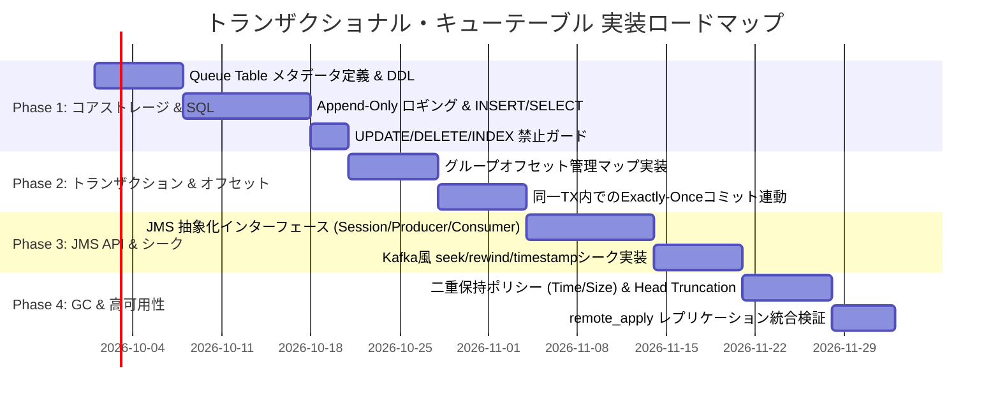

# 07. トランザクショナル・キューテーブル (Transactional Queue Tables / DB-Integrated MQ)

本ドキュメントは、**H2 Database in Rust (`h2database-rust`)** において、リレーショナルデータベース（RDBMS）とメッセージキュー（MQ）を完全に融合させた**「トランザクショナル・キューテーブル（Transactional Queue Table）」**機能の詳細設計書です。

---

## 📑 目次
1. [概要と設計背景](#1-概要と設計背景)
2. [設計原則とキーコンセプト](#2-設計原則とキーコンセプト)
3. [システムアーキテクチャ](#3-システムアーキテクチャ)
4. [ストレージ・データ構造設計 (MVStore 連携)](#4-ストレージデータ構造設計-mvstore-連携)
5. [SQL インターフェース仕様 (Queue Table DDL/DML/DQL)](#5-sql-インターフェース仕様-queue-table-ddldmldql)
6. [JMS 準拠 API & Kafka 風オフセットシーク仕様](#6-jms-準拠-api--kafka-風オフセットシーク仕様)
7. [トランザクション統合メカニズム (ACID & Exactly-Once)](#7-トランザクション統合メカニズム-acid--exactly-once)
8. [データ保持ポリシーとオンラインクリーニング (Retention & GC)](#8-データ保持ポリシーとオンラインクリーニング-retention--gc)
9. [高可用性レプリケーション (`remote_apply`) との統合](#9-高可用性レプリケーション-remote_apply-との統合)
10. [実装ロードマップとフェーズ分け](#10-実装ロードマップとフェーズ分け)

---

## 1. 概要と設計背景

### 1.1 背景と課題：Dual-Write 問題の根本解決
現代のイベント駆動アーキテクチャ（EDA）やマイクロサービスにおいて、「データベースへの更新」と「メッセージブローカー（Kafka, RabbitMQ, SQS 等）へのメッセージ送信」を両方行うケースが頻発します。
しかし、外部 MQ を別個に利用する場合、**Dual-Write（二重書き込み）の不整合問題**が発生します。
- データベースのコミットに成功したが、MQ への送信に失敗した（イベントロスト）
- MQ への送信に成功したが、データベースのコミットがロールバックした（幽霊イベントの送信）
- これを回避するために「Transactional Outbox パターン」を組むと、別テーブルのポーリングバッチ（CDC ツール等）が必要になり、アーキテクチャが極めて複雑化する

### 1.2 本機能が提供するソリューション
本機能は、**「データベースのテーブルそのものをメッセージキュー（Append-Only Commit Log）として扱う」**アプローチを採用します。

```text
┌──────────────────────────────────────────────────────────────────┐
│                   Single Database Transaction                     │
│                                                                  │
│   p_conn.execute("INSERT INTO orders VALUES (...);");            │
│   p_conn.execute("INSERT INTO order_events (payload) VALUES (..);│
│   p_conn.execute("COMMIT;");                                     │
│                                                                  │
│   ※ 注文テーブルの更新とキューへのエンキューが 100% 同一トランザクションで確定 │
│   ※ 失敗時は両方アトミックにロールバック（Dual-Write 問題の完全解消）     │
└──────────────────────────────────────────────────────────────────┘
```

さらに、従来の「取り出したら行が消える」破壊的キュー（destructive queue）ではなく、**Apache Kafka のような不変コミットログ＋オフセット方式**を採用し、**JMS (Java Message Service) 準拠のインターフェース**からシームレスに扱えるように設計します。

---

## 2. 設計原則とキーコンセプト

| 原則 | 内容 |
| :--- | :--- |
| **① DB同一トランザクション** | 2PC/XA 分散トランザクション不要。既存のローカル MVCC トランザクション（`tx.commit()` / `tx.rollback()`）と 100% 同一コンテキストで動作。 |
| **② キューテーブルとしての SQL 透過性** | 通常のテーブルと同様に SQL で `INSERT`（エンキュー）および `SELECT`（参照）が可能。ただしログの不変性を保つため `UPDATE`, `DELETE` は禁止。 |
| **③ インデックス制約** | シーケンシャルなオフセット順探索に特化。追加のセカンダリインデックスは作成不可（単一のクラスタ化オフセット B-Tree のみ）。 |
| **④ WHERE 句のオフセット指定制限** | `SELECT` の `WHERE` 句には内部オフセット（`_offset >= :val` 等）のみを指定可能とし、高速なストリーミングスキャンを保証。 |
| **⑤ Kafka 風オフセットシーク** | 各コンシューマグループが読み取り位置（Offset）を独立管理。過去の時点へのリプレイ（`seek`）、巻き戻し（`rewind`）に対応。 |
| **⑥ 二重保持ポリシーによるクリーニング** | メッセージは消費されても即時削除されず、**「保持期間（Time-based）」**または**「総容量上限（Size-based）」**を超過した時点で古い順に安全に自動クリーニング。 |
| **⑦ JMS 互換インターフェース** | JMS 2.0 / 3.0 の標準概念モデル（`ConnectionFactory`, `Session`, `MessageProducer`, `MessageConsumer`, `TextMessage` 等）に完全準拠。 |

---

## 3. システムアーキテクチャ

システムは、SQL エンジン、JMS クライアントレイヤー、MVCC トランザクション、MVStore ストレージの 4 階層で緊密に統合されます。

```text
┌────────────────────────────────────────────────────────────────────────┐
│                        Application & Client Layer                      │
│   ┌───────────────────────────┐      ┌───────────────────────────────┐ │
│   │   JMS-Compliant API       │      │   Standard SQL Client / psql  │ │
│   │   (Producer / Consumer)   │      │   (INSERT / SELECT)           │ │
│   └─────────────┬─────────────┘      └───────────────┬───────────────┘ │
└─────────────────┼────────────────────────────────────┼─────────────────┘
                  │                                    │
┌─────────────────▼────────────────────────────────────▼─────────────────┐
│                    SQL & Queue Catalog Layer (Query Engine)            │
│   ┌──────────────────────────────────────────────────────────────────┐ │
│   │ Queue Table Manager                                              │ │
│   │ - DDL: CREATE QUEUE TABLE ... WITH (RETENTION_TIME, MAX_BYTES)   │ │
│   │ - Guard: Deny UPDATE, DELETE, CREATE INDEX                       │ │
│   │ - Optimizer: Force Sequential Scan using Clustered Offset Tree   │ │
│   └──────────────────────────────────┬───────────────────────────────┘ │
└──────────────────────────────────────┼─────────────────────────────────┘
                                       │
┌──────────────────────────────────────▼─────────────────────────────────┐
│                    Transaction Layer (MVCC & ACID)                     │
│   ┌──────────────────────────────────────────────────────────────────┐ │
│   │ Transaction Context                                              │ │
│   │ - Atomic produce with business table writes                      │ │
│   │ - Consumer offset commit in same transaction                     │ │
│   │ - Undo Log integration on Rollback                               │ │
│   └──────────────────────────────────┬───────────────────────────────┘ │
└──────────────────────────────────────┼─────────────────────────────────┘
                                       │
┌──────────────────────────────────────▼─────────────────────────────────┐
│                  Storage Layer (Append-Only MVStore)                   │
│   ┌──────────────────────────────┐    ┌──────────────────────────────┐ │
│   │ Queue Log B-Tree Map         │    │ Consumer Group Offset Map    │ │
│   │ (Key: Offset -> MessageData) │    │ (Key: GroupID -> LastOffset) │ │
│   └──────────────┬───────────────┘    └──────────────────────────────┘ │
│                  │                                                     │
│   ┌──────────────▼───────────────────────────────────────────────────┐ │
│   │ Background Retention GC Worker                                    │ │
│   │ - Time-based Expire (Retention Duration)                         │ │
│   │ - Size-based Expire (Max Bytes Exceeded -> Head Truncation)       │ │
│   └──────────────────────────────────────────────────────────────────┘ │
└────────────────────────────────────────────────────────────────────────┘
```

---

## 4. ストレージ・データ構造設計 (MVStore 連携)

キューテーブル 1 つにつき、MVStore 上で以下の 3 つのマップが協調して動作します。

### 4.1 物理マップの構成

| マップ名 | 用途 | キー | 値 |
| :--- | :--- | :--- | :--- |
| `queue_data_{name}` | メッセージコミットログ本体 | `offset: u64` (8 bytes big-endian) | `MessageRecord` (バイナリ直列化データ) |
| `queue_offsets_{name}` | コンシューマグループの現在位置 | `group_id: String` | `ConsumerOffsetRecord` (`committed_offset`, `timestamp`) |
| `queue_meta_{name}` | キューのメタデータ・統計値 | `meta_key: String` | 次期採番オフセット、最古オフセット、総バイト数、設定値 |

### 4.2 メッセージレコードのバイナリレイアウト (`MessageRecord`)

```rust
#[derive(Debug, Clone, Serialize, Deserialize)]
pub struct MessageRecord {
    /// 単調増加する 64-bit 内部オフセット (0, 1, 2, ...)
    pub offset: u64,
    /// メッセージがエンキューされたコミットタイムスタンプ (UNIXエポックミリ秒)
    pub timestamp_ms: u64,
    /// JMS 準拠のユニークメッセージ ID (例: "ID:h2-mq-001-...")
    pub jms_message_id: String,
    /// オプショナルな関連付け ID (リクエスト・リプライパターン用)
    pub correlation_id: Option<String>,
    /// メッセージ種別 (JMS Type)
    pub jms_type: Option<String>,
    /// 宛先名 (キュー名)
    pub destination: String,
    /// 優先度 (0〜9、デフォルト 4)
    pub priority: u8,
    /// ユーザー定義ヘッダー・プロパティ (JMS Property)
    pub properties: HashMap<String, Value>,
    /// メッセージペイロード (TEXT, BYTES, JSON)
    pub payload: Vec<u8>,
    /// ペイロードのデータ型 (TEXT, BYTES, JSON, MAP)
    pub payload_type: MessagePayloadType,
}
```

### 4.3 オフセット採番と高速シーケンシャルアクセス
1. **アトミック採番**:
   エンキュー時、`queue_meta_{name}` 内の `next_offset` カウンタから 64-bit 整数を単調増加で取得します。
2. **クラスタ化オフセット B-Tree**:
   キーを `u64::to_be_bytes()`（ビッグエンディアン）とすることで、B-Tree 内でオフセット昇順に物理的に整列します。
3. **高速レンジスキャン**:
   `WHERE _offset >= :consumer_offset LIMIT :batch_size` を評価する際、B-Tree の $O(\log N)$ シークで開始キーに到達し、以降はページ内を $O(1)$ で連続読み出し（スリークなシーケンシャルイテレータ）します。

---

## 5. SQL インターフェース仕様 (Queue Table DDL/DML/DQL)

通常の SQL クライアント（psql, JDBC, CLI, 埋め込み API）から、キューテーブルを透過的に操作できます。

### 5.1 キューテーブル作成 (`CREATE QUEUE TABLE`)

```sql
CREATE QUEUE TABLE order_events (
    payload TEXT,
    topic VARCHAR DEFAULT 'orders',
    priority INT DEFAULT 4
) WITH (
    RETENTION_TIME = '7 DAYS',
    MAX_BYTES = '10GB'
);
```

#### パラメータ仕様:
- `RETENTION_TIME`: メッセージの最大保持期間（例: `'24 HOURS'`, `'7 DAYS'`, `'30 DAYS'`）。指定期間を経過した古いメッセージは自動破棄されます。
- `MAX_BYTES`: キュー内の最大データ保持容量（例: `'1GB'`, `'10GB'`, `'100GB'`）。データ総量がこの上限を超えた場合、保持期間内であっても最古のメッセージからヘッドトランケートされます。

### 5.2 システム定義の擬似列 (Virtual Columns)
キューテーブルには、ユーザー定義列の他に以下のシステム列が自動付与されます：

| 列名 | データ型 | 説明 |
| :--- | :--- | :--- |
| `_offset` | `BIGINT` | 単調増加する 64-bit メッセージ内部オフセット (Primary Key 相当) |
| `_timestamp` | `TIMESTAMPTZ` | メッセージがコミットされた正確な日時 |
| `_msg_id` | `VARCHAR` | JMS 準拠のメッセージ識別子 (`JMSMessageID`) |
| `_correlation_id` | `VARCHAR` | 相関 ID (`JMSCorrelationID`) |

### 5.3 エンキュー (`INSERT`) - 完全サポート

```sql
-- 通常の INSERT
INSERT INTO order_events (payload) VALUES ('{"order_id": 1001, "amount": 5000}');

-- 複数行一括 INSERT (バルクエンキュー)
INSERT INTO order_events (payload) VALUES 
    ('{"order_id": 1002, "amount": 1200}'),
    ('{"order_id": 1003, "amount": 3400}');

-- 業務テーブル更新と同一トランザクションでのエンキュー
BEGIN;
UPDATE inventory SET stock = stock - 1 WHERE item_id = 42;
INSERT INTO order_events (payload) VALUES ('{"event": "STOCK_REDUCED", "item_id": 42}');
COMMIT;
```

### 5.4 操作ガード (`UPDATE` / `DELETE` / `CREATE INDEX` の安全な禁止)

メッセージログの不変性（Append-Only）を担保し、オフセット順序を破壊させないため、以下の操作はパーサー/エグゼキュータ層で拒否されます：

```sql
-- 禁止：エラー H2Error::Unsupported("UPDATE is not allowed on Queue Table 'order_events'")
UPDATE order_events SET payload = 'new_value' WHERE _offset = 1;

-- 禁止：エラー H2Error::Unsupported("DELETE is not allowed on Queue Table 'order_events'")
DELETE FROM order_events WHERE _offset = 1;

-- 禁止：エラー H2Error::Unsupported("Secondary indexes are not allowed on Queue Table 'order_events'")
CREATE INDEX idx_order_events_topic ON order_events(topic);
```

### 5.5 デキュー・参照 (`SELECT`) - オフセット指定制限

`SELECT` 文によるメッセージの閲覧・取得が可能です。ただし、インデックス不要の高スループット走査を保証するため、**`WHERE` 句には `_offset` 列のみ指定可能**という厳格な制約を設けます。

```sql
-- オフセット 100 番以降から最大 50 件をシーケンシャル取得
SELECT _offset, _timestamp, payload 
FROM order_events 
WHERE _offset >= 100 
LIMIT 50;

-- 範囲指定によるリプレイ
SELECT _offset, _timestamp, payload 
FROM order_events 
WHERE _offset BETWEEN 500 AND 600;

-- 禁止：_offset 以外の列によるフィルタリングはエラー
-- エラー: H2Error::Unsupported("Only '_offset' column is allowed in WHERE clause on Queue Table")
SELECT * FROM order_events WHERE payload LIKE '%order_id%';
```

---

## 6. JMS 準拠 API & Kafka 風オフセットシーク仕様

Rust のネイティブ API および将来の Java/JDBC/JMS ドライバ向けに、JMS 2.0 / 3.0 仕様に準拠したエルゴノミックなインターフェースを提供します。

### 6.1 JMS オブジェクトマッピング

```rust
pub struct JmsConnectionFactory {
    database_url: String,
}

pub struct JmsConnection {
    conn: h2::Connection,
}

pub struct JmsSession {
    conn: h2::Connection,
    transacted: bool,
    ack_mode: AcknowledgeMode,
}

pub struct JmsQueue {
    name: String,
}

pub struct JmsMessageProducer {
    queue: JmsQueue,
    session: Arc<JmsSession>,
}

pub struct JmsMessageConsumer {
    queue: JmsQueue,
    session: Arc<JmsSession>,
    group_id: String,
    current_offset: Arc<AtomicU64>,
}
```

### 6.2 メッセージ送信 (Producer)

```rust
let factory = JmsConnectionFactory::new("h2://localhost:5432/appdb");
let connection = factory.create_connection().await?;
let session = connection.create_session(true, AcknowledgeMode::SessionTransacted).await?;
let queue = session.create_queue("order_events").await?;
let producer = session.create_producer(&queue).await?;

// テキストメッセージの作成と送信
let mut message = session.create_text_message("{\"order_id\": 2001}")?;
message.set_string_property("event_type", "ORDER_CREATED")?;
message.set_jms_correlation_id(Some("REQ-99882".to_string()));

producer.send(message).await?;

// セッションのコミット（DB トランザクションと同時にコミット）
session.commit().await?;
```

### 6.3 Kafka 風オフセットシーク機能 (Consumer Seeking)

メッセージコンシューマは、従来の破壊的 `receive()` だけでなく、**読み取り位置（Offset）を自在に前後移動（シーク）**できます。

```rust
let consumer = session.create_consumer(&queue, "payment-service-group").await?;

// 1. 特定のオフセット番号にシーク
consumer.seek(1500).await?;

// 2. キューの先頭（現在保持されている最古のメッセージ）へ巻き戻し (Rewind to beginning)
consumer.seek_to_beginning().await?;

// 3. キューの最新末尾へシーク（今後新しく届くメッセージのみを受信）
consumer.seek_to_end().await?;

// 4. 特定の日時時点へシーク (Time-based seek)
let one_hour_ago = std::time::SystemTime::now() - Duration::from_secs(3600);
consumer.seek_to_timestamp(one_hour_ago).await?;

// 5. メッセージの受信ループ
while let Some(msg) = consumer.receive(Duration::from_millis(500)).await? {
    println!("Offset: {}, Payload: {}", msg.get_offset(), msg.get_text()?);
    
    // トランザクションコミット（処理結果の DB 更新とオフセット進行をアトミックに確定）
    session.commit().await?;
}
```

---

## 7. トランザクション統合メカニズム (ACID & Exactly-Once)

### 7.1 エンキュー時の ACID 保証
`INSERT INTO queue_table` または `producer.send()` を呼び出した際、メッセージは即座に公開されるのではなく、**現在の MVCC トランザクションの未コミット領域**に記録されます。
- `COMMIT` されると、トランザクションのコミットバージョン番号が付与され、他のコンシューマから一斉に可視（Visible）になります。
- `ROLLBACK` された場合、Undo Log が再生され、メッセージは一切残らず破棄されます。

### 7.2 コンシューム時の Exactly-Once 処理モデル
コンシューマがメッセージを受信し、業務データを DB に書き込み、コミットする処理は、同一のトランザクションハンドルで行われます：

```rust
let mut tx = connection.begin().await?;

// 1. キューからメッセージをフェッチ (例: Offset 42)
let msg = consumer.receive_with_tx(&mut tx).await?;

// 2. メッセージの内容に基づいて業務テーブルを更新
tx.execute("UPDATE accounts SET balance = balance + 100 WHERE id = 10;").await?;

// 3. コンシューマグループのオフセットを 43 に進める
consumer.commit_offset_with_tx(&mut tx, msg.get_offset() + 1).await?;

// 4. トランザクションコミット
// -> 残高更新と「メッセージ 42 の消費完了」がアトミックに成立！
// -> クラッシュしても、中途半端な二重消費や未処理ロストは絶対に発生しない
tx.commit().await?;
```

---

## 8. データ保持ポリシーとオンラインクリーニング (Retention & GC)

メッセージが無限に肥大化してディスクを圧迫することを防ぐため、**「時間基準」**と**「容量基準」**のハイブリッドクリーニング機構を実装します。

```text
               Queue Table Commit Log
 ┌──────────┬──────────┬──────────┬──────────┬──────────┬──────────┐
 │ Offset 1 │ Offset 2 │ Offset 3 │ Offset 4 │ Offset 5 │ Offset 6 │ ...
 └──────────┴──────────┴──────────┴──────────┴──────────┴──────────┘
 ◄─────────────────────► ◄────────────────────────────────────────►
   Purged by Retention               Active / Retained Messages
   (Head Truncation)
```

### 8.1 二重保持ポリシーの評価ルール

1. **保持期間ポリシー (`RETENTION_TIME`)**:
   - `timestamp_ms < (CurrentTime - RetentionDuration)` となるメッセージは期限切れ（Expired）と判定。
2. **容量上限ポリシー (`MAX_BYTES`)**:
   - キューテーブルの総データバイト数が `MAX_BYTES` を超過している場合、総容量が上限を下回るまで、最古のオフセットから順に切り捨て（Head Truncation）対象と判定。

### 8.2 高速ヘッドトランケート (Head Truncation / Range Purge)
- 1行ずつ `DELETE` ループを回すのではなく、B-Tree の特性を活かして `[oldest_offset .. target_purge_offset]` のリーフページを**一括枝刈り（O(log N) Range Removal）**します。
- これにより、数百万件の期限切れメッセージが存在しても、ミリ秒単位で瞬時に解放されます。
- クリーニング処理はバックグラウンドのワーカースレッド（`QueueRetentionCleaner`）が周期的に実行するため、オンラインの Producer / Consumer を一切ブロックしません。

### 8.3 遅延コンシューマの保護と警告
もしコンシューマが長期間停止しており、まだ未読のメッセージが `MAX_BYTES` 超過によってトランケートされてしまった場合：
- コンシューマが過去オフセットをリクエストした際、**`H2Error::OffsetOutOfRange`**（Kafka の `OffsetOutOfRangeException` 相当）が返却され、最古の有効オフセットへの自動リセットまたはアラート発報が行われます。

---

## 9. 高可用性レプリケーション (`remote_apply`) との統合

本トランザクショナル・キューテーブルは、前回実装した**2インスタンス同期レプリケーション（`remote_apply`）と 100% 互換**です。

1. **ストレージレベル同期の恩恵**:
   - キューテーブルの実体は MVStore の `queue_data_{name}` および `queue_offsets_{name}` マップです。
   - Primary でエンキューがコミットされた瞬間、変更ログ（B-Tree の put 差分）が Standby に同期転送され、Standby のストアにアプライされます。
2. **`remote_apply` によるゼロラグ保証**:
   - Primary の `INSERT INTO queue_table` が完了した瞬間、Standby 側でも同じオフセットのメッセージがアプライ済みとなっています。
3. **Standby でのコンシューム**:
   - Standby インスタンスは Read-Only であるため、`SELECT` によるキューの閲覧や、インメモリでのコンシュームが可能です。
   - Primary 障害時も、Standby に全く同じメッセージログとオフセット履歴が存在するため、フェイルオーバー時のイベント欠損がゼロとなります。

---

## 10. 実装ロードマップとフェーズ分け

本設計に基づく実装は、以下の 4 フェーズで段階的に展開することを推奨します。



### フェーズ 1: コアストレージ & SQL インターフェース
- `CREATE QUEUE TABLE` 構文のパースとカタログ登録
- `queue_data_{name}` への追記（Append-Only）と単調増加オフセット採番
- `INSERT` の対応、および `UPDATE`, `DELETE`, `CREATE INDEX` の安全な禁止
- `WHERE _offset >= ?` を用いた `SELECT` シーケンシャルスキャン

### フェーズ 2: トランザクション連動 & オフセット管理
- コンシューマグループのオフセット記録マップ（`queue_offsets_{name}`）の実装
- 業務テーブルの更新と同一トランザクションでのメッセージ消費・オフセットコミット

### フェーズ 3: JMS クライアント & Kafka 風オフセットシーク
- JMS 準拠の Producer / Consumer API
- `seek()`, `seek_to_beginning()`, `seek_to_end()`, `seek_to_timestamp()` の実装

### フェーズ 4: 保持ポリシー GC & レプリケーション検証
- `RETENTION_TIME` と `MAX_BYTES` に基づくバックグラウンド Head Truncation GC
- 2 インスタンス `remote_apply` 同期構成下でのキュー同期・フェイルオーバー検証
